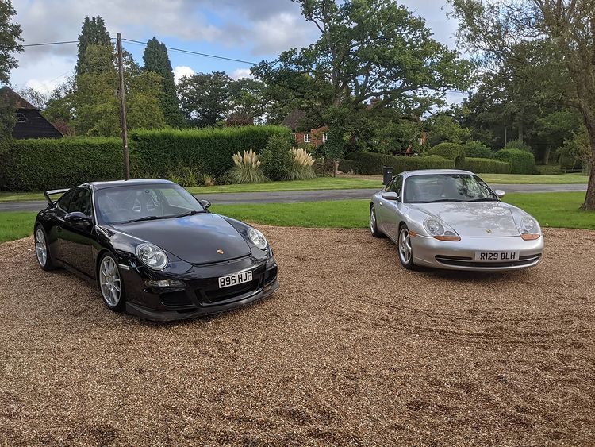
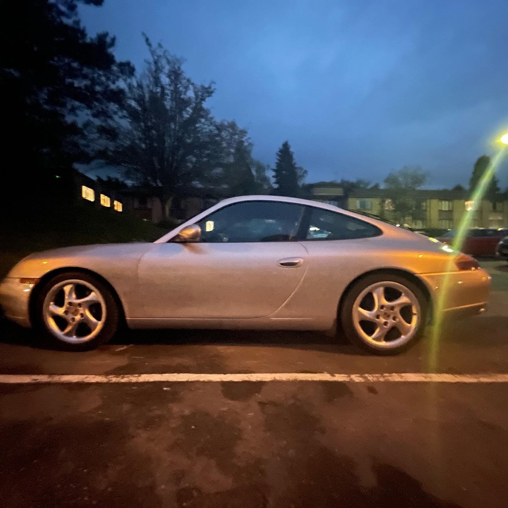
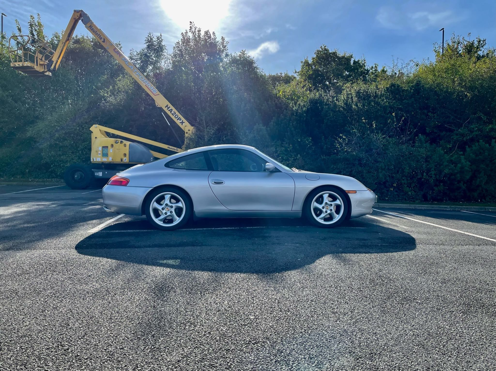

+++ 
draft = false
date = 2021-10-09T21:00:54Z
title = "Bought one!"
description = "Journey to buying my Porsche 996"
slug = "bought-one" 
tags = ['porsche']
categories = []
externalLink = ""
series = []
+++

After doing the PCP and lease thing for many years, I sold my BMW M140i back to the dealer in May, leaving me with £5K in my pocket. Little did I know that I could have kept it for another year and get even more. Never mind. I knew I wanted to just buy something interesting outright for not very much money. One last silly car before everything is electric. I decided on the last analogue 911 - the unloved 996.

The 996.1 was the first water cooled 911. The front, shared with a 986 Boxster, was controversial due to the large _fried egg_ headlights and the fact that from the front the cars looked identical, more or less. After many years of being ignored or made fun of, the 996 has aged pretty well. Prices have risen signifiantly in the past few years now that people realise that they were actually... pretty good. They will never have the following or explosive value increase of air cooled cars, but as a modern classic, they are a good buy. If you buy well.

I first found one at the local Nissan dealer. It was a 2003 C4 cabriolet. I didn't want a soft top, but it was a late car and well specified. In the back of my mind I knew I didn't want a cabriolet. During the negotiations the dealer sold the car to someone else. Fair enough, I was probably a difficult customer. In hindsight I am glad as I'm sure the _warranty_ on offer would have been entirely worthless.

Fast forward to September. After browsing PistonHeads and seeing the same tatty and overpriced examples at sketchy looking dealers, a promising private ad popped up. It ticked all of the boxes:

- 1998 C2 "sport pack" car
- Silver with black interior (no wild 90s colour schemes)
- 3.4 not 3.6 so possibly less chance of the dreaded bore score or IMS issues
- Bank 1 cylinder head replaced in 2005 due to crack (common on early ones: I guess it has been fine since!)
- Dual row IMS replaced in 2015 along with clutch, RMS, AOS, brake lines...
- Matching MPS4 tyres
- Hard back seats
- Cable throttle
- Low temperature thermostat and recent coolant change
- GT3 style centre console delete
- No sunroof
- Hollow spoke wheels
- M030 suspension originally
- 60K second hand gearbox as the old one expired at around 142000 miles
- Recent brake upgrades (EBC yellow stuff pads, braided hoses, GT3 cooling ducts, 997 master cyl, brake fluid)
- Recent semi solid RSS engine mounts
- Gundo'd exhaust as the stock note is very muted
- Working AC - new condensers in 2018
- Maintained by well regarded specialists, frequent services

Despite being over five years older than the first one I had looked at, I actually wanted it. It had high miles at just under 152000 but the owner was an enthusiast, having just bought a 997.1 GT3. It looked as if the other recent owners had also spent a fair bit on it. It felt right, so a deal was done and I ventured off to the South East to collect it, unseen without even bothering with a PPI. At the tail end of a pandemic with used car prices at stupid levels. During a petrol crisis. I certainly like to play the game on idiot mode. _What could possibly go wrong?_

My family put this down to one of Alex's mad capers and shrugged.

On my way down, my the bank notified me that they had decided to hold the transfer. After an hour of stress on the train and some frantic calls, the owner confirmed that the funds had been received. I was collected at the train station and was driven back in it. I could tell the car was even better than I was expecting.

I needn't have worried.

After inspecting the history (some VERY big bills over the years, oh no!) and filling in the "paperwork" online, I was soon on my way. The next challenge was to find some fuel. Thankfully the first local petrol station I passed had just received a delivery. Rather than drive back in a 23 year old car after a long train journey, I had had the foresight to book a nearby Travelodge. 

It was a pretty grim place, but I was glad to decompress there with a sandwich from the Tesco next door. I was probably more than a little bit stressed out, so it was a huge relief. 

I set off for home at 4AM. It was a pretty steady drive back at no faster than 65mph due to some pretty dense fog. Figuring out how to operate the fog lights was fun.

The car drove well but I didn't want to push it in the early hours. I just wanted to get home one piece. I made it back to the North East without issue. I was still apprehensive, but confident that against the odds, I'd managed to pick up a good 'un.

Now the fun begins. Wind noise, some suspension creaks, interior rattles and (gasp) a ticking noise on _tick over_ which I hoped wasn't as bad as the forums might have you believe. Let's see. All in all, very happy.