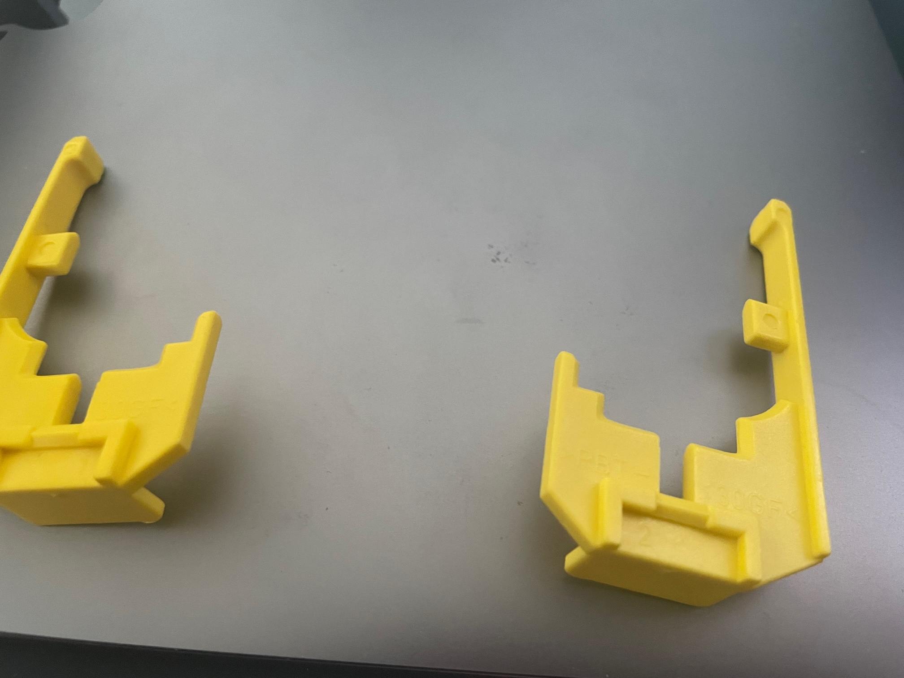

+++ 
draft = false
date = 2021-10-15T00:00:54Z
title = "Let there be light"
description = "Headlight upgrade"
slug = "light" 
tags = ['porsche']
categories = []
externalLink = ""
series = []
+++

Recent cars I've owned have had modern LED lights which makes night driving much easier. Older cars lights are shockingly bad in comparison as technology has moved on a lot in 25 years.

I took a punt on some [150% extra light bulbs from Halfords](https://www.halfords.com/motoring/bulbs/h7-477-car-headlight-bulb-halfords-advanced-up-to-plus150-percent-brighter-single-pack-718753.html). Huge upgrade and very cheap. They don't appear to run hotter or draw any more current so I'm hopeful nothing will melt.

Changing the bulbs is easy. You insert a special tool through a hole within the frunk and the unit pops out. No wires to undo. You can then take it indoors (it seems huge) and fit the new bulbs. Fitting is a reverse of removal, putting the entire unit back into the rails and rotating the tool until unit pops back in. It's a very loud pop which worried me.

The right hand side took around 2 minutes. The left hand side wasn't quite so easy.

The connector that the socket on the back of the light unit is on a stalk so that when the light pops back in, the connector also does. For whatever reason, the connector on this side was loose, so it was just resting on top of the socket. The connector is fitted to the stalk with a flimsy piece of yellow plastic - the only way I can describe it is like something out of a Christmas cracker. This locks the plug into the stack so that it remains rigid when the light unit is offered up to it. 

Part `996 631 24500` (LH) and `996 631 24600` (RH).

Luckily I managed to locate the yellow fitting that was loose in the headlight cavity and reattach it. Popped the lights in and all is good.

Paranoia set in so I paid a stupid amount of postage for two new ones, just in case. They'll probably sit in a box forever now.

I've had the lights out on other occasions and the whole process takes seconds now. A great design both for on the production line and for maintenance.

UPDATE: Well, great until it breaks. Apparently the plug was still misaligned (perhaps due to my ham fisted attempts to reinstall the light the first time) so the garage had to strip the arch out and properly locate the connector when they were replacing another bulb for me.