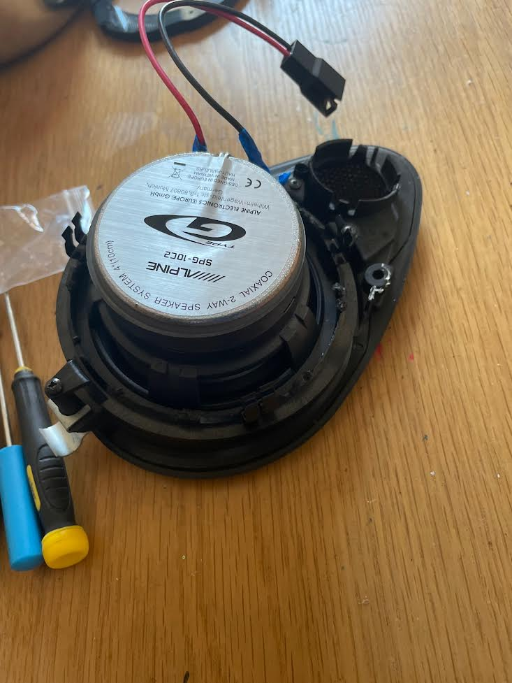

+++ 
draft = false
date = 2021-10-11T00:00:54Z
title = "Front dash speaker upgrade"
description = "Making Radio 2 sound a bit better"
slug = "speakers" 
tags = ['porsche']
categories = []
externalLink = ""
series = []
+++

My 996 has the middle of the range "hi-fi" package consisting of the MDR32 mini disc head unit (made by Becker) and six Nokia speakers powered by a small Nokia amp in the frunk. 

A Porsche CDC 3 changer was also added later by a previous owner which works perfectly, after I had found some CDs. No luck in finding my minidisc mix tapes from 2001. As it isn't a Bose system there's no weird DSP units or optical connections, as far as I know. This makes upgrading it cheaply a little easier.

I am glad that my car has the more basic audio as the contemporary _cutting edge_ from 1998 has aged very poorly. PacMan style satnav with large CD-ROM drives would be impossible to live with. A basic orange matrix display that shows `Radio 2` most of the time has aged far better.

The front dash speakers needed to go as the tweeters were blown. I followed [this guide on YouTube](https://www.youtube.com/watch?v=aIC-mP1hH50) which is basically a hack job. Destroy the disintegrated front speakers but salvage the connectors and mounts. You can then mount some [new Alpine speakers](https://www.amazon.co.uk/Alpine-SPG-10C2-10cm-2-Way-Speakers/dp/B002XCNPMS/ref=asc_df_B002XCNPMS/?tag=googshopuk-21&linkCode=df0&hvadid=310873119586&hvpos=&hvnetw=g&hvrand=1216362323464065415&hvpone=&hvptwo=&hvqmt=&hvdev=c&hvdvcmdl=&hvlocint=&hvlocphy=9046774&hvtargid=pla-562971012200&psc=1) within.

Very easy if you're happy to take a saw to some brand new speakers. They were less than £50 so I was not expecting much, but this was a huge improvement and great value for money. I only did the fronts but may do the backs later.

An even easier solution is to buy some [3D printed mounts on eBay](https://www.ebay.co.uk/itm/314000812679?hash=item491be82a87:g:WMoAAOSwYdRh-TV6) or [the whole kit including speakers, connectors and mounts... for a price](https://www.ebay.co.uk/itm/283868130472?hash=item4217dbeca8:g:~vsAAOSwv-5esIpY). I actually did get a set of the 3D printed mounts but unfortunately the speakers I had already bought were too big. D'oh.
