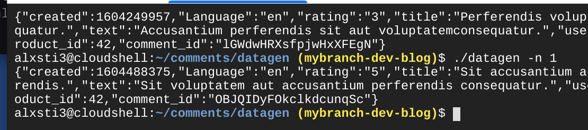
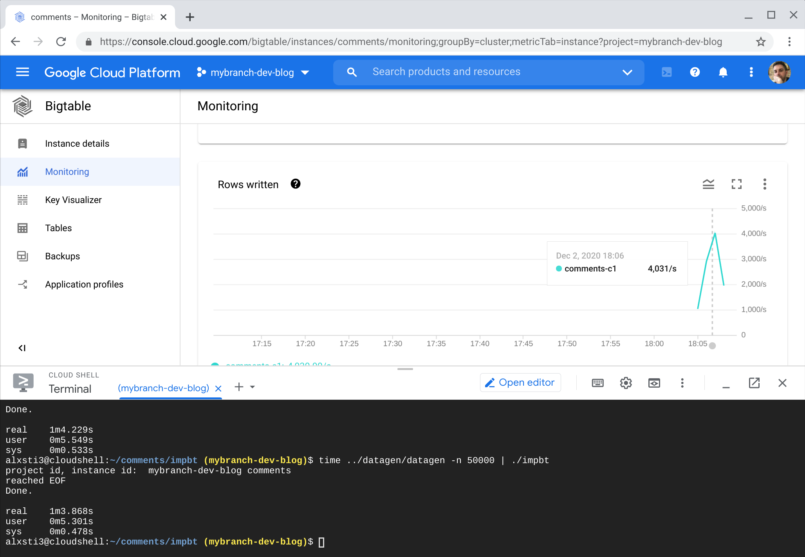
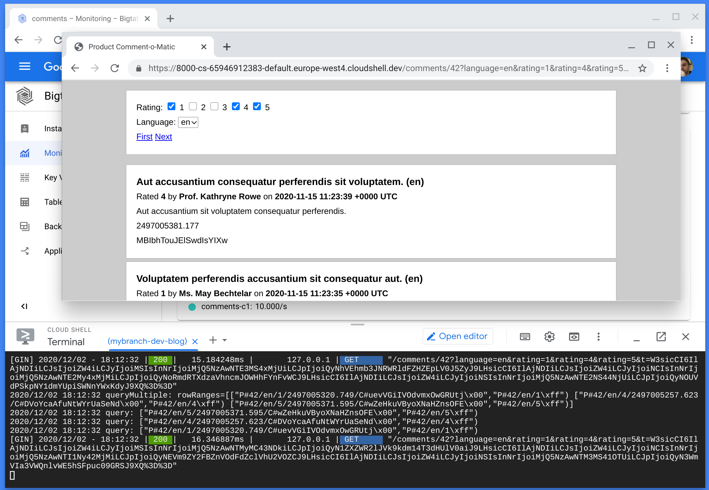
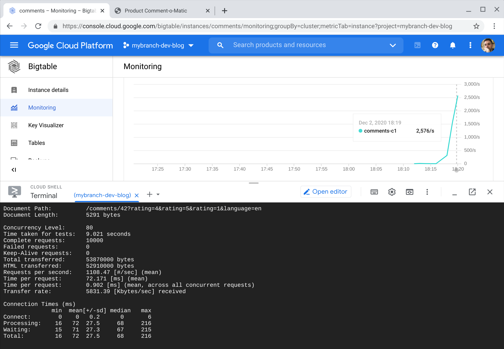
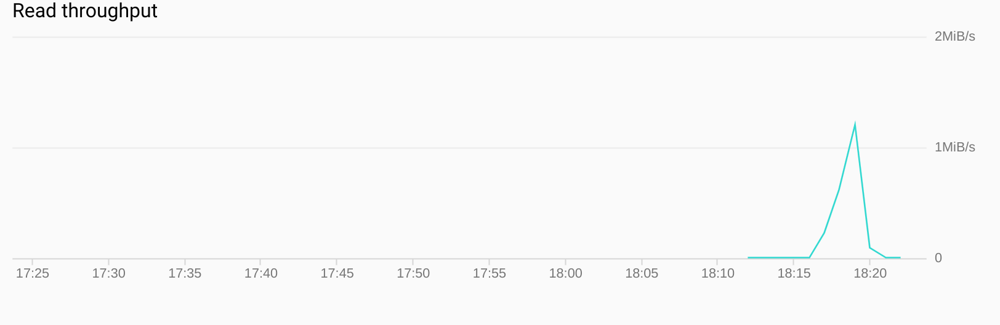
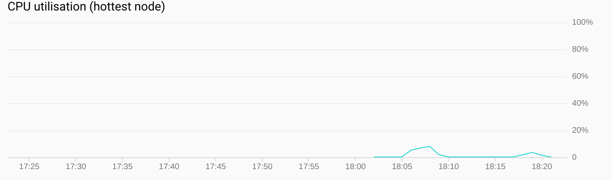

+++
draft = false
date = 2020-12-02T00:00:00Z
title = "Filtering and pagination with Cloud Bigtable"
description = "Building a paginated and filterable comments data model with Cloud Bigtable."
slug = "cloud-bigtable-paginated-comments"
tags = ["data","gcp","bigtable","dynamodb"]
categories = []
externalLink = ""
series = []
+++

In the [previous series of posts](/posts/dynamodb-efficient-filtering/), we built data model capable of filtering and paginating product comments with DynamoDB.

This post explores how we could solve the same problem with [Cloud Bigtable](https://cloud.google.com/bigtable).

You might wonder why another technology is now being discussed. It is my belief that a lot of the _thinking_ that goes into a data model design is somewhat portable, whether it be DynamoDB, Cloud Bigtable, Cassandra, HBase, or maybe even Redis.

It is worth pointing out that unlike DynamoDB, Cloud Bigtable is a poor fit for small amounts of data. It has a fairly high entry-level cost and optimizations that it can only perform at scale, making it overkill in many scenarios. That said, some of the modelling techniques presented here will apply to the larger volume and velocity scenarios where Cloud Bigtable makes more sense.

I am not suggesting you actually use Cloud Bigtable to build a product comments system, unless it was to be at a massive scale. Use DynamoDB, [Firestore](https://cloud.google.com/firestore), MySQL or one of the many alternatives. **However** ... if _comments as a service_ was your primary business offering, Cloud Bigtable could start to make more sense.

## Cloud Bigtable

Cloud Bigtable is a managed NoSQL offering from Google Cloud, similar to the internal Bigtable service that powers some huge Google properties, including search and GMail.

>Cloud Bigtable stores data in massively scalable tables, each of which is a sorted key/value map. The table is composed of rows, each of which typically describes a single entity, and columns, which contain individual values for each row. Each row is indexed by a single row key, and columns that are related to one another are typically grouped together into a column family. Each column is identified by a combination of the column family and a column qualifier, which is a unique name within the column family. [More..](https://cloud.google.com/bigtable/docs/overview#storage-model)

Despite this simple interface, Bigtable is an abstraction on top of a host of storage, infrastructure and workload orchestration genius.

There are several differences for a developer coming from DynamoDB. Most of note are:

- no dedicated sort keys, the only index is a single, lexicographic-ordered row key
- no automatically maintained secondary indexes
- no reverse scans
- no triggers to fan out the creation of duplicate records
- pay per node (minimum of $0.65/hr so around $450 a month for a single node, plus storage) rather than capacity units

Spinning up a Bigtable instance is near-instantenous through a single command. The only real dial to turn is adding more nodes and choosing between SSD or HDD storage. The bulk of the work lies with optimally modelling the data, with particularly careful thought around the row keys.

**Compute and storage are separate in Bigtable.** All nodes read data from a shared file system, meaning that there is no need to _load_ data onto a node so that it can answer queries about a partition of the dataset. In non-scientific terms, Bigtable arranges the workload based on the access patterns that we throw at it.

## Rejected approaches

A few approaches were considered before settling upon a port of the final DynamoDB solution.

### Power sets

The first option is to port the [original DynamoDB solution](/posts/dynamodb-efficient-filtering/) to Bigtable. In other words, we would duplicate a comment a large number times with different row keys to support all access patterns.

Although simple to implement, this approach will have a higher maintenance overhead than the DynamoDB version. There is no equivalent of DynamoDB Streams to create the projections in an event-driven manner, meaning this work has to be pushed out to the client program.

It would be possible to accept changes into a PubSub topic and have Cloud Functions or Cloud Run to update Cloud Bigtable. This has the drawback of making comment submission fire and forget: the comment will be accepted onto the topic, but will not be confirmed as having been written to the table.

### Regular expression row filter

Within reason, filters in Cloud Bigtable are more acceptable than with DynamoDB. **The big difference with Bigtable is the fact that a capacity increment is a single node. It is a _sunk cost_, so reading tens of thousands of rows maybe does not matter, when a single node is capable of scanning up to 220mb/sec.** Of course, this inefficiency will catch up with us as volume and concurrent access increases. Node resources are not infinite and scanning excessively will make query performance less predictable.

This solution differs as instead of creating many projections, we rely on row filters over a partition of comments for a product. By providing a start and end key, Bigtable will only scan rows relating to the relevant product. **This effectively partitions our data set so that we only scan comments for a given product.** If the key also contains the language, the query becomes more selective as only those rows will be scanned.

When using a filter, it is essential to whittle down the possible results as much as possible using a range or prefix scan.

If a product has uniform distribution of ratings and languages, this approach will work well. However, filtering for comments with a `1` rating when there are `20000` rows between the first `1`-rated comment and the next, will result in noticeable latency. Potentially the query will scan to the end of the comments for that product. This isn't a full table scan, but a _hot_ product with a lot of comments would cause this approach to have unpredictable read performance and resource utilisation.

## Access patterns

Once again, let's recap on the model we are building.

 >We are tasked with producing a data model to store and retrieve the comments shown on each product page within an e-commerce site.
 >A product has a unique identifier which is used to partition the comments. Each product has a set of comments. The most recent `20` comments are shown beneath a product. Users can click a next button to paginate through older comments. As the front end system might be crawled by search engines, we do not want performance to degrade when older comments are requested.

This can be broken down into the following access patterns.

- AP1: Show all comments for a product, most recent first
- AP2: Filter by a single language
- AP3: Filter by any combination of ratings from 1-5
- AP4: Show an individual comment
- AP5: Delete a comment
- AP6: Paginate through comments

## Row key design and projections

In order to port the DynamoDB solution, we need to rethink some aspects of the design.

Bigtable has no secondary indexes, so comment creation time needs to be embedded into the row key in order to newest comments first. As we need to filter on `language` and a set of selected `rating`s, these also need to be promoted into the key.

Bigtable does not support reverse scans and we need to show the most recent comments first. A trick to achieve this is to subtract the actual timestamp from a timestamp 100 years (or more) into the future.

``` python
LONG_TIME_FUTURE = 4102444800 # 1st Jan 2100 ...
created_ts = 1605387738 # 14th Nov 2020 ...
reversed_timestamp_key = str(LONG_TIME_FUTURE - created_ts)
```

The first element of the row keys for comment lists is `P#<product-id>`, ensuring all comments for a given product are contiguous. If this was a multi-tenant application, the first segment could be prefixed with a tenant identifier. The second element is a reverse timestamp, ensuring reverse time ordering of comments within that product.

The next two elements are the language and ratings attributes. Row keys have to be unique, so an identifier for the comment is appended as the last element.

So, assuming comment `1` for product `42` is in `language=en` and has `rating=5`, the following row key will be used:

- `P#42/2497057062123/en/5/COMMENT#1`.

There is a drawback to promoting the timestamp to the first element of the key. Although it provides us with global ordering for comments within a product, we cannot directly access all comments of a given rating or language without some degree of scanning and filtering. Changing the order of the segments within the row key would provide this locality, but would require us to change how we query the table.

By promoting `rating` before the timestamp in the row key, we would have a more selective index for filtering by rating. The downside is that rows would be sorted by `rating` and then timestamp. This is ideal if we only wanted to show a single rating, but requires parallel queries to satsify a query requiring multiple ratings. This is a worthwhile tradeoff.

Inspired by DynamoDB global secondary indexes, the solution is to manually _project_ the `comment` row **five** times:

- `C#<comment-id>` Main comment record, only directly accessed
- `P#<product-id>/~/~/<timestamp>/C#<comment-id>` All, no filters
- `P#<product-id>/<language>/~/<timestamp>/C#<comment-id>` By language
- `P#<product-id>/~/<rating>/<timestamp>/C#<comment-id>` By rating
- `P#<product-id>/<language>/<rating>/<timestamp>C#<comment-id>` By language and rating

It is up to the write path to ensure incoming comments are written to these rows. The read path will assume they are there and issue queries accordingly.

Bigtable has no atomicity between writes to multiple rows. There is a chance that a comment will fails to appear in all indexes. This could be rectified with a periodic check and repair job.

## Queries

The only type of query we can do in Cloud Bigtable is reading a single row, or range of rows. When reading a range of rows, a start and an end key should be provided to avoid performing a full table scan.

### AP1: Show all comments for a product, most recent first

Read rows from `P#42/~/~` to `P#42/~/~\xff`.

This will scan all reviews for this product until the page size is reached.

We have included two wildcards: one for language and one for rating in both the start and end key. This will ensure we _stay in lane_ and do not accidentally read rows from another projection.

### AP2: Filter by a single language

Read rows from `P#42/en/~` to `P#42/en/~\xff`

### AP3: Filter by any combination of ratings from 1-5

In parallel:

- Read n rows from `P#42/en/1` to `P#42/en/1\xff`
- Read n rows from `P#42/en/2` to `P#42/en/2\xff`
- Read n rows from `P#42/en/5` to `P#42/en/5\xff`

Merge results, sort by reverse timestamp, return topN.

For any language, use the wildcard `~` for the language segment.

When reading comments of rating 1-5, this can be simplified by issuing a single query to read from `P#42/en/~`.

### AP4: Show an individual comment

Read row from `C#<comment-id>`.

### AP5: Delete a comment

- Read row from `C#<comment-id>`, this will give attributes needed to form additional row keys.
- Synthesize `P#<product-id>` row keys for this comment and delete.
- Delete `C#<comment-id>` row.

### AP6: Show 20 comments per page, with ability to paginate

For the first page, read `20` rows. Find the row key of row `20` to use as a reference point in the table for the next page.

To fetch the next page, repeat the process by reading from that exclusive start key, with the same end key.

The approach for paging is the same taken for DynamoDB and is [explained in this post](/posts/dynamodb-efficient-filtering-3/). Cloud Bigtable does not return a value for `LastEvaluatedKey` like DynamoDB, but we can create one by simply inspecting the key for the last row displayed.

## Testing it out

Some small utilities were created to load a Cloud Bigtable instance with dummy data.

`datagen -n 1` emits _n_ dummy comments.



Piping its output through `impbt` imports the rows into the Cloud Bigtable table. 50,000 rows were added in about a minute. The utility was run on Cloud Shell, so it is possible that network bandwidth was the limiting factor.



Using Cloud Shell's great _web preview_ feature, I started the demo web application and verified it worked.



Then a very naive load test was run with `ab`. 10,000 requests were made to the same URL with a concurrency level of `80`. A better load test would have followed the pagination links. This is on the to do list.



Throughout the import and read test CPU use remained low.




These tests should be taken with a pinch of salt as they are in not realstic. However, they certainly prove that the data model works on Cloud Bigtable and does not work a single node cluster too hard.

## Summary

We have taken a design originally for DynamoDB and applied it Cloud Bigtable. While Cloud Bigtable has fewer features than DynamoDB, its design and raw performance at the lowest level of capacity has allowed us to think differently.

One notable Cloud Bigtable feature is its very simple integration with BigQuery. This provides a way of writing SQL queries against data held in Cloud Bigtable. There are many uses for this including batch aggregations, integrity checking jobs and ad hoc reporting. It would not be an approach you would use to power a production application, but it is a very low code way of performing operations against data held in Cloud Bigtable. DynamoDB supports similar with an EMR, but this is a truly serverless approach.

Cloud Bigtable's is gRPC based. Rows are streamed to the client over HTTP2, instead of being paginated into JSON responses split over many HTTP requests. No measurements were made, but the gRPC API is likely to have less protocol overhead.

The best fitting technology depends on the workload, budget and investment in either cloud. If all your services live in AWS, Cloud Bigtable would be a harder sell due to increased data transfer costs.

Both DynamoDB and Cloud Bigtable both force us to think at a lower level than a relational database to maximise efficiency. As previously stated, use of Cloud Bigtable would be overkill for a comments section unless the number of comments is incredibly high.

DynamoDB hits a sweet spot by being incredibly economical (possibly even free) for small workloads. Cloud Bigtable has a high initial price point of $0.65/hr for a single node cluster. A single Cloud Bigtable node can support a respectable number of operations, but this is only economical if you actually utilise them. A single node is the smallest billing increment.

As an answer to that, Google has other, more on-demand NoSQL products such as [Firestore](https://cloud.google.com/firestore). DynamoDB has an on-demand model, making it a versatile choice for workloads of all sizes - with provisioned pricing options to save money when the workload is better understood.

As workload size increases, the price differential between DynamoDB and Cloud Bigtable is likely to narrow. Both are fantastic, battle tested options that are great to work with.
