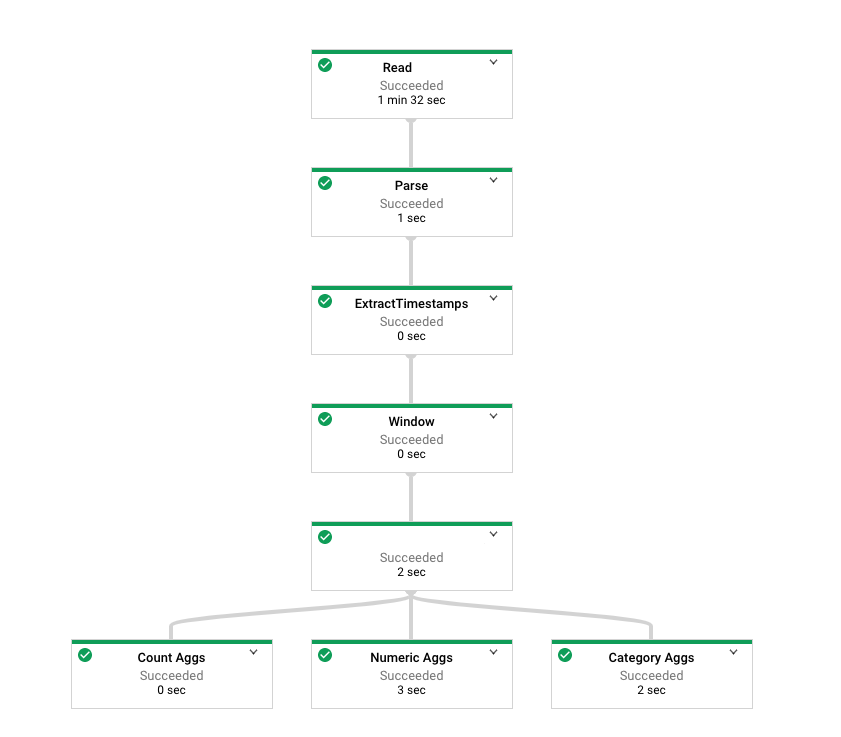

+++ 
draft = false
date = 2020-02-29T00:00:00Z
title = "Deep dive into Cloud Dataflow and Apache Beam"
description = "This week, I have been busy exploring Cloud Dataflow - Google Cloud's managed data processing platform using Apache Beam."
slug = "" 
tags = ["gcp","data","cloud dataflow","apache beam","spark"]
categories = []
externalLink = ""
series = []
+++

I have been busy doing a deep dive into [Cloud Dataflow](https://cloud.google.com/dataflow), as we look to potentially expand our use of it at work. There's a natural divide between the strong data offerings available on GCP, versus the rest of our estate which is over on AWS. BigQuery is clearly a gateway drug here - once committed to it, as we are, it becomes all too convenient to actually start processing data on GCP too.

Cloud Dataflow lets you process data from a variety of sources, without thinking about much other than _what_ you need to do with it. The infrastructure to run your pipeline is orchestrated and managed for you. It's a [well proven](https://techcrunch.com/2020/02/18/how-spotify-ran-the-largest-google-dataflow-job-ever-for-wrapped-2019/) with a handful of  high-profile users - for instance, if you got a Wrapped playlist from Spotify, it would have beeen a result of a Cloud Dataflow job.

Yet it doesn't get the same amount of press as Spark or Kafka Streams: offerings that aren't exactly the same, but potentially can be used to solve the same problems.

## What is Apache Beam?
The original SDK for Cloud Dataflow evolved into Apache Beam, making it agnostic of Google and GCP. If you wanted to, you could run your Apache Beam pipelines on other clouds via an alternate runner, such as Apache Flink or Spark. For a simple life, I'm using the managed service on GCP.

You define a data pipeline as a graph of transforms, starting with a _bounded_ source such as a database or collection of files. The source data is collected and processed, in parallel. Finally, you send your transformed data to a sink, such as a database table, data warehouse, collection of Parquet files or search index.

 The great thing about Apache Beam is that you can use same code, largely, when working with an _unbounded_ source such as a Kafka topic or message queue. Several years ago, the Lambda architecture advocated the use of batch and streaming/speed layers, which, at the time meant two distinct implementations. This made it a costly proposition. Today, with the Beam approach, it is feasible to consider backfilling/correcting from a bounded source whilst consuming in realtime from an unbounded source.

You write code in Java, Python or Go. Java seems to have the best support. If you know Scala, Spotify have released a library called [Scio](https://spotify.github.io/scio/index.html) as a higher level wrapper to Apache Beam. I've not tried this library as I've written very little Scala and I'd probably waste time learning Scala, but it looks like it makes for some very succinct code.

When you build your pipeline code, the graph is evaluated, validated and optimised. Any libraries you have used are uploaded to a Cloud Storage bucket, along with the serialized graph. You can then kick off your pipeline through the CLI or Console UI. In reality, a reliable scheduler should be used - Airflow has built-in operators for this very task.

## PTransforms, PCollections and I/O
The fundamental unit of work is a `PTransform<InputT, OutputT>`. It represents a step in your pipeline. A `PCollection` is an immutable, distributed data set that a transform operates on, element at a time. A `PTransform` returns a new `PCollection`. 

A `PTransform` is _applied_ to a `PCollection` to yield a new `PCollection`, potentially of a differing type.

A `PTransform` is the input and output of each step in a pipeline. As previously stated, a pipeline begins with a _source_ which is essentially a `PTransform<PBegin, OutputT>` that talks to some external source. At the end of the process, an _sink_ transform of `PTransform<InputT, PDone>` writes the data out to some storage or service.

Commonly, a `PTransform` executes _user code_ against the elements in a `PCollection`. This is achieved by wrapping a `DoFn<InputT, OutputT>` in a `ParDo` `PTransform`.

During pipeline execution, data in `PCollection`s might need to be passed between components, storage and VMs so needs to be serializable to byte strings. Each `PCollection` has a `Coder` attached to it. A `Coder` is analogous to a `Serde`, for those who are familiar with Kafka or Hive.

There are many [built-in I/O transforms](https://beam.apache.org/documentation/io/built-in/) for interfacing with external systems. GCP and AWS are well supported out of the box. As an exercise, I wrote a sink connector that interfaces with Salesforce's bulk API. It was not difficult, particularly as there were many established examples out there already. It is however important to understand the [rules](https://beam.apache.org/documentation/io/developing-io-java/) around serializability, immutability and thread safety.

## Grouping and Windowing
You can _group_ elements on their key or value. If they don't have a key already, you can add one through the `WithKeys` helper. Given `PCollection<KV<String, String>>` a grouping operation will yield `PCollection<KV<String, List<String>>>` - the value is now a list, with all values for that key in the list.

The SDK provides some higher level transforms, including many `CombineFn` implementations for calculating sums, means, approximate quantiles, and so on.

Applying time windows to data arriving into your pipeline is one of the most powerful, and potentially hardest to grasp aspects of Apache Beam. Firstly, for windowing to work, your input `PCollection` should have a timestamp on each element.

You can override the default timestamp provided by the source (i.e. Kafka), possibly by extracting a datetime value from the incoming record. Aggregations are then performed on the specified window, with _panes_ emitted when the window closes. There are many knobs to turn around window behaviour, so I'd strongly recommend reading the documentation. One interesting aspect is the ability to _trigger_ the emission of a pane even though it is not yet closed. This is useful for giving a running total of a window that has not yet closed. You can control whether or not to keep the emitted elements, and emit them again the next time the trigger fires. There is also a pletheora of settings around the handling of late data. Again, this is a big topic and a huge part of Beam, particularly when working with unbounded sources.

## Running a pipeline
Pipelines can take a set of options, which are runtime parameters such as an initial query or a bucket to read files from. You have two choices on how to execute your pipeline. You can either compile, upload it and execute it via Maven (or build a fat .jar and run that), or use Maven to submit a template. 

Templates fit in nicely with CI/CD approaches - your favourite build system such as Travis, Jenkins or Cloud Build runs the Cloud Dataflow tooling to upload the artifacts to Cloud Storage. They do, however, add some overhead. As options are not available at build time, they need boxed in a `ValueProvider<T>`. This means a reference to the value can be passed around the pipeline as a promise that it will contain a value at runtime, via its `get()` method. Unfortunately, this means that all parts of your pipeline that you want to inject options into **must** be able to accept a `ValueProvider`. If they can't, you're out of luck. 

It is also not possible to alter the shape of your pipeline graph (such as adding or removing certain transforms) at runtime. This is controlled at build time. You can still customise the graph through options, but in my mind these should be considered to be _build flags_ not _runtime parameters_.

A template can be run by supplying parameters, or `Options`. You can even supply metadata in a JSON file which causes the Cloud Dataflow UI to render a nice input form for your parameters. Airflow can also execute a pipeline from a template through the `DataflowTemplateOperator`.

When the pipeline is running you get a great visual representation of the graph showing throughput, along with any logs emitted.

(The above image is from a Cloud Dataflow pipeline I've been working on. Identifiable labels on the diagram have been removed. This example reads files from S3.)

The running activity display shows cumulative worker times, so if you have 10 VMs working for an hour, it'd show 10 hours - even though your pipeline only took an hour. As the fleet of VMs might grow over the lifetime of a pipeline run, this makes sense - although seeing an operation claim to have been running for 2 days takes some getting used to at first!

Common operations include aggregating metrics, joining data from multiple sources and easily parallelising transformations. 

Apache Beam works in both batch mode where a `PCollection` is bounded by the files or result set, or in _unbounded_ streaming mode where new data is always arriving from a streaming source such as Kafka or Cloud PubSub. As discussed above, Beam offers powerful windowing functionality - for instance, to count the number of impressions a page has in a 10 minute window, split by geographic region. The count can be emitted at the close of window, or before. This is a deep topic, well beyond the scope of this document.

## Thoughts so far
From my brief exposure, there are a few compelling things about the SDK (Beam) and managed _runner_ (Cloud Dataflow) that strike me.

The library allows you to compose your transforms as reusable building blocks. The same building blocks can mostly be used whether your source is streaming or batch. If you want to swap out the source or destination (or indeed any part of your pipeline), simply ensure the input and output types align. In other words, if your BigQuery sink expects a `Person` object, ensure that your Redshift sink also expects a `Person` object and if not, write an intermediate _adapter_ PTransform to map it.

The platform analyses your pipeline code and provisions infrastructure to run it. On Cloud Dataflow, this is across a number of Compute Engine VMs. As the job runs, the runner autoscales the VMs as needed. On Cloud Dataflow, [work can be rebalanced dynamically](https://cloud.google.com/blog/products/gcp/no-shard-left-behind-dynamic-work-rebalancing-in-google-cloud-dataflow).

In addition to orchestrating VMs, Cloud Dataflow can optionally offload expensive _shuffle_ operations (used in `GroupBy` operations) to a managed service, taking load off worker VMs. This external service incurs an additional cost, but Google claim it saves money as the VMs are up for a shorter period of time.

To take advantage of all of those autoscaled VMs, you might think that you need to do some pretty complex distributed programming and coordination. Nope. Just ensure that your _user code_ fits within Beam's programming model (which, admittedly, can take some time to learn properly.) The platform handles the distribution and coordination of work. It's pretty clever. 

At first the framework feels restrictive to work in, and some of the DSL-in-Java idioms a little weird at first, but by preventing you from doing things that will break (or making it difficult), the average developer stands a good chance of writing a data pipeline that scales nicely, if they stay within the guard rails. That's the promise at least. The Direct Runner is a strict implementation of the Beam programming model that does additional checks before running your pipeline locally. This can give some degree of confidence that it won't all collapse when you deploy it to the Cloud Dataflow runner.

Some data engineers or scientists may prefer to use the Python SDK, for consistency with other work they may do. The fundamentals don't change, but it is important to still write Python code that follows the Beam programming model. For instance, there might be little point in simply wrapping an existing Python program that uses `pandas` to count, or uses a multiprocessing library, when there are approaches that are native to Beam.

As discussed above, templates are powerful but keep in mind that they will not allow you to customise your pipeline significantly. Their intended use is for things like filenames and database tables.

Storing secrets such as credentials to external services is something that needs to be given careful thought. You could just pass them as options, but they'd be visible within the console. A better approach is to leverage the Secret Service or KMS within GCP, fetching them at runtime. Again, this relies upon your code being able to tolerate fetching these settings at runtime. The AWS Java SDK, although it lacks any explicit Apache Beam support (or does it need it), is pretty good in this regard. I implemented `GCPSecretServiceAWSCredentialsProvider`. (Catchy name, right? I used to write Objective-C.) This provider implementation does a request to the secret service to retrieve the credentials for the AWS SDK to use. It hooks in elegantly alongside the other providers in the chain. Of course, I'm running this pipeline on GCP and need access to AWS resources. If you were running this pipeline on AWS, this wouldn't be relevant, nor would it be if you only needed to access other GCP services as you'd use the IAM/service account implementation available on both of the clouds.

`Coders` can occasionally mean battling with Java's generics system. Avro appears to be the recommended approach for user code models, but there are some rough edges around date handling. It is possible to hack around those (or simply just represent dates using `long`). In some cases, it's acceptable to use Java's in-built serialization. This works, but you will receive warnings if your model objects do not override a hashCode and equals. A workaround is to use a library like [immutables](https://immutables.github.io/) or [autovalue](https://github.com/google/auto/tree/master/value).

Which reminds me, when adding new PTransforms use of the builder pattern is recommended. Nobody in their write mind would write builder code by hand, and the Apache Beam team recommend the use of [autovalue](https://github.com/google/auto/tree/master/value). Whilst it works, I find that there's still a fair amount of boilerplate involved. However, despite this, when writing custom PTransforms that have a lot of parameters, I use it. For model objects, I recommend immutables - but it really doesn't matter too much.

## Conclusion
Hopefully the above notes are useful. I enjoy working with this technology and am excited to get even more pipelines into production with it.

[Discuss on Twitter](https://twitter.com/search?q=mybranch.dev%2Fposts%2Fcloud-dataflow)
