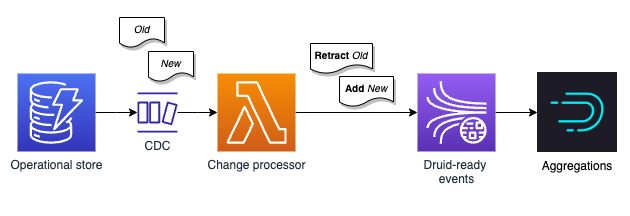

+++ 
draft = false
date = 2022-08-07
title = "Using change data capture to perform flexible aggregations with Druid and DynamoDB"
description = "Druid is built to store immutable events, not records that can get updated at any time. This post explores how to build a Druid data source from a DynamoDB table to provide flexible aggregations."
slug = "druid-cdc"
tags = ["druid", "dynamodb", "cdc", "change data capture", "dynamodb-streams", "olap", "elasticsearch", "opensearch", "counts"]
categories = []
externalLink = ""
series = []
+++



[Apache Druid](https://druid.apache.org) can ingest and store huge volumes of events for interactive analysis. 

Events are things that have happened: a user buys something, a temperature reading changes, a delivery van moved and so on. It is useful to be able to aggregate these events interactively to spot trends and understand behaviour. Events can be filtered and split based on dimension values, allowing us to explore data. In addition, flexible data sources provide engineers with an easy way of gathering metrics to surface to end users. _You have tweeted in **93** times today!_

Unfortunately getting a stream of events from systems that aren't event driven can be a challenge. Changes are persisted by mutating an existing record in an operational store.

**When a single record is mutated over time, I found it challenging to reflect this in Druid.** This is because Druid stores data in segments that are immutable. The segment in which an event is stored is determined largely when it happened. The only way to change or remove a single event is to rebuild the segment without it, perhaps by reingesting the entire time interval. If the workload is not time sensitive and volume manageable, then it can be feasible to simply _drop and reload_ the current year on a nightly basis. But it then becomes a challenge knowing where to place the records in time. If a user signed up in 2015, does their record always live in the 2015 segment? Or does the user cease to exist in 2015, and jump forward to the 2022 segment? **It just doesn't feel right.** 

## Change data capture to the rescue
Luckily, many operational databases support [change data capture](https://en.wikipedia.org/wiki/Change_data_capture) streams. 

This gives us some events to work with whenever changes occur in the database. They're not descriptive business events like _user changed surname_. 

They instead convey the change made to the record, for instance _user id 5 updated, here's the old version and here's the new version_.

## Magic Druid events
With a little bit of processing, we can transform these CDC events into a stream of events that are tailored for Druid.

DynamoDB can publish the time, type of event (insert, modify, delete) and importantly both the old and new _images_ of the item being changed.

Two additional fields are computed:
- **retraction?** A boolean set to true if the event type is a `delete` OR a `modify` AND at least one of the dimension values has changed
- **count** an integer set to `-1` if retraction is true, otherwise `1`

These are explained further in the following sections.

### Assert and retract
If a new value needs to be stored, it is an **addition** so `retraction: false`.

If the record is being **modified** this is both a retraction of previously asserted values as well as an assertion of the new, replacement values from that point onwards. Two events would be stored in Druid: one with the old values with `retraction: true` and one with the new values and `retraction: false`.

If the record is being **deleted** then previously asserted events need to be retracted from that point onwards, so `retraction: true`.

Storing events in this way allows Druid to give answers _as of_ a certain date interval.

### Count
Conceptually similar to a bank account, _reducing_ the positive and negative `count` values will give us the current count _balance_. 

The below vector represents give additions, each set to 5.

```clojure
(reduce + [1 1 1 1 1]) => 5
```

If a retraction happens, this is appended. The same reduction will see the count will decrease.
```clojure
(reduce + [1 1 1 1 1 -1]) => 4
```

In a Druid data source, a `SELECT SUM("count") FROM datasource` query can be used to find this count. A `WHERE` clause can be added to filter by any defined dimension. This could be used to only show the count relating to a given customer, as well as the collective value. Other Druid queries are of course possible, for instance splitting by dimensions such as `country` and only showing the `topN` dimensions.

As noted previously, adding a `__time` interval allows for temporal queries, enabling Druid to answer questions like _what was the count for this customer during July 2022?_

This approach will get slower with a large number of events. In the next section rollups are discussed. This is similar to using snapshots with event sourced systems: rather than replaying every event, start from an _opening balance_ as the initial value of the sum.

The first element in the vector below is an opening balance of `292`. Subsequent values are applied to it.

```clojure
(reduce + [292 1 1 1 1 -1]) => 295
```

### Rollup
Storage and query time can be reduced by _rolling up_ when the events are ingested. If the workload can tolerate granularity of a day, Druid can simply store the reduced value for a given set of dimensions. Assuming the six events from the previous section `[1 1 1 1 1 -1]` were the only events for that day, Druid would store a count of `4` in a single pre-aggregated event. It now has less work to do at query time.

## DynamoDB
This pattern can be used with DynamoDB as shown in the simple architecture below. The requirement is to provide a **flexible** data source that can provide a count which can be split and filtered by a number of dimensions. For instance: _location with the most users_, _most active user today_ and so on.


The operational store is configured with a DynamoDB stream that triggers a Lambda function whether the table items are modified. The Lambda function transforms the CDC events into the Druid events described previously. 

The events are written to a Kinesis stream which is then ingested by Druid. Changes are reflected within a few seconds. The realtime ingestion rolls up the events by the hour and a later batch job rolls up to a day.

## Conclusion
As a test, around **twelve million** events were ingested into a single data node Druid cluster running on an `r6gd.xlarge` instance. Storage footprint was around **350MB** including five string dimensions. Query performance is consistently in low double digit milliseconds.

**In summary, this pattern gives us a flexible, high performance data source allowing counts to be split and filtered by our included dimensions. As Druid's segments are immutable and stored on S3, additional historical nodes can be added trivially in order to scale reads. The only code required is that of the Lambda function to convert CDC events into Druid events.**

But just how flexible do you _really_ need to be?

Maybe you don't need this. You can certainly aggregate in simpler technologies than Druid! It may be acceptable to simply accumulate the values in a Lambda function and keep them in DynamoDB.

If it feels like you are starting to write your own _poor man's Druid_ or already happen to have Druid available, then this approach may be worthy of your consideration, particularly if your use case can benefit from the temporal capabilities shown.

Let me know what you think! I'm [@alexjreid](https://twitter.com/AlexJReid) on Twitter.