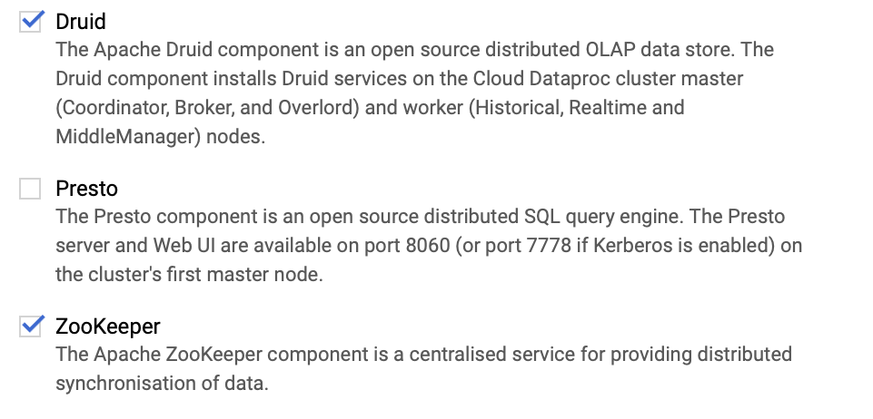

+++ 
draft = false
date = 2020-04-16
title = "Running Druid on Cloud Dataproc"
description = "Today I discovered a ridiculously easy way to run a Druid cluster on GCP: flick a switch when creating a Cloud Dataproc cluster."
slug = "druid-on-dataproc"
tags = ["data","druid","olap","gcp","dataproc"]
categories = []
externalLink = ""
series = []
+++

Today I discovered a ridiculously easy way to run a [Druid](https://druid.io) cluster on GCP: flick a switch when creating a Cloud Dataproc cluster. It's even a recent version (0.17 at time of writing).



Great, right? (Assuming you don't mind using something labelled _alpha_ by Google.)

## Customisation
There is literally no documentation other than the page I stumbled across: [Cloud Dataproc Druid Component](https://cloud.google.com/dataproc/docs/concepts/components/druid).

After running up a small cluster, I noticed some things were missing:
- the [Druid router](https://druid.apache.org/docs/latest/design/router.html) process contains a great console which makes one-off ingests easy to achieve. Unfortunately, this is not enabled.
- the `druid-google-extensions` extension is not included, meaning the cluster cannot load files from GCS.

Luckily, Cloud Dataproc provides a mechanism called _initialisation actions_ for customising nodes. These are nothing more than scripts that each node pulls from GCS and executes. I created two scripts to rectify the above.

- `enable-druid-router.sh` creates a config file and systemd unit for the router process; this means the master node will listen on port 8888. [Gist](https://gist.github.com/AlexJReid/1f0cc59d31a2ac8ff1e69d2c756a098c)
- `enable-google-extensions.sh` appends a different `druid.extensions.loadList` line in the common properties file, enabling GCP ingest support. [Gist](https://gist.github.com/AlexJReid/1684106b2118dfa69f98b68345cad634)

Nothing too out of the ordinary.

## Running it
Anyone who is famiilar with Druid will know that it can take a bit of effort to learn and configure well. For a simple cluster, this can be reduced to almost a one-liner.

```
gcloud dataproc clusters create druid-example \
    --region europe-west1 \
    --subnet default \
    --zone europe-west1-b \
    --master-machine-type n1-standard-4 \
    --master-boot-disk-size 500 \
    --num-workers 2 \
    --worker-machine-type n1-standard-4 \
    --worker-boot-disk-size 500 \
    --num-preemptible-workers 2 \
    --image-version 1.5-debian10 \
    --optional-components DRUID,ZOOKEEPER \
    --tags druid \
    --project myproject \
    --initialization-actions 'gs://your-dataproc-actions-bucket/enable-druid-router.sh'
```

## Thoughts
The component is labelled alpha, so could vanish at any time. It isn't really doing anything clever, it just means that Druid is part of the standard image for all Dataproc machines. It is ready to be used in a few minutes of provisioning a cluster.

The above initialisation actions are brittle because I'm assuming Google won't change where they install Druid.

By default, the cluster uses storage HDFS rather than GCS or S3. This could be changed with yet another initialisation action.

One of the nice things about Druid is the ability to scale out the various processes as required. This approach is opinionated: the master(s) run the query, broker, coordinator and overlord processes (as well as Zookeeper), the worker nodes serve as historical, middle manager and indexing processes. 

That said, there still might be a lot of value in this simple setup. It'll be interesting to see if Google evolve this component in the future. Even _some_ customisation options would be great.