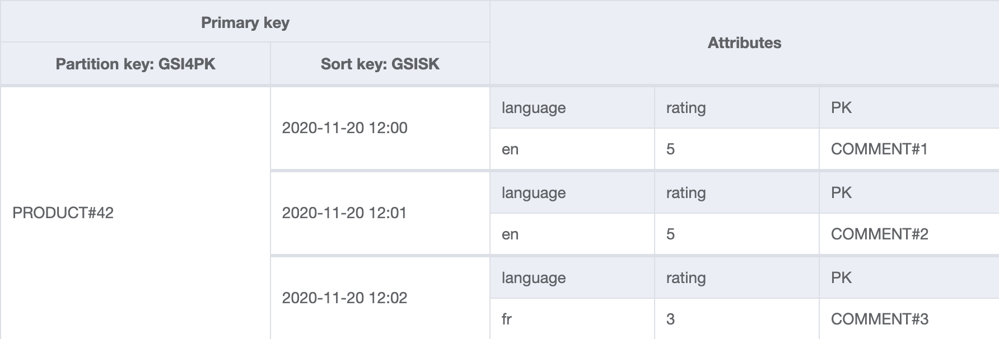

+++ 
draft = false
date = 2020-11-21T19:00:00Z
title = "Efficient NoSQL filtering and pagination with DynamoDB - part 2"
description = "An exploration of using data duplication to implement an efficient paginated and filterable product comments system on DynamoDB. In this post, we improve upon our original design with more GSIs and parallel queries."
slug = "dynamodb-efficient-filtering-2"
tags = ['nosqlcommments','dynamodb']
categories = []
externalLink = ""
series = []
+++

In the [previous post](/posts/dynamodb-efficient-filtering/), a paginated and filtered data model representing product comments was discussed. It was not a perfect solution as a large number of redundant items were created by code that we would have to maintain. 

**In this post, we will improve upon our original model with more GSIs and parallel queries.**

Previously, we had to create a Lambda function and use DynamoDB Streams. DynamoDB has built-in functionality that can achieve this more effectively: global secondary indexes.

In addition, there was a desire to keep the client program simple and get an answer from a single request to DynamoDB. If we relax that possibly misguided notion and allow ourselves to issue multiple queries in parallel, gathering and processing the small amount of returned data within our client, we might end up with a better model.

Let's apply both approaches and see what happens.

## Access patterns

Firstly let's recap on the model we are building.

>We are tasked with producing a data model to support the comments that get shown on each product page within an e-commerce site. 
>A product has a unique identifier which is used to partition the comments. Each product has a set of comments. The most recent `20` comments are shown beneath a product. Users can click a next button to paginate through older comments. As the front end system might be crawled by search engines, we do not want performance to degrade when older comments are requested.
This can be broken down into the following access patterns.

- AP1: Show all comments for a product, most recent first
- AP2: Filter by a single language
- AP3: Filter by any combination of ratings from 1-5
- AP4: Show an individual comment
- AP5: Delete a comment
- AP6: Paginate through comments

## Table design

>To save space, not all non-indexed item attributes such as the comment title, text and username are not shown on the below diagrams. `language` and `rating` are shown to demonstrate non-key attributes being projected into GSIs.

### Table

The below table contains three comments for product `42`. To create a comment, a single item is written to the table with the keys shown. The write path is out of scope. Imagine it is an API that receives a `POST` request from a web or mobile client, generates an `Item` that conforms to our model and makes the `PutItem` call.


That's a lot more than key attributes than last time! This is because items need to contain a key for each of the indexes they're going to appear in. We reuse `GSISK` across all of the other indexes as it stores the creation date, the common sort key.

**DynamoDB handles the projection of necessary keys and attributes into four other indexes on our behalf.** Only a subset of attributes from the table are projected to save space and reduce query costs. This is shown in the following diagrams.

We form the partition key with this pattern:
```
PRODUCT#<identifier>[/<projected filter 1>/<projected filter 2>]
``` 
We populate the sort key with a sortable date string to ensure ordering. As seen above, we need to use slightly different partition keys to support a range of queries. Discussion around the keys used in each GSI is explained in the following sections.

### GSI: byLangAndRating


The partition key contains the product identifier, comment language and rating. The date, a sortable string, is used as the sort key.

This index is suitable for getting all comments for a single language and single rating. Only a subset of attributes from the table are projected to save space and reduce query costs.

### GSI 2: byLang


The partition key contains the product identifier and the comment language. The creation date (stored in `GSISK`) is used as the sort key.

This index is suitable for getting all comments for a given language, regardless of rating. This is the default state when a user visits each product page, so will see the most traffic.

### GSI 3: byRating


The partition key contains the product identifier and the comment rating. The creation date (stored in `GSISK`) is used as the sort key.

This index is suitable for getting all comments for a given rating, regardless of language.

### GSI 4: all



The partition key contains just the product identifier. The creation date (stored in `GSISK`) is used as the sort key.
As its name would imply, this index is suitable for getting all comments of any language and any rating.

## Queries

All queries should have `ScanIndexForward` set to `false` in order to retrieve the most recent comments first, and a `Limit` of `20`.

### AP1: Show all comments for a product, most recent first

- Query on `all`
    - GSI4PK = `PRODUCT#42`

### AP2: filter by a single language

- Query on `byLang`
    - GSI2PK = `PRODUCT#42/en`

### AP3: Filter by any combination of ratings from 1-5

#### a. Single language

- Rating `2, 3 or 5` in language `en`
    - In parallel:
        - Query on `byLangAndRating`
            - GSIPK = `PRODUCT#42/en/2`
            - Limit = `20`
        - Query on `byLangAndRating`
            - GSIPK = `PRODUCT#42/en/3`
            - Limit = `20`
        - Query on `byLangAndRating`
            - GSIPK = `PRODUCT#42/en/5`
            - Limit = `20`
    - Gather results into single collection, reverse sort on `GSISK` and return top N

#### b. Any language, single rating

- Rating `2`
    - Query on `byRating`
        - GSI3PK = `PRODUCT#42/2`

#### c. Any language, multiple ratings

- Rating `3 or 5`
    - In parallel:
        - Query on `byRating`
            - GSI3PK = `PRODUCT#42/2`
        - Query on `byRating`
            - GSI3PK = `PRODUCT#42/5`

### AP4: Show a comment directly through its identifier

- `GetItem` on table
    - PK = `COMMENT#100001`
    - SK = `COMMENT#100001`

### AP5: Delete

- `DeleteItem` on table
    - PK = `COMMENT#100001`
    - SK = `COMMENT#100001`

### AP6: Paginate through comments

Run any of the above queries with `Limit` set to `20`. Use `LastEvaluatedKey` returned by DynamoDB to paginate through results by passing it as `ExclusiveStartKey` in the next query request.

Pagination support for `AP3` is slightly more complicated and will be covered in the next post.

## Query planning

Logic is required to choose which access pattern is best suited to resolve a query based on the provided parameters.

For instance, given:

- `language=en`
- `rating=1 rating=2 rating=3 rating=4 rating=5`

`AP2` will be used as all ratings are specified, making the filtering a needless cost. The results will be the same for more work.

`AP3a` would be used if only `rating=2 rating=4` are required.

If no filtering is specified, `AP1` would be used.

The following code snippet demonstrates shows a basic implementation.

```go
baseKey := NewProductKey(productID) // => PRODUCT#42

// Select strategy based on filter parameters
// This tells us what index to query, what key to use and its value
switch findStrategy(language, ratings) {
case all:
    items, err = performQuery("GSI4PK", baseKey, "all")
case allLangSingleRating:
    items, err = performQuery("GSI3PK", baseKey.Append(ratings[0]), "byRating") // => PRODUCT#42/5
//... etc
}
```

Databases have query planners. If you've ever prefixed a SQL query with `EXPLAIN` and tried to make sense of the output, you have just asked the database how it will satisfy your query. This is the work the database will do if it were to execute the query. Although the example above is a crude switch statement, it is performing the same role. Given `input` use `index` with `key(s)`.

This logic, along with any parallel query coordination (discussed in the next section), should be written once and provided to consumers either as a library or an API. This abstraction provides a high level interface to the model. We can also make improvements without needing consumers to change their code.

## Parallel queries

Multiple ratings are required for `AP3`. Our design dictates that this is achieved by issuing multiple queries. Doing this in parallel can reduce latency. Modern languages like Go make this fairly straightforward, as demonstrated below. A similar outcome could be achieved with promises, futures or threads in other languages.

```go
func performQueryMultiple(pk string, pkValues []string, indexName string) ([]CommentDynamoItem, error) {
	type batchResult struct {
		items  []CommentDynamoItem
		errors []error
	}

	var wg sync.WaitGroup
	itemsCh := make(chan []CommentDynamoItem)
	errorsCh := make(chan error, len(pkValues)) // Buffered to not block

	// Wrap perform query, yielding its output to itemsCh and errorsCh
	batchPerformQuery := func(pkv string) {
		defer wg.Done()
		items, err := performQuery(pk, pkv, indexName)
		// Log and pass on errors
		if err != nil {
			errorsCh <- err
		}
		itemsCh <- items
	}

	// Consume items from DynamoDB and yield topN
	batchResultCh := make(chan batchResult)
	go func() {
		var allItems []CommentDynamoItem
		var errors []error

		for items := range itemsCh {
			allItems = append(allItems, items...)
		}

		for error := range errorsCh {
			errors = append(errors, error)
		}

		if len(errors) > 0 {
			batchResultCh <- batchResult{errors: errors}
		} else {
			// Reverse sort on GSISK/creation date
			sort.Slice(allItems, func(i, j int) bool {
				return allItems[i].GSISK > allItems[j].GSISK
			})
			// Send topN
			batchResultCh <- batchResult{items: allItems[0:min(20, len(allItems))]}
		}
	}()

	// Begin by dispatching a query for each key in pkValues e.g. PRODUCT#42/1, PRODUCT#42/4
	for _, pkv := range pkValues {
		wg.Add(1)
		go batchPerformQuery(pkv)
	}
	// Wait for queries to complete or fail. Close channels to stop above consumer.
	wg.Wait()
	close(itemsCh)
	close(errorsCh)

	// Collect the aggregated output from the consumer, checking for any errors that occurred.
	result := <-batchResultCh

	if len(result.errors) > 0 {
		// Roll errors into one
		err := errors.New("one or more dynamodb calls failed")
		for _, e := range result.errors {
			err = errors.Wrap(err, e.Error())
		}
		return nil, err
	}

	return result.items, nil
}
```

The above function runs multiple queries, collects the results (up to `len(pkValues) * 20` items, combined), reverse date sorts them and returns the top N items. It makes multiple calls to `performQuery` which actually runs the query. `performQuery` is also used directly for simpler access patterns that can be answered in a single query.

```go
func performQuery(pk string, pkValue string, indexName string) ([]CommentDynamoItem, error) {
	log.Printf("performQuery: pk=%s, pkValue=%s, indexName=%s", pk, pkValue, indexName)

	q := expression.Key(pk).Equal(expression.Value(aws.String(pkValue)))
	expr, err := expression.NewBuilder().WithKeyCondition(q).Build()
	if err != nil {
		return nil, fmt.Errorf("unable to build expression: %v", err)
	}

	results, err := client.Query(&dynamodb.QueryInput{
		TableName:                 aws.String(tableName),
		IndexName:                 aws.String(indexName),
		Limit:                     aws.Int64(limit),
		KeyConditionExpression:    expr.KeyCondition(),
		ExpressionAttributeValues: expr.Values(),
		FilterExpression:          expr.Filter(),
		ExpressionAttributeNames:  expr.Names(),
		ConsistentRead:            aws.Bool(false),
		ScanIndexForward:          aws.Bool(false),
    })
    
	if err != nil {
		return nil, fmt.Errorf("unable to complete query: %v", err)
	}

	var items []CommentDynamoItem
	err = dynamodbattribute.UnmarshalListOfMaps(results.Items, &items)
	if err != nil {
		return nil, fmt.Errorf("unable to unmarshal items: %v", err)
	}
	
	return items, nil
}
```

## Building the table

**There is nothing to do here. DynamoDB will handle the replication _and_ keep the duplicated items in sync.** Deleting a comment is now just a case of deleting the item from the table. This is a huge win, reducing the risk of inconsistencies while lowering costs.

## It works!

A simple UI was built on top of this model. Notice how the query is resolved using different indexes and keys depending on the query parameters.


## Problems

You might have noticed that we're fetching more data than we return in `AP3`. Page size is `20` comments, yet we are loading `20 * number_of_rating_values`, so `[1, 2, 3, 4]` would load up to `80` comments, throwing away `60`. We _overscan_ so that we can be sure we have enough records from each rating to fill up the page, after the combined results have been sorted by date. (As explained earlier, for `[1, 2, 3, 4, 5]`, the filter is a no-op, so our query planner will bypass this and use a more optimal index.)

You might think that it would be more efficient to perform a query to get `60` keys and then do a `BatchGetItem` on the top `20`. This will cost more as a `BatchGetItem` _charges_ a minimum of one read capacity unit (RCU) per item, allowing us to read a single item up to `4KB`. A comment will be nowhere near that big, so this approach would be wasteful. A query, on the other hand, consumes RCUs based on the actual data read, allowing us to read at least ten comments with a single RCU.

In addition, a product may have comments with only `5` and `1` ratings. There is no point in looking for other ratings. We can improve on these potentially wasted calls by maintaining counters for each rating. A query for comments with rating `3` can be skipped if the corresponding count is `zero`. This has will be explored in the next post.

## Summary

**We've built a comment filtering solution without needing to use DynamoDB filters and we haven't needed to duplicate data excessively.** We are still duplicating, but are doing so on a far smaller scale. Importantly, the duplication, or rather, index projection, is now handled by DynamoDB. We no longer need Lambda and DynamoDB streams to maintain the table.

The client code is now more complex, but there is a lot of flexibility when DynamoDB and the client work together in unison to provide a _data service_. These are implementation details that consumers of the model should not be exposed to. It is essential to encode this logic into a library or API so that all consumers can work at a higher level.

**When working with DynamoDB it is better to directly address known access patterns instead of trying to build something overly generic and reusable.** We cannot use this model to meet every new access pattern as we might do with a relational database, but the model is flexible enough to answer more questions efficiently, such as:

> Show the most recent positive and most recent negative comment for a product

> When was a product last commented on?

> ... and so on, let me know if you spot any others!

The [NoSQL Workbench](https://docs.aws.amazon.com/amazondynamodb/latest/developerguide/workbench.html) model is [available for download](product-comments-nosql-wb-v2.json). NoSQL Workbench is a **great** tool, try it out if you haven't already.

In the final post, we will add some statistics, pagination and add an API. After that we will explore how we can solve the same problem with another NoSQL database, Cloud Bigtable. Thanks for following along so far!

[Discuss on Twitter](https://twitter.com/search?q=alexjreid.dev%2Fposts%2Fdynamodb-efficient-filtering-2)

_Comments and corrections are welcome._
