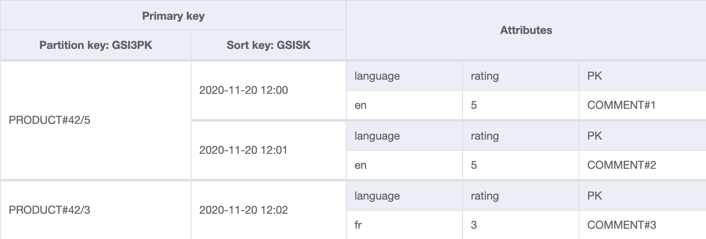

+++ 
draft = false
date = 2020-11-21T19:00:00Z
title = "Efficient NoSQL filtering and pagination with DynamoDB - part 2"
description = "An exploration of using data duplication to implement an efficient paginated and filterable product comments system on DynamoDB."
slug = "dynamodb-efficient-filtering-2"
tags = ['nosqlcommments','dynamodb']
categories = []
externalLink = ""
series = []
+++

In the [previous post](/posts/dynamodb-efficient-filtering/), a paginated and filtered data model representing product comments was demonstrated. It was not a perfect solution as large number of redundant items were _manually_ created by our code. The number of permutations would increase dramatically if the queries got even slightly more complicated.

Although this isn't a bad trade off if write volume and is low queries are unlikely to get more complex, we should iterate to see if we can do better. 

Previously, we had to write code and use DynamoDB Streams to write duplicate entries. DynamoDB has built-in functionality that can achieve more or less the same thing: global secondary indexes.

In addition there was a desire to keep the client program simple and get an answer from a single request to DynamoDB. If we relax that possibly misguided notion and allow ourselves to issue multiple queries in parallel, gathering and processing the small amount of returned data within our client, perhaps we can end up with an more efficient model.

Let's apply both of these approaches and see what happens.

## Access patterns

Here is a recap of the access patterns.

- AP1: Show all comments for a product, most recent first
- AP2: Filter by a single language
- AP3: Filter by any combination of ratings from 1-5
- AP4: Show an individual comment
- AP5: Delete a comment
- AP6: Paginate through comments

## Table design

> Due to space constraints, not all non-indexed item attributes such as the comment title, text and username are not shown on the below diagrams. `language` and `rating` are shown to demonstrate non-key attributes being projected into GSIs.

### Table

The below table contains three comments for product `42`. To create a comment, a single item is written to the table with the keys shown.


That's a lot more than key attributes than last time! This is because items need to contain a key for each of the indexes they're going to appear in. We reuse `GSISK` across all of the other indexes as it stores the creation date of the comment.

Only a subset of attributes from the table are projected to save space and reduce query costs. This is shown in the following diagrams.

We form the partition key with the pattern `PRODUCT#<identifier>/<projected filter 1>/<projected filter 2>` and use the sort key to ensure correct ordering. As seen above, we need to use slightly different partition keys to support a range of queries. Discussion around the keys used in each GSI is detailed in the following sections.

### GSI: byLangAndRating


The partition key contains both the product identifier and comment language. The date, a sortable string, is used as the sort key.

This index is suitable for getting all comments for a single rating and single language. Only a subset of attributes from the table are projected to save space and reduce query costs.

### GSI: byLang


The partition key contains just the comment language. The creation date (stored in `GSISK`) is used as the sort key.

This index is suitable for getting all comments for a given language, regardless of rating. This is the default state when a user visits each product page, so will see the most traffic.

### GSI: byRating



The partition key contains just the comment rating. The creation date (stored in `GSISK`) is used as the sort key.

This index is suitable for getting all comments for a given rating, regardless of language.

### GSI: all


The partition key contains just the product identifier. The creation date (stored in `GSISK`) is used as the sort key.
As its name would imply, this index is suitable for getting all comments of any language and any rating.

## Queries

Let's try it out. All queries should have `ScanIndexForward` set to `false` in order to retrieve the most recent comments first, and a `Limit` of `20`.

### AP1: Show all comments for a product, most recent first

- Query on `all`
    - GSI4PK = `PRODUCT#42`

### AP2: filter by a single language

- Query on `byLang`
    - GSI2PK = `PRODUCT#42/en`

### AP3: Filter by any combination of ratings from 1-5

#### a. Single language

- Rating `2, 3 or 5` in language `en`
    - In parallel:
        - Query on `byLangAndRating`
            - GSIPK = `PRODUCT#42/en/2`
            - Limit = `20`
        - Query on `byLangAndRating`
            - GSIPK = `PRODUCT#42/en/3`
            - Limit = `20`
        - Query on `byLangAndRating`
            - GSIPK = `PRODUCT#42/en/5`
            - Limit = `20`
    - Gather results into single collection, sort on `GSISK` and return top N

#### b. Any language, single rating

- Rating `2`
    - Query on `byRating`
        - GSI3PK = `PRODUCT#42/2`

#### c. Any language, multiple ratings

- Rating `3 or 5`
    - In parallel:
        - Query on `byRating`
            - GSI3PK = `PRODUCT#42/2`
        - Query on `byRating`
            - GSI3PK = `PRODUCT#42/5`

### AP4: Show a comment directly through its identifier

- `GetItem` on table
    - PK = `COMMENT#100001`
    - SK = `COMMENT#100001`

### AP5: Delete

- `DeleteItem` on table
    - PK = `COMMENT#100001`
    - SK = `COMMENT#100001`

### AP6: Paginate through comments

Run any of the above queries with `Limit` set to `20`. Use pagination tokens returned by DynamoDB to paginate through results. Performance will remain the same, regardless of what page is being requested.

## Query planning

Some decision logic is required to choose which access pattern should be used to resolve a query based on the incoming parameters.

For instance, given the parameters:

- `language=en`
- `rating=1 rating=2 rating=3 rating=4 rating=5`

`AP2` should be used as all ratings are specified, making the filtering a needless cost. The results will be the same for more work.

`AP3a` would be used if only If `rating=2 rating=4` are required.

If no filtering is specified, `AP1` should be used... and so on. 

The following code snippet demonstrates how a basic implementation looks.

```go
baseKey := "PRODUCT#" + productID

// Select strategy based on filter parameters
// This tells us what index to query, what key to use and its value
switch findStrategy(language, ratings) {
case all:
    items, err = performQuery("GSI4PK", baseKey, "all")
case allLangSingleRating:
    items, err = performQuery("GSI3PK", appendKeySegment(baseKey, ratings[0]), "byRating")
//... and so on
}
```

This logic, along with any parallel query coordination (discussed in the next section), should be written once and distributed to users of this table either as a library or a REST/gRPC API. This abstraction provides a simpler interface through which to interact with the model. As long as the contract is upheld, we can make further changes to our model without needing consumers to have to change their code.

## Parallel queries

Multiple ratings are required for `AP3`. This is achieved by issuing multiple queries in parallel, merging the results and sorting them. `go` makes this straightforward, as shown below.

```go
// CommentDynamoItem represents an item in the comments2 DynamoDB table.
type CommentDynamoItem struct {
	PK       string
	SK       string
	GSIPK    string
	GSISK    string
	GSI2PK   string
	GSI3PK   string
	GSI4PK   string
	Language string
    Rating   string
    Title    string
    Text     string
}

func performQueryMultiple(pk string, pkValues []string, indexName string) ([]CommentDynamoItem, error) {
	var wg sync.WaitGroup
	itemsCh := make(chan []CommentDynamoItem)
	errorsCh := make(chan error, len(pkValues))

	// Wrap performQuery, sending results to itemsCh
	batchPerformQuery := func(pkv string) {
		defer wg.Done()
		items, err := performQuery(pk, pkv, indexName)
		if err != nil {
			errorsCh <- err
		}
		itemsCh <- items
	}

    // Dispatch a query for each `pkValues` item.
    // They may look like this: PRODUCT#42/en/1, PRODUCT#42/en/3, ...
	for _, pkv := range pkValues {
		wg.Add(1)
		go batchPerformQuery(pkv)
	}

	// Consume into batchResultCh
	type batchResult struct {
		items  []CommentDynamoItem
		errors []error
	}
    batchResultCh := make(chan batchResult)
    
	go func() {
		var allItems []CommentDynamoItem
		var errors []error

		for items := range itemsCh {
			allItems = append(allItems, items...)
		}

		for error := range errorsCh {
			errors = append(errors, error)
		}

		if len(errors) > 0 {
			batchResultCh <- batchResult{errors: errors}
		} else {
			// Reverse sort on GSISK
			sort.Slice(allItems, func(i, j int) bool {
				return allItems[i].GSISK > allItems[j].GSISK
			})
			// Send topN
			batchResultCh <- batchResult{items: allItems[0:min(20, len(allItems))]}
		}
	}()

	// Wait for queries to complete (or fail)
	wg.Wait()
	close(itemsCh)
	close(errorsCh)

	// Collect result and form response, returning any errors that occurred
	result := <-batchResultCh
	close(batchResultCh)

	if len(result.errors) > 0 {
		err := errors.New("unable to make one or more calls to dynamodb")
		for _, e := range result.errors {
			err = errors.Wrap(err, e.Error())
		}
		return nil, err
	}

	return result.items, nil
}
```

The above function runs multiple queries, collects the results (up to `100` items, combined), reverse date sorts them and returns the top N items. It makes multiple calls to `performQuery` which actually runs the query. This function is also used directly for simpler access patterns.

```go
func performQuery(pk string, pkValue string, indexName string) ([]CommentDynamoItem, error) {
	log.Printf("performQuery: pk=%s, pkValue=%s, indexName=%s", pk, pkValue, indexName)

	q := expression.Key(pk).Equal(expression.Value(aws.String(pkValue)))
	expr, err := expression.NewBuilder().WithKeyCondition(q).Build()
	if err != nil {
		return nil, fmt.Errorf("unable to build expression: %v", err)
	}

	results, err := client.Query(&dynamodb.QueryInput{
		TableName:                 aws.String(tableName),
		IndexName:                 aws.String(indexName),
		Limit:                     aws.Int64(limit),
		KeyConditionExpression:    expr.KeyCondition(),
		ExpressionAttributeValues: expr.Values(),
		FilterExpression:          expr.Filter(),
		ExpressionAttributeNames:  expr.Names(),
		ConsistentRead:            aws.Bool(false),
		ScanIndexForward:          aws.Bool(false),
    })
    
	if err != nil {
		return nil, fmt.Errorf("unable to complete query: %v", err)
	}

	var items []CommentDynamoItem
	err = dynamodbattribute.UnmarshalListOfMaps(results.Items, &items)
	if err != nil {
		return nil, fmt.Errorf("unable to unmarshal items: %v", err)
	}
	
	return items, nil
}
```

## Building the table

**There is nothing to do here. DynamoDB will handle the replication _and_ keep the duplicated items in sync.** Deleting a comment is now just a case of deleting the item from the table. This is a huge win, reducing the risk of inconsistencies while lowering costs.

## It works!

A simple UI was built on top of this model. Notice how the query is resolved using different indexes and keys depending on the query parameters.


## Problems

You might have noticed that we're fetching more data than we return in `AP3`. Page size is `20` comments, yet we are loading `20 * number_of_rating_values`, so `[1, 2, 3, 4]` would load up to `80` comments, throwing away `60`. We _overscan_ so that we can be sure we have enough records from each rating to fill up the page, after the combined results have been sorted by date. (As explained earlier, for `[1, 2, 3, 4, 5]`, the filter is a no-op, so our query planner will bypass this and use a more optimal index.)

You might think that it would be more efficient to perform a query to get `60` keys and then do a `BatchGetItem` on the top `20`. This will cost more as a `BatchGetItem` _charges_ a minimum of one read capacity unit per item, allowing us to read a single item up to `4KB`. A comment will be nowhere near that big, so this approach would be cost inefficient. A query, on the other hand, uses read capacity units based on the data read, allowing us to read maybe eight to ten comments with a single RCU.

As we will see in future posts, other NoSQL databases can accommodate the _multi-get_ pattern cheaply.

## Summary

**We've built a comment filtering solution without needing to use DynamoDB filters and we haven't needed to duplicate data excessively.** We are still duplicating, but are doing so on a far smaller scale. Importantly, the duplication, or rather, index projection, is now handled by DynamoDB. We no longer need Lambda and DynamoDB streams to maintain the table.

The client code is now more complex. There are implementation details that users of our table should not care about, on both read and write paths. It is essential to encode this logic into a library or API so that consumers can work at a higher level. This kind of abstraction is recommended even if the table will never be directly accessed by other teams.

**When working with DynamoDB it is better to directly address known access patterns instead of trying to build something overly generic and reusable.** We cannot use this solution to meet every new access pattern as we might do with a relational database, but the model is flexible enough to answer some more questions efficiently, such as:

> Show the most recent positive and most recent negative comment for a product

> When was a product last commented on?

> ... and so on, let me know if you spot any others!

The [NoSQL Workbench](https://docs.aws.amazon.com/amazondynamodb/latest/developerguide/workbench.html) model is [available for download](product-comments-nosql-wb-v2.json). This is a **great** tool which I'd strongly recommend using when working with DynamoDB.

In the final post, we will add some statistics, pagination and an API. Thanks for following along so far!

[Discuss on Twitter](https://twitter.com/search?q=alexjreid.dev%2Fposts%2Fdynamodb-efficient-filtering-2)

_Comments and corrections are welcome._