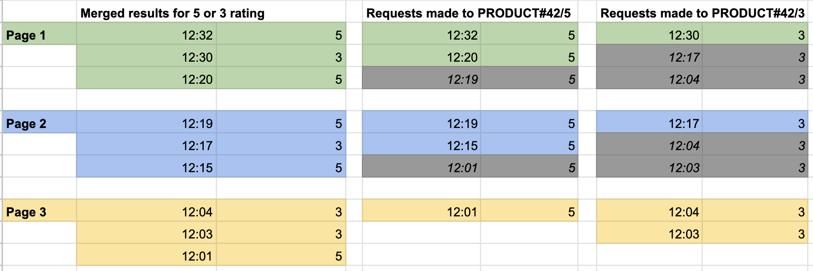
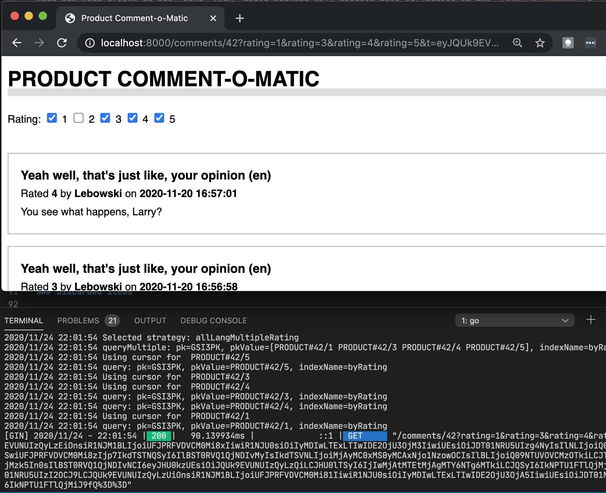

+++ 
draft = false
date = 2020-11-24T13:00:00Z
title = "DynamoDB pagination when multiple queries have been combined"
description = "In this post we will explore how to implement pagination when the output of multiple queries have been combined to build a page of results."
slug = "dynamodb-efficient-filtering-3"
tags = ['nosql-series','dynamodb','aws','go']
categories = []
externalLink = ""
series = []
+++

This series of posts demonstrates efficient filtering and pagination with DynamoDB.

Part 1: [Duplicating data with Lambda and DynamoDB streams to support filtering](/posts/dynamodb-efficient-filtering/)

Part 2: [Using global secondary indexes and parallel queries to reduce storage footprint and write less code](/posts/dynamodb-efficient-filtering-2/)

Part 3: **How to make pagination work when the output of multiple queries have been combined**

-----

In this post we will explore how to implement pagination when the output of multiple queries have been combined to build a page of results.

## Pagination

We require a user to be able to paginate through comments that have been written for a product. If a popular product has received thousands of comments, they are only likely to want to read a few at a time.

DynamoDB supports pagination by giving us a reference point in a query response to use for the next set of results, if there are any. This is called `LastEvaluatedKey`.

When querying a GSI, as we are, this takes the form of key value map, containing: 
- GSI partition key
- GSI sort key
- table partition key
- table sort key

When querying a table, only the table partition key and sort key is returned.

The pattern is simple for many of our access patterns. If you get a `LastEvaluatedKey`, include it in the next query as `ExclusiveStartKey`.

## Parallel request pagination

In the [previous post](/posts/dynamodb-efficient-filtering-2/), access pattern `AP3` required us to display comments of multiple ratings, such as `3` or `5`. Our table design meant that we performed multiple queries and merged the results in our DynamoDB client code.

Now we have (at least) two `LastEvaluatedKey`s to choose from. How do we paginate through the combined result set? 

The grid below assumes a page size of three comments per page, and a filter of rating `3` or `5`.



`9` comments of ratings `3` or `5` are distributed, in reverse order of creation, across `3` pages. Each page request results in `2` requests to DynamoDB, one for both selected partitions in the `byRating` index. 

Rows with a grey background have been discarded by the pagination process. 

Page `1` is filled up by the comments at `12:32` and `12:20` from partition `PRODUCT#42/5` the one at `12:30`. For a user to navigate to page `2`, we need to generate `LastEvaluatedKey`s for **both** of the partitions that we are reading. **We do this by generating a `LastEvaluatedKey` for the last visible item from each partition.**

```json
{"GSI3PK": "PRODUCT#42/3", "GSISK":"12:30", "PK":"COMMENT#8", "SK":"COMMENT#8"}
{"GSI3PK": "PRODUCT#42/5", "GSISK":"12:20", "PK":"COMMENT#7", "SK":"COMMENT#7"}
```

This gets wrapped into a map, keyed by the active GSI PK. 

```json
{
    "PRODUCT#42/3": {"GSI3PK": "PRODUCT#42/3", "GSISK":"12:30", "PK":"COMMENT#8", "SK":"COMMENT#8"},
    "PRODUCT#42/5": {"GSI3PK": "PRODUCT#42/5", "GSISK":"12:20", "PK":"COMMENT#7", "SK":"COMMENT#7"}
}
```

This structure is used as a combined `LastEvaluatedKey`. 

When the user clicks on the _next_ link, their request will contain this collection of two `LastEvaluatedKey`s, in addition to the other original parameters. Of course, DynamoDB won't understand it as is. 

The [query planner](/posts/dynamodb-efficient-filtering-2/#query-planning) will again determine that two parallel queries to `PRODUCT#42/5` and `PRODUCT#42/3` are needed. 

When building the queries, our client will look for a `LastEvaluatedKey` to use from the above structure. If one exists, it will extract it and include it as the `StartExclusiveKey` in the corresponding query.

## Encoding pagination context

A common way of passing the above pagination context between _pages_ is to encode it as a _cursor_ URL parameter. This is often done by compressing and base64 encoding it. You might also choose to encrypt it if you are worried about leaking details about your data model to the outside world.

## It works

After loading some randomised data into the table, the model worked as expected.



## Discussion

### Discarded items

This approach discards results returned from DynamoDB that do not fit onto the page. In the below example, the item at `12:04` in partition `PRODUCT#42/3` will be discarded **twice**, before finally appearing on page `3`. 

**Rows with a grey background have been discarded by the pagination process.**


This approach is still better than using DynamoDB filters on an index that contains comments of all ratings. Imagine a product that received many hundreds of `5` or `4` rated comments, but the user wanted to see `1` ratings. If the most recent `1` rated comment was in 2017 and the next in 2014, a large number of rows would need to be read and filtered. This would be costly and slow. The dedicated `byRatings` index allows rapid access to these comments, regardless of how they are distributed in time.

Maybe we could project only keys to an index, resulting in very small items. Reading these multiple times would cost less. Once we have a set of keys for items we definitely want to return. we would fetch the full comment item with a `BatchGetItem` request.

However, performing multi-get random accesses on a key is an expensive approach:
>... a `BatchGetItem` _charges_ a minimum of one read capacity unit (RCU) per item, allowing us to read a single item up to `4KB`. A comment will be nowhere near that big, so this approach would be wasteful. A query, on the other hand, consumes RCUs based on the actual data read, allowing us to read at least ten comments with a single RCU.

This would be a backward step. When querying with the proposed model, the discarded items are unlikely to make a huge difference to cost, beyond a small amount of extra data transfer from DynamoDB to our client. (Client does not mean the end user, it means the program that connects to DynamoDB, such as an API running in a container.)

It might be tempting to implement a cache within the client to retain these discarded rows and display them later. This is an interesting approach, but it is likely to add complexity for little return. It starts to make our client stateful and harder to scale.

A DynamoDB cache is a solved problem. Putting [DAX](https://aws.amazon.com/dynamodb/dax/) in between our client and DynamoDB could be a simple and effective solution to this concern, with likely performance improvements as well.

### Pagination context size

The pagination context is fairly large, weighing in at a few hundred bytes, depending on how many partitions need to be queried. For simplicity, we have exposed the structure DynamoDB expects. As there is some duplication in the JSON, it may compress well. Rather than JSON, it could be serialised as a `protobuf`. It is debatable whether this is worth the effort and a proof of concept would be needed to measure payload size of compressed JSON vs a protobuf. In addition, some people may find a URL with a base64 encoded parameter to be ugly.

## Summary

**We've added pagination to all access patterns. The first iteration of our model is now complete.** 

In the next post we will explore some low hanging fruit: 

- looking at some unplanned access patterns that have accidentally fallen out of our model design
- deploying a simple data service as a container that exposes the model to a web and API client
- populating the table with some random data
- a very simple load test to understand resource utilisation and costs

## Links

- [Guys, we’re doing pagination wrong...](https://hackernoon.com/guys-were-doing-pagination-wrong-f6c18a91b232)

_Comments and corrections are welcome. I am working on making the diagrams more accessible._
