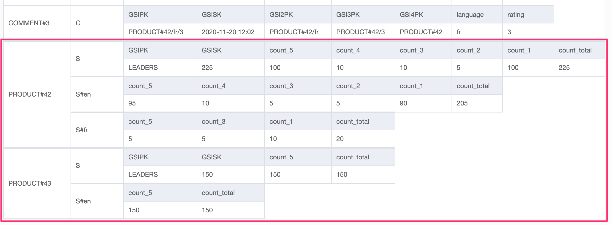

+++ 
draft = false
date = 2020-11-25T13:00:00Z
title = "Storage and retrieval of statistics in DynamoDB"
description = "In this post we will explore how to store statistics within our data model, with index overloading and sparse indexes."
slug = "dynamodb-efficient-filtering-4"
tags = ['nosql-series','dynamodb','aws','go']
categories = []
externalLink = ""
series = []
+++

This series of posts demonstrates efficient filtering and pagination with DynamoDB.

Part 1: [Duplicating data with Lambda and DynamoDB streams to support filtering](/posts/dynamodb-efficient-filtering/)

Part 2: [Using global secondary indexes and parallel queries to reduce storage footprint and write less code](/posts/dynamodb-efficient-filtering-2/)

Part 3: [How to make pagination work when the output of multiple queries have been combined](/posts/dynamodb-efficient-filtering-3/)

Part 4: **Storage and retrieval of comment statistics using index overloading and sparse indexes**

-----

In this post we will explore how to store and retrieve statistics relating to the comments a product has. **We will do it without making any table changes or adding new indexes.**

So far, we have built a commenting system that allows users to filter by any combination of rating (1-5) and a single language. Displaying counts for a given criteria will provide a better user experience. The statistics will also allow the query planner to make more efficient queries by skipping sub-queries when the count is zero.

## New access patterns

- `AP7` - comment count by rating for a product
- `AP8` - comment count by rating for a product, filtered by one language
- `AP9` - grand total of comments for a product
- `AP10` - grand total of comments for a product, filtered by one language
- `AP11` - a leaderboard of the top N products that have the most 5-rated comments

## Storage

In our existing table we will create new items to store statistics alongside the comments. As the new items will represent aggregated statistics from comments relating to a `PRODUCT`, they are added with partition key following the format `PRODUCT#<idenfitier>`. 

The table sort key will store a coded description of what the _statistics_ item represents: `S#<language>`, with an item for each applicable language. The total counts across all languages will be stored in an additional item with sort key `S`. The item has `count_*` attributes containing a count for each applicable rating.

The below table shows two new partitions in our existing table for `PRODUCT#42` and `PRODUCT#43`.

To support the leaderboard in `AP11`, under the `S` item, an existing GSI is overloaded. `GSIPK` is set to a single partition called `LEADERS` and `GSISK` is set to the number of comments with rating `5`. The leader board emerges when we view the GSI. If this product does not have any `5`-rated comments, the `LEADERS` item will not be created.

We have stored the number of `5`-rated comments in the sort key, so order will be maintained. When we query this GSI, we will set `ScanIndexForward` to `false` to get the highest numbers first. The `LEADERS` item will only appear in this GSI. 

Regional leaderboards are not in scope, but would be possible to achieve by populating `GSKPK` with a language suffix, for example `LEADERS#en`, in the subsequent items.

## Queries

### AP7: comment count by rating for a product

- Query on `table`
  - PK = `PRODUCT#42`
  - SK = `S`
- Read all attributes `count_*`

### AP8: comment count by rating for a product, filtered by one language

- Query on `table`
  - PK = `PRODUCT#42`
  - SK = `S#en`
- Read all attributes `count_*`

### AP9: grand total of comments for a product

See `AP7`, read attribute `count_total`.

### AP10: grand total of comments for a product, filtered by one language

See `AP8`, read attribute `count_total`.

### AP8: a leaderboard of the top N products that have the most 5-rated comments

- Query on `gsi`
  - PK = `LEADERS`
  - SK = (not set)
  - Limit: `10` (for top 10)
  - Scan index forward: `false`
- Read key `GSISK` for count of `5` rated comments
- Read key `PK` for product identifier

## Write path

DynamoDB Streams and a Lambda function would be used to ensure the _statistics_ items are recalculated upon each change event. 

**Updating statistics in an event driven manner means it is inexpensive to get the count by simply reading the relevant items.**

If this feature was being added after the system originally went live, Step Functions or EMR could be used to parallel scan the table and retroactively populate the statistics.

## Summary

**We've extended our model to support storage of statistics and associated access patterns, and, best of all, we have done it without modifying the table or adding any new indexes.** 

All we have done is add more items and thought up some new queries. No existing queries needed to be changed.

**Index overloading** was used when we repurposed an existing GSI to store the leaderboard.

**Sparse indexes** were used to ensure the statistics items do not appear in GSIs as we have not set any GSI keys. This saves on replication costs and provides a natural filter, as statistics access patterns only query the table. The exception is the `S` statistics item, which **does** set `GSIPK` to `LEADER` and `GSISK` to the count of `5`-rated comments. This is so it appears in `GSI`, in order. `GSISK` is used to store the creation date in the **context** of `GSIPK: 'PRODUCT#42/...'` items. It's used for something entirely different in the **context** of `GSIPK: 'LEADER'` items.

_Comments and corrections are welcome. I am working on making the diagrams more accessible._
