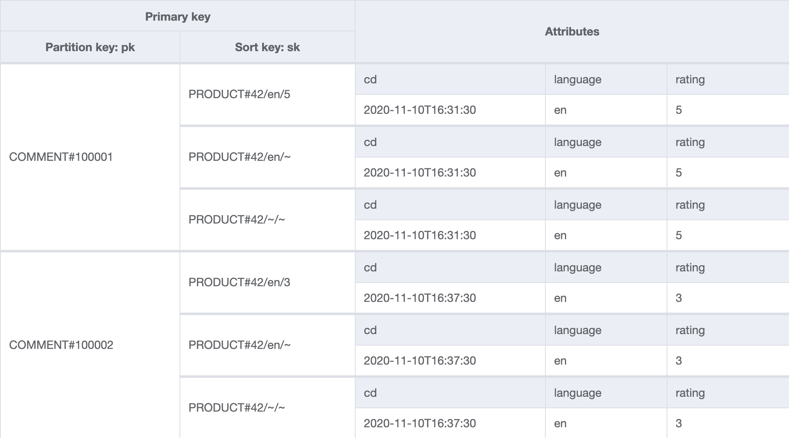
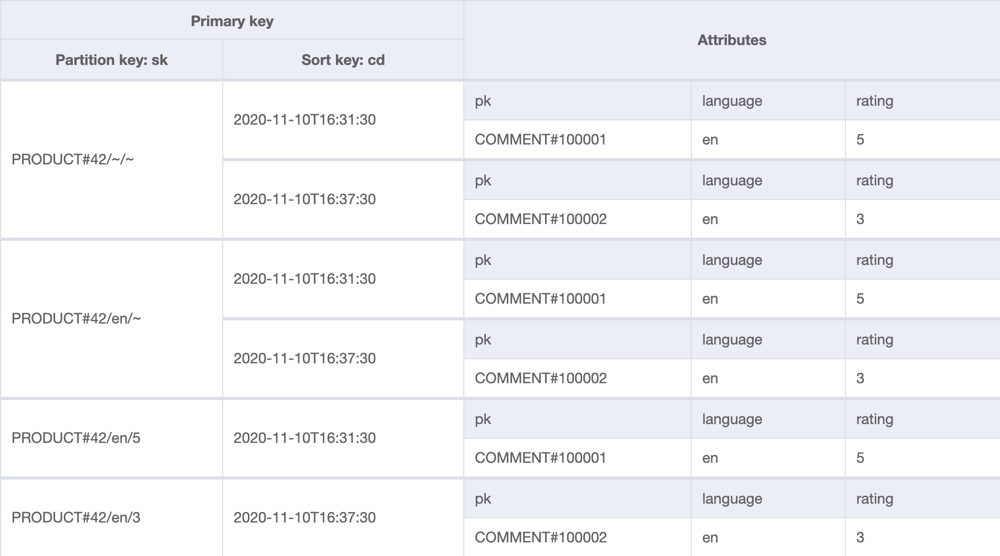

+++ 
draft = false
date = 2020-11-09T17:54:11Z
title = "Efficient NoSQL filtering and pagination with DynamoDB - part 1"
description = "An exploration of using data duplication to implement an efficient paginated and filterable product comments system on DynamoDB."
slug = "dynamodb-efficient-filtering"
tags = ['nosqlcommments','dynamodb','aws']
categories = []
externalLink = ""
series = []
+++

It never ceases to amaze me just how much is possible through the seemingly constrained model that DynamoDB gives us. It's a fun puzzle to try to support access patterns beyond a simple key value lookup, or the retrieval of an ordered set of items.

The NoSQL gods teach us to store data in a way that mirrors our application's functionality. This is often achieved by duplicating data so that it appears in multiple predefined sets. DynamoDB secondary indexes allow us to automatically duplicate items with different attributes from the item as keys.

This can get us a long way. However, a common approach is to delegate more complex queries to another supplementary system, such as Elasticsearch. DynamoDB remains the source of truth, sending updates to Elasticsearch via DynamoDB Streams and a Lambda function.

In many cases, this hybrid solution is the right approach, particularly when the model is complex or too challenging to fit into DynamoDB. Perhaps the scale DynamoDB provides simply isn't needed for every single access pattern. However, running two stores and replicating them is definitely added complexity. Elasticsearch, even when managed, can be a complex and expensive beast. I believe it is desirable to keep things as lean as possible and only follow that path if it is necessary. 

This series of posts explores what is possible with DynamoDB alone.

## Example scenario: a product comments system

 We want to model the comments section shown on each product page within an e-commerce site. A product has a unique identifier which is used to partition the comments. Each product has a set of comments. The most recent `20` comments are shown at first and users can click a next button to paginate through older comments. As the system might be crawled by search engines, we do not want performance to degrade when older comments are requested.

This can be broken down into the following access patterns.

- AP1: Show all comments for a product, most recent first
- AP2: Filter by a single language
- AP3: Filter by any combination of ratings from 1-5
- AP4: Show an individual comment
- AP5: Delete a comment
- AP6: Paginate through comments

## What's wrong with DynamoDB filters?

DynamoDB allows us to filter query results before they are returned to our client program. You might think that filters are all we need here as it is possible to filter on any non-key attribute, which sounds liberating at first. However, if a large amount of data is filtered out, we will still consume resources, time and money in order to find the needle in the haystack. This is particularly costly if each item size runs into kilobytes.

Filters do have utility at ensuring data is within bounds (such as enforcing TTL on expired items that might not have been _collected_ yet) but in summary, they work best when only a small proportion of the items are thrown away by the filter.

## Table design

### Table

The below table contains two comments for product `42`. Note that there are duplicate items for each comment.



### GSI

The global secondary index `gsi` will be used to answer the majority of the queries. Both comments exist under `PRODUCT#42/~/~` (any language, any rating) and `PRODUCT#42/en/~` (English, any rating). `PRODUCT#42/en/5` and `PRODUCT#42/en/3` contain only one comment each, as the two comments in the table are rated `5` and `3`.



Not shown are the non-indexed attributes such as the comment text itself.

## Key design

Let's elaborate on `sk`. Each `sk` under a comment `pk` represents membership to a collection of comments for that product, of the criteria encoded into the key.

`sk` consists of a `/` delimited string. The first element is the type, `PRODUCT#` and its identifier `42`. The second element is the language, such as `en` or `~` to denote _any_. The final element is the rating number, from `1` to `5`.

Any **combination** of ratings can be specified in addition to a single selected language (or all languages). 

Here are some examples:

- `<product>/<language>/<ratings>`
- `PRODUCT#42/~/~` - any language
- `PRODUCT#42/en/~` - English only
- `PRODUCT#42/en/1` - English only, with a rating of 1
- `PRODUCT#42/en/1.2.5` - English only, with a rating of 1, 2 or 5
- `PRODUCT#42/~/1.2.5` - any language, with a rating of 1, 2 or 5

It might help to think of each `sk` as representing an ordered set of comments. It maps neatly onto a URI such as `/product/42/comments/en/1.2.3` or more likely `/product/42/comments?language=en&rating=1&rating=2&rating=3`.

## Duplicates needed

We assume this application will be write light and read heavy, so it is acceptable to store the same comment multiple times in order to provide inexpensive querying.

As per `QP1`, a user can choose to show _all_ languages or select a single language. This can be met by double-writing the item with different `sk` values, once with `~` as the language element, and once with the actual language of the comment, such as `en`.

`QP3` is more complicated as any combination of ratings can be requested. A user could select `1` to only see bad comments, or `5` to only see the good comments - or any combination of those. To achieve this, a _power set_ is calculated to generate keys for the possible combinations. The number of items in a power set is `2 ** len(values_in_set)` so in this case `2 ** len({1,2,3,4,5}) = 32` so the power set size is `32`. We can remove any items from the set that do not contain the rating of the comment being posted. This brings the set size down to `16`.

Ultimately, we write the comment to the table `32` times with a `sk` representing each combination of ratings, once for all languages and once for the actual language. A set containing multiple ratings is serialised to an ordered, `.`-delimited string such as `1.2.3.4.5`.

You could think about each of the ratings being toggle switches that are set low or high.

- `00001` = Rating 1
- `00010` = Rating 2
- `00100` = Rating 3
- `01000` = Rating 4
- `10000` = Rating 5

Combinations are represented as you'd expect.

- `10001` = Rating 1 and 5
- `11111` = All ratings

```python
>>> rating_1 = 0b00001
>>> rating_5 = 0b10000
>>> bin(rating_5 | rating_1)
'0b10001'
>>> rating_5 | rating_1
17
```

As the combination of `rating_5` and `rating_1` is `17`, this could be used as a more compact representation of the selected ratings, as a future optimization. Instead of `PRODUCT#42/en/1.2.3.4.5`, `PRODUCT#42/en/31` could be stored instead.

It has the side-effect of allowing longer set values to be stored. For instance, if instead of numeric ratings we used `['Poor', 'Fair', 'Good', 'Great', 'Excellent']`, the keys would be longer and we would consume more resources.

It might seem premature, but shaving bytes off repeated keys and attribute names is considered good practice. The tradeoff is that this portion of the key is less readable by the human eye.

## Queries

We should now be able to satisfy all of our access patterns. All queries should have `ScanIndexForward` set to `false` in order to retrieve the most recent comments first, and a `Limit` of `20`.

### AP1: Show all comments for a product, most recent first

- Query on `gsi`
  - SK = `PRODUCT#42/~/~`

### AP2: Filter by a single language

- Local language:
  - Query on `gsi`
    - SK = `PRODUCT#42/en/~`
- All languages
  - Query on `gsi`
    - SK = `PRODUCT#42/~/~`

### AP3: Filter by any combination of ratings from 1-5

#### Single language

- Rating 1
  - Query on `gsi`
    - SK = `PRODUCT#42/en/1`
- Rating 1 or 5
  - Query on `gsi`
    - SK = `PRODUCT#42/en/1.5`
- Rating 2, 3 or 4
  - Query on `gsi`
    - SK = `PRODUCT#42/en/2.3.4`

#### All languages

- Rating 5, all languages
  - Query on `gsi`
    - SK = `PRODUCT#42/~/5`

### AP4: Show a comment directly through its identifier

- Show comment `100001`
  - Query on table
    - PK = `COMMENT#100001`
    - Limit = 1

### Delete comment 100001

- Query on `table`
  - PK = `COMMENT#100001`

Delete each value for PK/SK returned in a batch.

### AP6: Paginate through comments

Run any of the above queries with `Limit` set to `20`. Use pagination tokens returned by DynamoDB to paginate through results. Performance will remain the same, regardless of what page is being requested.

## Building the table

This approach works by duplicating redundant items with different keys. Triggers are a great way to automate the creation of these duplicated items. A DynamoDB stream should be setup on the table and connected to a Lambda function.

When a comment is created, the wildcard  `sk` should be used, i.e. `PRODUCT#42/~/~`. We will call this the _primary item_.

The Lambda function will be invoked with a change payload when the primary item is added, updated or deleted. From the attributes `language` and `rating`, it will generate the duplicate items and add them to the table. If `language` and `rating` subsequently change, previous duplicate items will be removed before the new duplicate set is added. Upon a delete modification, all duplicate items will be removed.

An additional attribute, `auto` is added to the automatically created items so that the Lambda function knows to take no action in response to items that it has created in the table.

## Problems

It is expected that this simple design will perform well, support lots of traffic and be very economical to run **if the number of comments posted is hundreds per day.**

The reason for this caveat is we are doing a lot of duplication here. There will come a point where the number of duplicates ceases to remain feasible if the _possible values_ as set cardinality increases.

```python
2 ** 5 = 32
2 ** 6 = 64
2 ** 7 = 128
2 ** 8 = 256
...
```

As the number of duplicates increases, so does the number of operations and therefore cost. Changes need to the original record need to be kept in sync. Large payloads could be compressed with `snappy` or `bz` to potentially reduce consumed capacity units. This has the drawback of making the data illegible in the DynamoDB console and other tools.

Creation of the duplicate items could partially fail. Although the Lambda will retry, it is possible that the table will be left in an inconsistent state. An hourly Lambda function could check the table, processing recent changes. Larger repair jobs implemented with Step Functions or EMR could be written to check integrity, but these may be costly to run on a large table.

## Summary

Despite the identified caveats around excessive redundancy and storage requirements, we've successfully built a filtering solution without needing to use DynamoDB filters. **The table is very simple to use: all access patterns can be satisfied with a single query.**

**Nothing is free of course, we have paid for this by duplicating the data and taking on the corresponding compute, write and storage costs.** There is nothing wrong with duplicating data to get efficient queries. Coupled with DynamoDB Streams and Lambda functions, duplicates are automatically maintained, without cluttering client code.

However, we can do better. The [next post](/posts/dynamodb-efficient-filtering-2/) will investigate how we can reduce the storage footprint with some additional GSIs and a slightly more complicated client program.

[Discuss on Twitter](https://twitter.com/search?q=alexjreid.dev%2Fposts%2Fdynamodb-efficient-filtering)

_Corrections and comments are most welcome._

## Links

If you found this interesting, you'll enjoy the following even more.

- [When to use (and when not to use) DynamoDB Filter Expressions](https://www.alexdebrie.com/posts/dynamodb-filter-expressions/)
- [Best Practices for Using Secondary Indexes in DynamoDB](https://docs.aws.amazon.com/amazondynamodb/latest/developerguide/bp-indexes.html)
- [NoSQL Workbench](https://docs.aws.amazon.com/amazondynamodb/latest/developerguide/workbench.html)
- [Video: Advanced Design Patterns at re:Invent 2019](https://www.youtube.com/watch?v=6yqfmXiZTlM)
