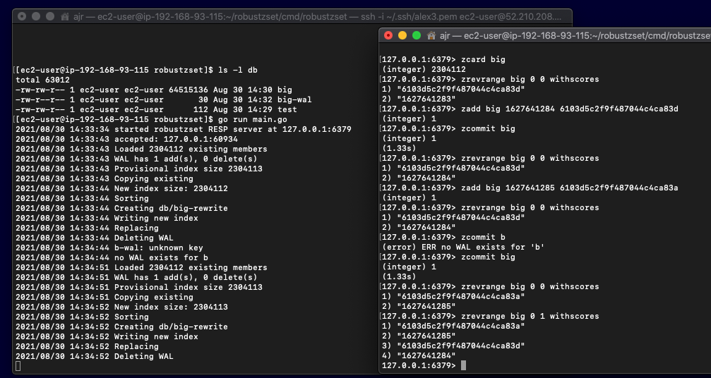

+++ 
draft = false
date = 2021-10-27T10:03:12Z
title = "DynamoDB pagination with page numbers in URLs"
description = "For SEO reasons, we might want to use page numbers in URLs. This post discusses how this is possible with DynamoDB and a secondary store."
slug = "dynamodb-page-numbers" 
tags = ['dynamodb', 'pagination', 'redis', 'zset', 'sqlite', 'aws', 'paging']
categories = []
author = "Alex Reid"
externalLink = ""
series = []
+++

>For SEO reasons, we might want to use page numbers in URLs when displaying large collections. This post discusses how this is made possible by combining DynamoDB with secondary store.

Back when we all used SQL databases, it was common to paginate through large result sets by appending `LIMIT offset, rows per page` to a `SELECT` query. Depending on the schema, data volume and database engine, this was [inefficient to varying degrees](https://tusharsharma.dev/posts/api-pagination-the-right-way). On smaller result sets and with the right indexes, it was... posssibly OK.

Databases like DynamoDB prevent this inefficiency by handling pagination differently. You can page through a pre-sorted table by selecting a partition and optionally a range within the sort key. After DynamoDB has returned a page of results and there are more to follow, it provides you with `LastEvaluatedKey` which you can pass to the next iteration of the query as `ExclusiveStartKey` in order to get the next page.

Random access to page n is not possible unless you know the keys that coincide with a page break. You've got to fetch the pages in order. Users cannot jump to page 292 or only show the last page. This is entirely acceptable in many cases as modern user interfaces often provide _infinite scrolling_ or a _show next 20_ link. 

As the `ExclusiveStartKey` is embedded into a URL, this means that this _next link_ is not stable. If the table changes, the link to retrieve page `2` changes. If the results are scanned in reverse (for instance, most recent first) the next link will change every time a new record is added. This generates a lot of URLs, which, although I am not an expert, can [hinder SEO efforts](https://www.portent.com/blog/seo/pagination-tunnels-experiment-click-depth.htm) on public sites where effective indexing is important.

Some may also say that `?page=2` looks nicer than an encoded exclusive start key (which itself may consist of several key-value pairs, possibly as a base64-encoded structure), but this might just be vanity.

What if, for whatever reason, we wanted to bring back those old-school, things-were-better-back-in-the-old-days page numbers?

# The pattern: map exclusive start keys to a numeric index
An exclusive start key is just a structure containing the keys needed to _resume_ the query and grab the next n items. It is nothing more than a reference point. 

Rather than conveying it as part of the URL which is ugly and possibly leaks implementation details, we could instead store the key components needed to generate an exclusive start key from a numeric index. A `page` or `skip` query parameter would be included in the URL. A look up for _item 20_ will internally yield the keys needed to construct an exclusive start key to _skip_ results by arbitrary intervals.

The drawback of this approach is the added complexity around building, maintaining, storing and serving this numeric index of rows. To avoid a confusing user experience, it is vital that the system of record and numeric index are kept consistent. Allowing users to filter the results will invalidate any pre-calculated page numbers, so additional indexes will need to be maintained. Only low cardinality, coarse filters are likely to be feasible in order to minimize the number of page indexes that need to be built.

The next section details some theoretical (read: half-baked and unproven) approaches. Note that there may be WTFs, misunderstandings or things I have not considered. **Consider them to be non-production ready musings.**

# Approaches
Our example scenario is an e-commerce site that has product pages where users can comment on a product.

The following approaches assume `comments` DynamoDB table has the string keys `PK, SK, PK2`, where `PK` is a randomly generated comment ID, `SK` is a datetime of when the comment was posted, and `PK2` is a grouping key, the SKU of a product the comment relates to. A global secondary index on `PK2, SK` is used by the application to show sets of comments, in reverse order.

| PK     | SK               | PK2 (GSI PK)     | other attributes |
|--------|------------------|------------------| ---------------- |
| abc281 | 2021-08-25 13:00 | DAFT_PUNK_TSHIRT | ...              |
| abd212 | 2021-08-25 13:30 | DAFT_PUNK_TSHIRT | ...              |
| abc912 | 2021-08-25 13:42 | DAFT_PUNK_TSHIRT | ...              |
| ccc232 | 2021-08-25 13:55 | DAFT_PUNK_TSHIRT | ...              |

## Redis sorted sets
The simplest approach is to bring out everyone's favourite swiss army knife, Redis. The partition and sort keys would be loaded into Redis sorted sets. Redis itself could be run on a managed service like AWS Elasticache.

A sorted set provides numeric index-based access to the keys (referred to as the _rank_ of a set member), which can then be used to construct an `ExclusiveStartKey` to pass to DynamoDB. As the name of the type implies, Redis maintains the ordering using a _score_ value. We will use a numeric representation of the _creation date_ as the score.

Assuming the table outlined above, we will use `PK2` as the Redis key for a sorted set, `PK` as the member and `SK` (converted to UNIX time) as the score. In other words: `ZADD <PK2> to_unixtime(<SK>) <PK>`, would be sent to Redis.

A Lambda function connected to a DynamoDB Stream off the table could issue these commands so that both stores remain in-sync. It'd also need to send `ZREM/ZADD` to handle any deletions and changes.

To get the exclusive start key for any page, the Redis command `ZREVRANGE <PK2> <start> <end> WITHSCORES` where both _start_ and _end_ is the index of the item to retrieve the keys of, would be sent to Redis. 

This will yield a list response where `0` is `<PK>` and `1` is `<SK>`. SK should be converted back to a date time string from UNIX time. This is all that is needed to construct an `ExclusiveStartKey` which can be used in a DynamoDB query.

It is possible to get the total cardinality for grouping key with `ZCARD <PK2>` which is needed to calculating the total number of pages.

Storing a large number of sorted sets with millions of members could get expensive due to how a sorted set is implemented by Redis: a map and a skip list. It is also quite annoying to have to pay for a lot of RAM for items that won't be frequently accessed.

However this may be a reasonable trade off as it is a very simple solution that is likely to have predictable, consistent high performance.

## Relational sorted sets
Sorted sets can be implemented in a relational database such as MySQL. This could use a managed service like AWS RDS in its various flavours. This approach also performed very well with sqlite.

The sorted sets would live in a single table with a convering index on `PK2 ASC, SK DESC`. Instead of a `ZREVRANGE` Redis command, a query like `SELECT PK, SK FROM pages WHERE PK2=? ORDER BY SK DESC LIMIT n, 1` is used. 

Despite using `LIMIT`, performance is expected to be reasonable due to the small row size. Instead of `ZCARD` a `SELECT COUNT(*) FROM pages WHERE PK2=?` query would be used, but it would be worth understanding the performance characteristics, despite an index being present.

A similar Lambda function would keep this table in-sync with the DynamoDB table.

## Files on disk, EBS, EFS or even S3
If you don't want to run Redis or a relational database, the bang for buck option is the file system. There are several options here ranging from very fast instance-connected SSDs to EBS, EFS and object store services like S3.

This approach works by defining a fixed size C-style structure and writing the corresponding bytes to a file. Random access is made possible by calculating the offset within the file based on the consistent size of a structure. You can then `seek` to the relevant offset (calculated from the `index * SIZE`) and `read` that number of bytes.

With this pattern, the grouping key `PK2` is used to name the file. If a lot of keys are expected, a small optimisation would be to shard the keys into a fixed number of subdirectories. As with the prior approaches, a function that consumes a DynamoDB stream be responsible for writing to these files.

Assuming a 24-character value for `PK`, and `SK` converted to an integer unix time, the code to read `index` would be something along these lines.

```python
STRUCT_DEF = "24s i" # create a struct of char[24], int
SIZE = struct.calcsize(STRUCT_DEF) # 28 bytes (24+4)

PK2 = "DAFT_PUNK_TSHIRT"

with open(f"{PK2}.pag", "rb") as file:
    file.seek(SIZE * index) # zero indexed
    values = struct.unpack(STRUCT_DEF, input.read(SIZE))
    print(f"PK: {values[0]}, SK: {values[1]}, PK2: {PK2}")
```

This is likely to perform well on EC2 with instance storage or EBS. Non-scientific tests showed it worked far better than expected with an EFS mounted in a Lambda function. If some additional latency can be tolerated, the real _bargain basement_ solution is to selectively read **just the individual record** out of the much larger index object stored on S3. This is achieved by passing an HTTP range header, similar to the file offset above.

```python
page_index = boto3.resource('s3').Object('pagination-indexes', f"{PK2}.pag")
start = SIZE * index
end = start + SIZE - 1
res = page_index.get(Range=f"bytes={start}-{end}")
values = struct.unpack(STRUCT_DEF, res["Body"].read())
print(f"PK: {values[0]}, SK: {values[1]}, PK2: {PK2}")
```

A crude way to find the number of entries to divide the file size by the struct size. This is an inexpensive operation with some pitfalls that are beyond the scope of this write-up. An alternate approach would be to maintain a header struct, again of fixed size, at the head of the index file.

So, we've established that read path is simple and fast. The write path is more complex. The model of appending bytes to a file does not work if we want to maintain order and cannot say with 100% certainty that records won't appear out of order. Perhaps strict ordering is not necessary, but it would be confusing to have a comment from 2018 appearing alongside one from 2021. Additionally, as the index increases in size, it will need to be rewritten in sorted order. If S3 is being used as a storage backend, this would mean a `PutObject` of several megabytes to add a single entry. The shape of your workload will dictate whether or not this is reasonable.

A simple remedy is to not directly write to the index file at all, instead sending the change _commands_ to an append-only write ahead log. At a timed interval (or when the WAL reaches a certain size), a _commit_ process could run and apply these changes into the ordered index file, discarding the WAL. This reduces the amount of work needed to perform a sort and rewrite on the entire index, particularly if networked storage or S3 is where the indexes are stored. Deletions are fast in Redis as the member value is also indexed, which adds to the in-memory storage footprint of a sorted set. This file based approach does not bother to do that, members marked for deletion are simply skipped when the file is rewritten.

The clear cost to this approach is that changes won't immediately appear. If a degree of latency is acceptable, this is not a bad trade off. A complimentary hack would be to not consult the pagination index at all when querying the first n pages, and simply limit in your client. For example, instead of setting the DynamoDB query `Limit` to `20`, set it to `200` and take a slice of the returned items to deliver up to page 10. This will increase read costs but caters for newest always being visible, with the potentially acceptable risk of some comments being shown again on page 11.

The index files can be generated in any language. In Python, the `struct` module is one way to achieve this - likewise in go, the `binary` module and ordinary go structs work as you would expect (although check how much reflection is being used to _decode_ the structs: avoiding this can make a staggering difference to performance.) 

This portability provides interesting options for a _backfill_ of indexes as an indepedent batch process, for instance with Apache Spark or Apache Beam. Data from an operational store or data warehouse could be used to cheaply generate the index files in parallel. Changes that are happening beyond what is stored within the batch source would fill the write-ahead logs. Once the batch operation is complete, the discussed _commit_ process can be enabled to _catch up_ the indexes.

There will probably be other edge cases and discussions to be had around locking. It's important not to try and write your own database, but it would be a bad idea to allow consumers even read-only access to the files. As this is a fairly low level approach, an API or Lambda function should be considered as the interface to the files.

Despite the odd looks you will probably get for suggesting this as a general approach, I quite like it for its simplicity, low cost, portability and high performance. 

_An interesting hybrid of this and the previously discussed relational approach would be to use sqlite as [an alternative to fopen](https://www.sqlite.org/whentouse.html). Instead of dropping structs into a file, a sqlite database file would be used, providing a stable file format and the beautiful, highly performant sqlite engine for ordering. The storage footprint, due to the covering index, is likely to be much larger._

### Redis-compatible interface to files
I took the file system appproach a bit further and built a [RESP](https://redis.io/topics/protocol) service that implemented a few commands including `ZCARD, ZRANGE, ZADD and ZREM`. This worked pretty well on a `t4g.micro` EC2 instance. The `ZADD` and `ZREM` commands stage the changes to a separate file, as discussed above. A custom command, `ZCOMMIT` can be issued for a sorted set key. This will apply any pending changes to the index. When committing a few changes to an index file containing **2.3m** items, the rewrite took about **1.3** seconds. Too expensive to run on every change, but if rewrites are only done occasionally, this could be acceptable in some scenarios. Each sorted set has its own index file, so a large number of indexes could be rebuilt in parallel with no other state or coordination required.

The `redis-benchmark` tool showed about **60000 rps** (without pipelining) for the commands besides `ZCOMMIT`. This is obviously much slower than proper Redis, but acceptable. 



There is nothing clever going on here. No log-structured merge trees or efficient sorting algorithms, just a frankenstein of the standard go library with some RESP help from the excellent [tidwall/redcon](https://github.com/tidwall/redcon).

If you don't mind your sorted sets being occasionally out of date, you can host a **lot** of keys on disk using a very cheap EC2 instance. The set with 2.3m members occupied less than **65MB** of disk space. **This will cost far, far less than keeping them all in RAM.** 

As ever, it depends on whether your workload can tolerate these delayed commits and what the risk profile is with regard to potential data loss. There are other downsides - you will need to pick a file system that can efficiently store several small files. Use of a sqlite container file (or small number of them, representing a shard) may actually work out better. Perhaps something like RocksDB could be used to store the structs. 

# Conclusion

**tl;dr: use Redis.** While the file-based approaches are economical, we stray into dangerous territory of _writing a sketchy database of our own_. In most cases this would be penny wise but pound foolish. If you have the budget, applying the sorted sets pattern with a managed Redis instance or cluster is most likely the sane option.

**Perhaps this is a solved problem in some database you don't use but maybe should do. Maybe you just need to use whatever you are already using correctly.** In this age of polyglot persistence, Kafka and so on, data has become liberated and can be streamed into multiple stores, each filling a particular niche. However, this is still operational overhead. 

Before making the leap, consider whether the approaches discussed in this post are a case of YAGNI. In your context, is it really the best user experience to present users with _page 1 of 392716_? Must they be able to randomly jump to page 392701? Could your user interface slim down the result set more intuitively, so that using your application is less _database-y_? For example, infinite scrolling (think Twitter) is simpler for the user and seems more _native_ these days. [Guys, we're doing pagination wrong](https://hackernoon.com/guys-were-doing-pagination-wrong-f6c18a91b232) is a great post that delves into the details further.

We don't live in a one-size-fits-all world and sometimes creative solutions cannot be avoided. Workloads have varying levels of tolerance to eventual consistency and degrees of _acceptable correctness_. I'd be interested to hear thoughts on these approaches and if you've solved this problem in similar or entirely different way.

[Discuss on Twitter](https://twitter.com/search?q=https%3A%2F%2Falexjreid.dev%2Fposts%2Fdynamodb-numeric-pagination%2F&src=typed_query)
