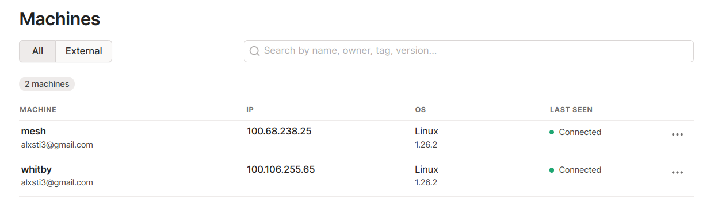
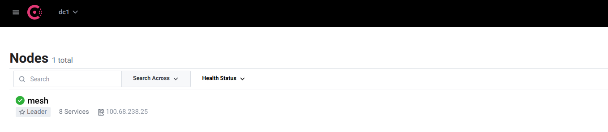
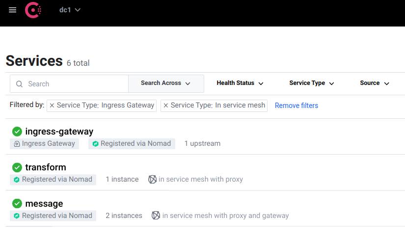
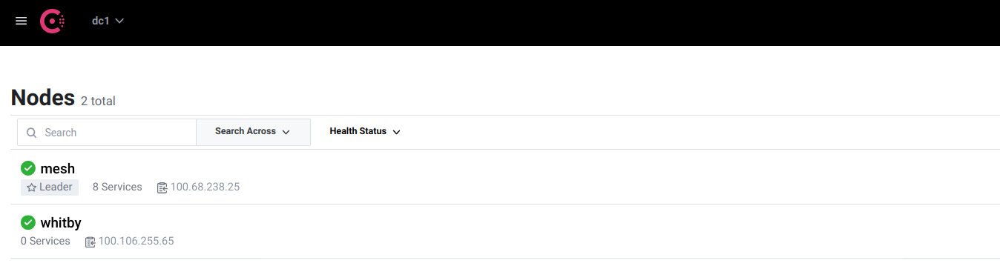
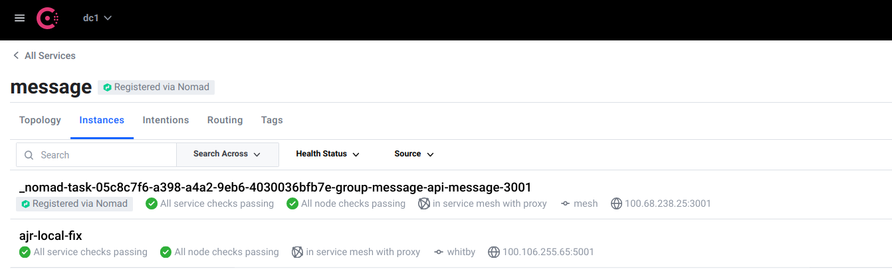
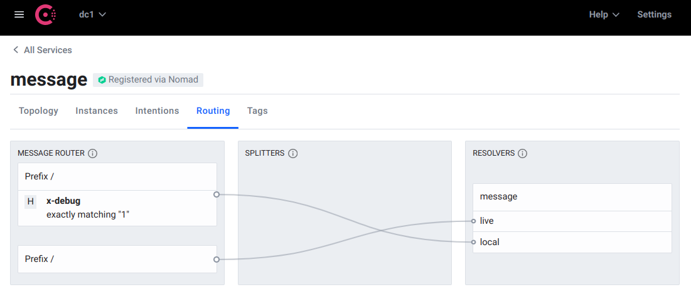
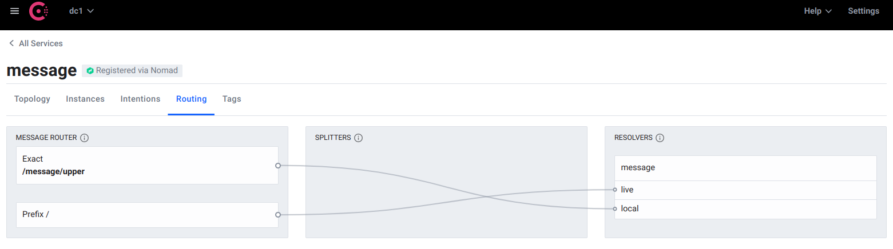

+++ 
draft = false
date = 2022-07-14T00:03:12Z
title = "Patching in a development service"
description = "It is not always feasible to run an entire system composed from microservices locally. This post discusses using a service mesh to 'patch' a locally running service into a remote test environment, for development purposes."
slug = "patching-in-a-development-service" 
tags = ['api', 'service mesh', 'envoy', 'consul', 'http', 'microservices', 'dev environment', 'local dev', 'tailscale']
categories = []
author = "Alex Reid"
externalLink = ""
series = []
+++


Composing systems out of smaller microservices has been commonplace for several years now. One trade off is increased complexity around development environments.

Suppose the system you are working on consists of hundreds of services that all potentially make requests to one and other. If you are unlucky you might be faced with the task of spinning _everything_ up locally or within a new cloud provider account. 

This is costly and often too much work. You might be inclined to blindly deploy to a test or staging environment, after testing your service runs as expected in isolation. Even then, there is a high probability of breaking things for other users. You are also likely to suffer a slow feedback loop with every single change requiring a build and deployment.

An alternative idea is to _patch in_ a new implementation from a local environment into a real test environment that is already running all of the other services. This could be a full or partial replacement. You could just patch in or _overlay_ a new implementation of an existing resource, with all other requests going to the existing implementation.

## A contrived scenario
Imagine that we have a service with the resource `/message` that returns `Hello world!!!`. It also provides the subresources `/message/lower` and `/message/upper` which return lower and uppercase representations of the same string. 

```
$ curl https://some-service.test-env-1.mycompany.com/message
Hello world!!!
$ curl https://some-service.test-env-1.mycompany.com/message/lower 
hello world!!!
$ curl https://some-service.test-env-1.mycompany.com/message/upper
HELLO WORLD!!!
```

Unfortunately, as our former selves had a shameful past of being microservice astronauts, the case transformation happens in another service instead of being a local function call. To make matters worse, the transformation service cannot be recompiled for Linux as the code was lost in a fire. The team that owns it have warned us that it incorrectly interprets certain extended characters and that a _correct_ implementation would actually cause huge problems to other services that have worked around it. Let's let sleeping dogs lie.

Anyway, our stakeholders have decided that three exclamations after `Hello world` is excessive and a waste of bandwidth, so we have been tasked to create a new version of the service with only one.

Before deploying, we want to preview the change running locally by having it appear in a **remote test** environment. This provides an opportunity to test its interaction with other services.

## A solution with Consul and Envoy
One way to do this is with a service mesh. This is a way of connecting services together to build a secure, observable and malleable system. [HashiCorp introduces the concepts more fully in this video](https://www.consul.io/docs/connect). Consul and Envoy Proxy are used to form this example service mesh.

The test environment is running within a cloud provider. My local development machine, `whitby`, is on the same network, thanks to a [Tailscale](https://tailscale.net). Other VPNs are available!



We can see the test environment has a single node in Consul where all of the services are running.



For this example scenario, we are running services called `message` and `transform`. `message` makes calls to the `transform` service.


Services within the mesh are accessed from the outside via an _ingress gateway_ also shown here. This is where the above `curl` commands are issued. It is the entry point into the environment. The ingress gateway is configured to accept ingress into the `message` service, but not `transform`. Requests to `transform` can only originate within the mesh.

The test environment uses Nomad to schedule the services running as Docker containers but they could be running on AWS ECS, Kubernetes, VMs... or a development machine, as we will soon see.



To patch in to the test environment, I start a Consul agent on my local machine, ensuring the Tailscale IP is used and enabling gRPC, which is how the Envoy retrieves its configuration on an on-going basis.

```bash
$ consul agent -retry-join mesh...tailscale.net \
    --advertise $(tailscale ip -4) \
    --data-dir /tmp/consul \
    -hcl 'ports { grpc = 8502 }'
```

The agent appears in Consul.



> Note that Consul's LAN gossip protocol, as its name would imply, is not designed to run across the Internet. Running a local agent is a bad idea and a fix for this [is described later on](#lan-gossip-and-slow-networks).

Our _service under development_ is the `message` service, which needs to be registered the local Consul agent. The configuration is largely the same as a deployed version of the service, only with different metadata. This is important as it means that we can isolate this instance of the service later on.

The configuration also references the `transform` service. As the `transform` service is within the mesh with no external ingress configured, a non-mesh client cannot just connect to it directly as mTLS is used between services.

```hcl
service {
    id = "ajr-local-fix"
    name = "message"
    port = 5001
    meta {
        version = "local"
    }
    connect {
        sidecar_service {
            proxy {
                upstreams {
                    destination_name = "transform"
                    local_bind_port  = 4001
                }
            }
        }
    }
}
```

```bash
$ consul services register message-service.hcl
Registered service: message
```

To receive traffic, Envoy is started. Consul configures it for us. All we need to do is specify the service ID we just registered.

```bash
$ consul connect envoy -sidecar-for ajr-local-fix
```

The service appears in Consul as a new instance alongside the _real_ deployed instance. 



Finally, the service itself is started. 

```bash
$ PORT=5001 MESSAGE="Hello world!" TRANSFORM_SERVICE_URL=http://localhost:4001 \
    ./routing-demo
```

Note the `TRANSFORM_SERVICE_URL` environment variable. By calling the `transform` service through Envoy, the `message` service can just do a dumb HTTP call, offloading any security (mTLS, access control) considerations.

We get traffic to both the deployed and locally running service.

```bash
$ curl https://some-service.test-env-1.mycompany.com/message # local
Hello world!
$ curl https://some-service.test-env-1.mycompany.com/message # live
Hello world!!!
$ curl https://some-service.test-env-1.mycompany.com/message/upper # local
HELLO WORLD!
```

## L7 configuration entries to the rescue
This is a good start, but both service instances are receiving requests in a round robin. We need to guard the local version so that it only receives traffic when a certain condition is met, such as an HTTP header being present and containing a certain value. This can be achieved with a service resolver and service router.

Firstly, we define the resolver which uses service metadata to form _subsets_ of the service instances. Using metadata specified when the service is registered in Consul, the sets can be defined with an expression.

```hcl
Kind = "service-resolver"
Name = "message"
DefaultSubset = "live"

Subsets {
    live {
        Filter = "Service.Meta.version == v1"
    }
    local {
        Filter = "Service.Meta.version == local"
    }
}
```

A router allows us to direct traffic to those subsets with some simple rules. Note that if none of the rules defined below match, the default subset, `live` is used.

```hcl
Kind = "service-router"
Name = "message"

Routes = [
    {
        Match {
            HTTP {
                Header = [
                    {
                        Name  = "x-debug"
                        Exact = "1"
                    }
                ]
            }
        }
        Destination {
            ServiceSubset = "local"
        }
    }
]
```

Applying these entries causes the routing logic to be reflected within a few seconds.

```bash
$ consul config write resolver.hcl 
Config entry written: service-resolver/message
$ consul config write router.hcl 
Config entry written: service-router/message
```



```bash
$ curl -H "x-debug: 1" https://some-service.test-env-1.mycompany.com/message # local
Hello world!
$ curl https://some-service.test-env-1.mycompany.com/message # live
Hello world!!!
```

The output from the local `message` service instance can be changed by restarting the process with a different environment variable. The change is immediately available all other services running in this environment that know to pass the `x-debug: 1` header. There was no need for a redeploy.


```bash
$ PORT=5001 MESSAGE="Local hello world" TRANSFORM_SERVICE_URL=http://localhost:4001 \
    ./routing-demo

$ curl -H "x-debug: 1" https://some-service.test-env-1.mycompany.com/message/upper
LOCAL HELLO WORLD
```

The routing rules can be changed without restarting or redeploying anything. Instead of looking for the `x-debug` header, we could specify that requests made to the `/message/upper` subresource are sent to the new implementation. This is a minor change to the service router.

```hcl
Kind = "service-router"
Name = "message"

Routes = [
    {
        Match {
            HTTP {
                PathExact = "/message/upper"
            }
        }
        Destination {
            ServiceSubset = "local"
        }
    }
]
```

The change takes effect immediately.



```bash
$ curl https://some-service.test-env-1.mycompany.com/message
Hello world!!!
$ curl https://some-service.test-env-1.mycompany.com/message/upper
LOCAL HELLO WORLD
```

This is a great example of using resolvers and routers to to _patch_ a service at the resource level. We can apply the _strangler pattern_ to older services, by gradually overriding resources and pointing them to a new implementation, while sending _everything else_ to the old implementation. 

The same mechanics can be applied to a blue-green or canary deploy, where traffic is routed between different deployed versions of a service. This arrangement could be for a few minutes during a deployment, or for several months as part of a longer running migration project.

## LAN gossip and slow networks
Consul agents are designed to run in close proximity on the same low latency network. This is clearly not the case if an engineer is working from home or a train. 

### Remote Consul agent
An alternative approach is to provision a remote Consul agent.

For this to work, a minor adjustment is made to the service registration.

```
service {
    id = "ajr-local-fix"
    name = "message"
    port = 5001
    # use service instance IP, not that of the remote Consul agent
    address = "whitby...tailscale.net" 
    meta {
        version = "local"
    }
    connect {
        sidecar_service {
            proxy {
                # also set here for checks to pass
                local_service_address = "whitby...tailscale.net"
                upstreams {
                    destination_name = "transform"
                    local_bind_port  = 4001
                }
            }
        }
    }
}
```

Starting Consul is almost the same. We need to tell Envoy to connect to the remote Consul agent.

```
$ consul connect envoy -sidecar-for ajr-local-fix \
    -grpc-addr remote-consul-patch-in...tailscale.net:8502
```

To abstract things, a tool that provisions _patch in_ agents on demand (perhaps on something like AWS Fargate or very small VM) with associated configuration would be straightforward to implement. This could make _patching in_ a very simple process. It might look like this:

```
$ patch-in -env test-1 -service message -port 5001
Provisioning a remote dev Consul agent... done!
Registering service: message with ID local_message_d4ce479a-5bb2-4a2c-a802-ef1ee47d0465
Starting local Envoy proxy.

Ready to go. Please start your local service on port 5001.
```

### Make your local environment remote
The latency problem also goes away if what we have been calling the _local_ environment was on a remote VM on the same network as the rest of the Consul agents. [Remote development](https://code.visualstudio.com/docs/remote/vscode-server) is a very interesting topic.

## Conclusion
In the example scenario we have:

- started a local version of the service
- patched it into a real test environment
- seen requests to the environment be routed to the local service as dictated by matching rules
- seen the local service call out to the transformation service **through the service mesh**
- seen how the local service can be called by other mesh services to test integrations
- made changes to the local service and seen the changes immediately without redeploying

**What particularly impressed me was the tight feedback loop.** I was able to patch a local implementation of the `message` service into a real environment and make changes to it without redeploying. I could potentially attach a debugger or REPL to the running process for even more insight into the running of my development service.

Astute readers will have noticed I have not mentioned security, namely ACLs and certificates. These are an essential ingredient to ensuring that only trusted services can join the mesh.

It is likely that this approach is only appropriate for test environments. It would be a bad idea to attempt with a production environment, unless you have a clickbait blog post cued up: _I accidentally put my laptop into production and here's what happened!_

Tooling to automate and secure the patch in process would be essential. This needs to just work for engineers and not get in their way. The whole point of this exercise is to make things easier.

Some might say that the importance of running locally is being overstated and that the traffic management features of Consul are the real killer feature here. Deploying a branch to a test environment and just patching that in might actually be _good enough_. I'd love to know what you think. Comments and corrections are also welcome. I'm [@alexjreid](https://twitter.com/AlexJReid) on Twitter.

## Links
- [Consul L7 Traffic Management](https://www.consul.io/docs/connect/l7-traffic) describes service resolvers, routers and splitters in more detail.
- Image credit: photo by [John Barkiple](https://unsplash.com/@barkiple?utm_source=unsplash&utm_medium=referral&utm_content=creditCopyText) on [Unsplash](https://unsplash.com/photos/xWiXi6wRLGo?utm_source=unsplash&utm_medium=referral&utm_content=creditCopyText)
