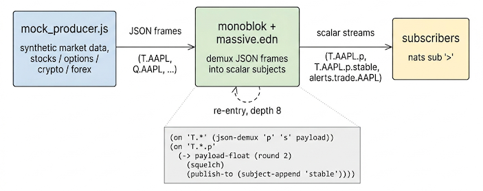
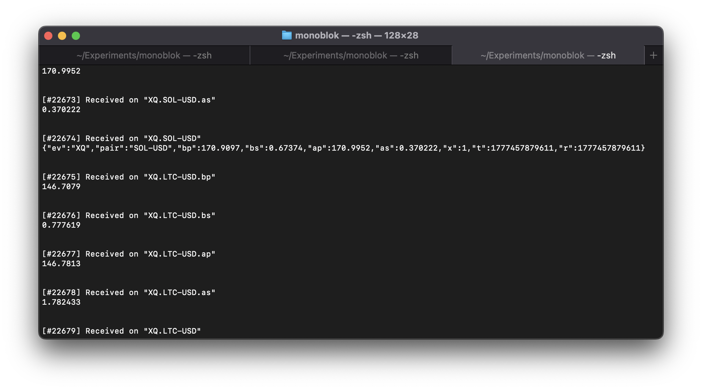

+++
draft = false
date = 2026-04-29
title = "Taming a market data firehose with monoblok"
description = "Demuxing a raw market data feed conditioned at the broker, plus the new re-entry feature in v0.0.28"
slug = "monoblok-massive"
tags = ["nats","zig","pub-sub","stream-processing","monoblok","patchbay","market-data"]
categories = ["projects"]
externalLink = ""
series = []
ShowToc = false
TocOpen = false
+++



I added new end-to-end example in the [monoblok](https://github.com/lexvicacom/monoblok) repo: [examples/json-massive](https://github.com/lexvicacom/monoblok/tree/main/examples/json-massive). 

Running it shows synthetic data, roughly simulating the [Massive](https://www.massive.com) websocket market data feed (stocks, options, crypto, forex) being conditioned by patchbay rules at the broker.

>monoblok solves this problem nicely. Tick data moves fast, the JSON frames carry several fields per message, and every downstream consumer otherwise re-implements the same demux, round, dedupe, alert plumbing. Doing it once at the broker means subscribers can use subject filtering to pick the slice they actually need and ignore the rest.

The producer is a small Node script that speaks the NATS protocol over a plain socket (no npm dependencies) and publishes synthetic frames on subjects shaped `<ev>.<symbol>`. The patchbay file is [massive.edn](https://github.com/lexvicacom/monoblok/blob/main/examples/json-massive/massive.edn). Open three terminals and run:

```bash
# 1: monoblok with the demuxing patchbay
monoblok --port 4222 examples/json-massive/massive.edn

# 2: the synthetic producer
node examples/json-massive/mock_producer.js

# 3: peek at everything
nats sub '>'
```



The screenshot shows it running. Raw `T.AAPL` JSON frames land alongside the demuxed `T.AAPL.p` and `T.AAPL.s` scalar streams, plus the deduplicated `T.AAPL.p.stable` mirror and any `alerts.trade.AAPL` triggers. A subscriber that only cares about price changes subscribes to `T.*.p.stable` and gets a clean, deduplicated, per-symbol stream of rounded floats (assuming that precision is acceptable for their use case). No JSON parsing, no client-side dedupe.

The patchbay is staged:

```clojure
;; 1. Demux the JSON frame into per-field scalar subjects.
(on "T.*"
  (json-demux "p" "s" payload))

;; 2. Round and dedupe the demuxed price stream.
(on "T.*.p"
  (-> payload-float
      (round 2)
      (squelch)
      (publish-to (subject-append "stable"))))

;; 3. Alert on big single-trade jumps.
(on "T.*.p"
  (when (>= (abs (delta payload-float)) 1.0)
    (publish
      (str-concat "alerts.trade." (subject-token 1))
      payload)))
```

That second and third rule depend on a feature that didn't exist a week ago.

## Re-entry, capped at 8

The interesting bit is rule 2 matching `T.*.p`, a subject that only exists because rule 1 emitted it. In [0.0.28](https://github.com/lexvicacom/monoblok/releases/tag/v0.0.28), a publish produced by patchbay itself is now eligible to match downstream rules. Previously it would have been forwarded to subscribers and that was that, so a staged pipeline like the one above had to be flattened by hand into one rule that did everything inline. Awkward, especially when several rules want to feed off the same demuxed scalar.

Re-entry is the obvious thing to want and the obvious thing to be nervous about. A rule that emits a subject which matches itself is a feedback loop: howl, except in subject-space. The cap is 8: a publish can re-enter the rule engine up to 8 times in a single causal chain, then it stops. Long enough for any reasonable staged pipeline (demux, condition, mirror, alert is 3 or 4), short enough that a misconfigured terminates, with a warning, almost immediately.

This release also lets `:` appear in subjects, which matters here because options use OCC symbols like `O:AAPL250620C00200000`. The single `(on "T.*" ...)` rule covers stock and options trades because the wildcard happily matches the colon-bearing token.

## Free LVC for slow markets and the close

A dashboard opening on Sunday afternoon wants to render the last print for every symbol it tracks. Nothing is publishing, the market is closed, and the patchbay has been idle for two days. Subscribe to `$LVC.T.*.p.stable` and the broker hands back the most recent rounded price for every symbol it has ever seen, then nothing else until trading resumes. Same one-shot subscribe works for a logger restarting mid-session, or a tool that just wants the last print on a thinly-traded name where ticks arrive minutes apart.

The subject last-value cache (LVC) is a built-in feature of monoblok, on by default. It comes along for free with anything the patchbay publishes: the demuxed scalars on `$LVC.T.*.p`, the deduplicated mirror on `$LVC.T.*.p.stable`, and the raw frames on `$LVC.T.*`. No JetStream stream, no external KV, no extra rules. The dedupe rule above is what makes the `.stable` LVC actually useful too: without `squelch`, the cached value would be whatever noisy reprint happened to land last, rather than the last meaningful price.

## Already-aggregated channels

A small aside that's worth knowing if you're poking at the real Massive feed rather than the mock: the `AM` / `XA` / `CA` channels deliver server-side OHLC bars when using a `-delayed` feed. The patchbay just demuxes those into scalar `o` / `h` / `l` / `c` / `v` streams instead of recomputing bars from raw trades. If you only have a trade stream and want to build bars yourself, there's a `bar` primitive and a separate `examples/bars.edn` for it.

## Try it

Repo, code, and a more detailed README at [examples/json-massive](https://github.com/lexvicacom/monoblok/tree/main/examples/json-massive). Binaries for the 0.0.28 release are on the [releases page](https://github.com/lexvicacom/monoblok/releases/tag/v0.0.28). The earlier [playground post](/posts/monoblok-demo/) is still the easiest way to get a feel for the primitives without running anything locally.
