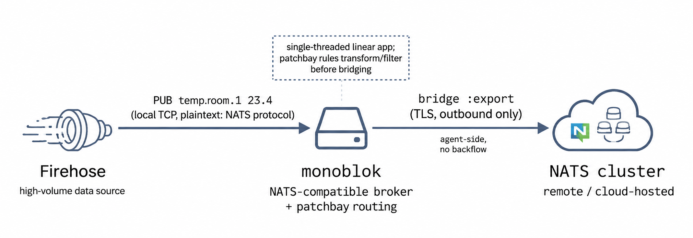
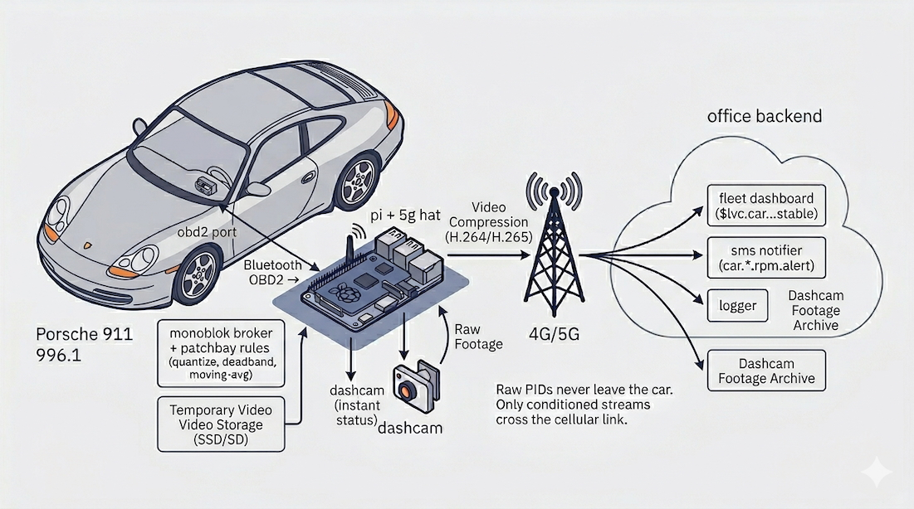
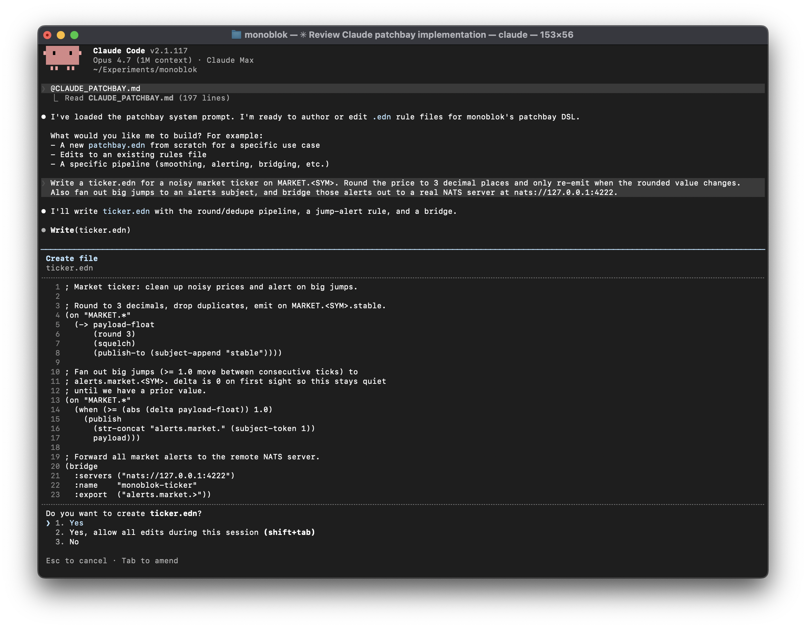

+++
draft = false
date = 2026-04-21
title = "Monoblok: a NATS-compatible broker that conditions the signal before subscribers see it"
description = "An experimental NATS-compatible pub/sub broker that conditions the signal in flight (deadband, debounce, dedupe, demux) with a last-value cache on every subject."
slug = "monoblok"
tags = ["nats","zig","pub-sub","stream-processing","monoblok","patchbay","greatest-hits"]
categories = ["projects"]
externalLink = ""
series = []
ShowToc = true
TocOpen = false
+++


Every team I've worked on has written the same subscriber: read a messy stream, clean it up, republish it. Data can move quickly, but the speed doesn't always carry value. Most of it is noise.

[monoblok](https://github.com/lexvicacom/monoblok) is a broker that does that work once, before a message reaches any subscriber. It sits between your publishers and your real message broker, and conditions the signal in flight: deadband, debounce, dedupe, demux JSON payloads into per-field subjects. The cleanup logic is stable, configured once, instead of being re-implemented in every subscriber.

The pattern: publishers PUB to monoblok instead of directly to NATS, using the exact same NATS client. No code changes. Monoblok does the conditioning, then forwards the tidy subjects to your real cluster. Subscribers get a stream that's already correct.

Useful for jittery sensors (the £2.99 Temu kind), high-frequency market data, fleet telemetry, anything where the data moves fast but most of the movement isn't worth a downstream message.


It's a small partially NATS-compatible pub/sub server written in Zig. Alongside the conditioning DSL (called **patchbay**), there's a second feature worth flagging up front: a last-value cache on every subject, so late-joining subscribers see the current state immediately rather than waiting for the next publish.

It is experimental at this point, but the ideas are solid.

**Update:** [try the public demo server with the NATS CLI](/posts/monoblok-demo/), no install required.

## Key features

**The last-value cache (LVC).** Every subject has an implicit cache of its most recent value. Subscribe to `$LVC.foo.bar` and you immediately receive the cached value (if any), then the live stream of subsequent publishes. Wildcards work too. It's on by default and costs a couple of percent overhead.

**Patchbay.** A small S-expression DSL that runs at the broker, per message. You write rules of the shape `(on SUBJECT-FILTER BODY)` and the body gets evaluated when an incoming subject matches. The vocabulary borrows heavily from electronics: `squelch` to suppress duplicates, `deadband` to ignore small wobbles, `quantize` to snap to a grid, plus a family of O(1) windowed aggregates (`moving-avg`, `moving-max` and friends). Here's the canonical example from the readme:

```clojure
(on "sensors.*"
  (-> payload-float
      (round 1)
      (squelch)
      (publish-to (subject-append "stable"))))
```

Round to 1 decimal place, drop it if it hasn't changed, republish to `sensors.<whatever>.stable`. That's the lot. If the grammar feels unfamiliar, fear not: Claude Code handles it quite happily once pointed at the [patchbay prompt](#using-patchbay-with-claude-code) further down.

**NATS bridge.** An outbound bridge to a real NATS cluster ships in the default build. You nominate subject filters to export, and matching publishes are forwarded upstream while everything else stays local. The point is that an edge monoblok can do its conditioning work locally and only send the tidy, meaningful subjects on to a production NATS deployment. More on this further down.



Sensors publish to a local monoblok, patchbay rules do the conditioning, and only the tidy subjects of interest get trampolined out to a remote NATS cluster. The subjects remain in the local monoblok for local subscribers.

The pattern of using monoblok as a front-NATS for existing publishers is an elegant, light addition. What might have previously been handled by a consumer can now be done by monoblok. All consumers of the processed subjects are none the wiser, they just connect to the same production NATS environment. NATS is not actually necessary though: in smaller or more experimental setups, it is fine to simply point those consumers at monoblok instead.

## A worked example: catching over-revs at Peter's Porsche Rentals

Peter runs a boutique rental outfit with a dozen 911s on the books. Customers pay a lot of money per day and occasionally decide the [A69](https://en.wikipedia.org/wiki/A69_road) is a good place to see what 9000rpm feels like. Peter would like to know about that, ideally while the car is still out, so he can have a conversation at handover rather than discovering a trashed engine three services later.

A £10 Bluetooth OBD2 dongle plugged into the diagnostic port exposes a firehose of PIDs: RPM, coolant temperature, throttle position, short and long-term fuel trims, O2 sensor voltages, intake manifold pressure, the lot. A small Python script on a Raspberry Pi tucked behind the glovebox polls the dongle over RFCOMM and publishes each reading to `car.<vin>.<pid>`.

Because monoblok compiles for ARM, the broker itself runs on the same Pi. A 5G hat gives it an uplink, so conditioned streams go straight to Peter's reporting system without ever shipping raw PIDs over the cellular link. Conditioning at the edge, analysis in the cloud.



What Peter wants:

1. A clean per-car telemetry stream for the fleet dashboard. RPM, coolant, speed, the usual.
2. An over-rev alert the moment a car holds the engine above 7500rpm for more than a couple of seconds. One brief blip past redline on a downshift is forgivable; ten seconds in the limiter is a phone call.
3. When he opens the dashboard in the morning, the current state of every car on hire, immediately. No "waiting for first reading" spinner.
4. It isn't just to spy. If the car has issues, he may want to provide pre-emptive assistance.

The raw feed is exactly the sort of thing patchbay was built for. RPM updates many times a second and wobbles constantly at a steady throttle. Coolant barely moves once the engine is warm. Publishing all of this unconditioned over a metered 5G connection is wasteful and makes the dashboard feel like it's drinking from a firehose.

Deadband, incidentally, is exactly what most consumer cars already do to their own gauges. The coolant temperature needle on a modern dash sits stubbornly in the middle across roughly 75-105°C of actual sensor reading, and only twitches if things get genuinely cold or genuinely hot. VW, Ford and others figured out a long time ago that a needle tracking the real value would have drivers ringing the dealership every time they sat in traffic on a warm day. Same primitive, different reason for wanting it.

```clojure
;; RPM: quantize to 50rpm buckets, drop duplicates, republish
(on "car.*.rpm"
  (-> payload-float
      (quantize 50)
      (squelch)
      (publish-to (subject-append "stable"))))

;; Coolant temp: 1°C deadband is plenty
(on "car.*.coolant"
  (-> payload-float
      (round 0)
      (deadband 1.0)
      (publish-to (subject-append "stable"))))

;; Over-rev alert: fire once when the 20-sample moving average
;; crosses above 7500rpm.
(on "car.*.rpm"
  (-> (> (moving-avg 20 payload-float) 7500.0)
      (rising-edge)
      (publish-to (subject-append "alert"))))

;; All-clear: fire once when the same moving average drops back below.
(on "car.*.rpm"
  (-> (> (moving-avg 20 payload-float) 7500.0)
      (falling-edge)
      (publish-to (subject-append "ok"))))
```

The over-rev rule is the one Peter cares about. A single sample over 7500 gets averaged with the surrounding values and ignored; twenty samples in a row up there, and `rising-edge` fires exactly once on the crossing rather than spamming an alert every sample while the car sits in the limiter. The mirror rule with `falling-edge` emits an all-clear the moment the average drops back. A `transition` form collapses the two into one (same semantics, one shared prev slot, one ring buffer instead of two); the two-rule version is shown here because it makes the primitives visible. State is per rule per subject, so each car has its own independent ring buffer.

The interesting part is what crosses the 5G link. Raw PIDs at full rate would chew through a SIM's data allowance for no good reason; most of it is redundant. Conditioning at the edge means the uplink only carries RPM when it moves into a new 50rpm bucket, coolant when it shifts by a degree, and over-rev alerts only when a customer is actually abusing the car. Everything else stays on the Pi. Peter's backend subscribes to `car.*.*.stable` and `car.*.*.alert` and gets a tidy, low-volume feed it can log, graph or react to without having to do its own conditioning.

The LVC is a life saver on the backend side. When Peter opens the fleet dashboard first thing, subscribing to `$LVC.car.*.*.stable` yields the last known value for every PID on every car without having to wait for the next change. If a logger process restarts, same deal. Useful if you're trying to work out the state a car was in at the moment something went wrong.

Once the over-rev alert is sitting on a pub/sub subject rather than buried in a log file, it becomes a seam for anything else you want to hang off it. A small service subscribed to `car.*.rpm.alert` can push a notification to Peter's phone the moment it fires. Another can look up the customer against the rental record and fire off a politely-worded SMS reminding them that the car is leased, not theirs, and that the limiter exists for a reason.

The dashcam trigger is the interesting one. Grabbing a still is time-sensitive: the moment you want captured is *now*, not thirty seconds later when the 5G link comes back after a tunnel or a patch of rural Wales with no signal. So that subscriber runs on the Pi itself, on the same broker, and pokes the dashcam over the local network the instant the alert lands on the subject. No uplink required. Because the alert payload carries the offending RPM reading, the subscriber can stamp it straight onto the image before saving: a JPEG with `8,420 RPM` burned into the corner is a lot harder to argue with at handover than a log line. The notification and SMS services live back at the office and pick up the same alert whenever the 5G link is healthy again, because the broker buffers anything that couldn't be delivered. Same subject, two very different latency and connectivity profiles, no extra plumbing.

None of these subscribers know or care about OBD2; they're plain subscribers to a clean, meaningful stream. You can add or remove them without touching the car, the Pi or the patchbay rules.

## Implementation notes

Everything runs in an event loop provided by the excellent [libxev](https://github.com/mitchellh/libxev), so you get kqueue, io_uring, epoll or IOCP depending on where you run it. No threads or locks, zero-copy fan-out. It speaks enough of the NATS wire protocol that any NATS client can connect. This is rather convenient because it means you can drop it in alongside existing tooling without writing a client library first, or simply replace NATS as an experiment.

Benchmarking against the existing `nats bench` commands was convenient, although obviously `nats-server` is a mature Go codebase with a decade of production history behind it, and I ran these with an empty patchbay so the numbers measure raw broker work only.

A M4 Mac Mini monoblok is within single-digit percent of `nats-server` on the single-publisher 64B workload (6.46M vs 7.14M msg/s) and pulls sharply ahead as fan-out grows: 17.52M (!) vs 4.82M msg/s at 50 subscribers. 17.52M seems high so I'm cynical and need to look into that. 🤏🧂

Linux is a similar tale. On a 2-core Hetzner VM with the io_uring backend this time. Multi-publisher throughput collapses to parity because a single-threaded loop can't scale past one core while nats-server spreads across both, and the single-subscriber fan-out case flips the other way (0.73M vs 1.09M msg/s, likely io_uring completion batching misbehaving under low concurrency), but by 50 subscribers monoblok is ahead again at 3.98M vs 3.05M msg/s. Throughput will drop from these figures in proportion to how much your rules do, but it's a respectable starting point. 

## Sitting in front of a real NATS cluster

An outbound bridge to a real NATS cluster ships in the default build. Configuration is a single optional form in the patchbay file:

```clojure
(bridge
  :servers  ("tls://connect.ngs.global:4222")
  :creds    "/etc/monoblok/ngs.creds"
  :tls      true
  :name     "monoblok-prod-1"
  :export   ("telemetry.>" "alerts.>"))
```

It's export-only: publishes whose subject matches any `:export` filter are forwarded to the remote cluster, everything else stays local. Local subscribers are served before the forward, so edge consumers don't wait on the uplink.

Back to Peter's rental fleet: the Pi in each car keeps running its conditioning rules locally, and the bridge forwards only `car.*.*.stable` and `car.*.*.alert` up to the office NATS cluster. Raw PIDs still never cross the 5G link, but now the uplink target is a proper cluster with persistence and replication.

## Using patchbay with Claude Code

Writing patchbay rules by hand is fine once you've internalised the primitives, but it's much nicer to have Claude Code do it for you. There's a self-contained system prompt in the repo, [claude-patchbay.md](https://raw.githubusercontent.com/lexvicacom/monoblok/main/docs/claude-patchbay.md), that teaches the model the grammar, the bound symbols, the idioms and the anti-patterns.



Append it to your project's `CLAUDE.md` and Claude Code will pick it up whenever you're editing rule files:

```sh
curl -fsSL https://raw.githubusercontent.com/lexvicacom/monoblok/main/docs/claude-patchbay.md >> ./CLAUDE.md
```

Or inline it into a one-off prompt with `@claude-patchbay.md`. Handy.

## Why this is all interesting


The conventional logic is "broker moves bytes, application does logic." That's fine and largely correct, but there's a category of logic, signal conditioning, that you could argue belongs at the broker. It's stateless from the application's point of view, it's the same boring code reimplemented in every consumer, and it benefits enormously from being applied once, centrally, before fan-out.

Putting a small DSL at the broker for this kind of work is a nice middle ground. It's not trying to be Flink, Beam or Kafka Streams. It's just a few primitives, declared once, that turn raw sensor noise into something useful before it ever leaves the broker. The LVC then makes late-joining subscribers a non-event, which is the other thing every realtime app ends up reinventing.

It's just a toy but the applications are endless. Swap office temperature sensors for market data ticks where you want to deadband out the noise and only emit on meaningful moves, fleet telemetry from a few thousand vehicles where most of the GPS jitter is uninteresting, IoT estates with flaky sensors that need smoothing before anyone trusts the readings, gaming or trading dashboards where late-joining clients shouldn't have to wait for the next event to see current state. **Same primitives, different domains.**

There are many loose ends to tidy up: a TTL on last-value cache entries so stale state doesn't linger forever or grow unbounded, maybe TLS (or just rely a NLB to terminate), proper structured logging, and a resilience story. Further out, getting it running on a microcontroller is an interesting direction, swapping the Pi for something an order of magnitude cheaper and lower-power at the edge.

The code lives at [github.com/lexvicacom/monoblok](https://github.com/lexvicacom/monoblok) and there are both x86 and ARM Linux builds ready to go on the [releases page](https://github.com/lexvicacom/monoblok/releases) if you want to skip the build step and give it a spin.

If you've thoughts or want to chat about this sort of thing, [give me a shout](mailto:alex@lexvica.com) or find me on [X](https://x.com/AlexJReid) or [LinkedIn](https://www.linkedin.com/in/alexjreid/).
