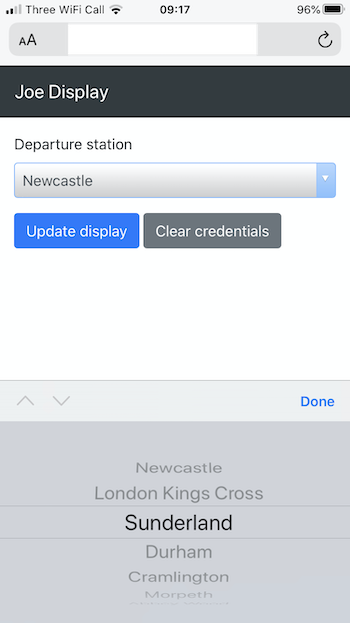

+++ 
draft = false
date = 2019-12-19T10:00:00Z
title = "Driving an OLED display with a Raspberry Pi and AWS IoT"
description = "Using a Raspberry Pi to expose an OLED panel as a thing that can be easily interacted with."
slug = "rpi-oled-aws-iot"
tags = ['raspberry-pi','aws','iot','python']
categories = []
externalLink = ""
series = []
+++

This project started when my son asked me for a [replica train departures board](https://ukdepartureboards.co.uk/store/product/desktop-departures/) for Christmas. I thought this was a great idea and the example on sale looks to be a really neat implementation. However, I wanted us to have a go at building one ourselves. I promised that if we failed miserably I’d buy him one!

[After locating some code on GitHub](https://github.com/balena-io-playground/UK-Train-Departure-Display), I managed to get it up and running. But I felt there was room for improvement. I wanted:

*   a simple way of displaying _anything_ on the OLED panel without writing more code every time. This is useful for extending this project and also allowing for reuse on other projects.
*   to decouple the _data_ and _display_ aspects
*   to display things other than very exciting train departures
*   the ability to update the display from other systems
*   a way of controlling the station shown without having to SSH into the RPi, ideally through any web browser not on the same network as the RPi

### Display as a thing

The key idea was to expose the OLED/Raspberry Pi as a _thing_ that accepts _display events_ from other components and systems. **Display events** can originate in-process or come from external source such as an HTTP request, Redis PubSub channel or MQTT topic subscription. This allows for very simple programs to interact with the panel with very little code.

External processes can perform an HTTP request or write to a topic to update it. This is nice and flexible as in theory, data can now come from any source and at any frequency. There is no need to poll for new data to refresh the display every few seconds.

Exposing the display as an addressable _thing_ that renders events means that this architecture will work well with IoT platforms such as AWS IoT. This is covered later in this post.

### Display Events and Stages

I implemented a simple library for rendering events on the panel. The code and more information is available in this [GitHub repository](https://github.com/AlexJReid/joedisplay).

A `Display Event` is a dictionary (encoded as a JSON object when being passed between systems) containing structured data to display on the OLED panel. It must contain a `stage` property to tell the display how to render the data. It is sent to the thing from a source such as a queue, topic or HTTP request.

Upon receiving this display event:


{
    "stage": "metrics",
    "metrics": [
        {"value": "7", "label": "Days to go"},
        {"value": "2", "label": "Naughty"},
        {"value": "312", "label": "Presents"},
        {"value": "9", "label": "Reindeer"}
    ]
}


The panel updates like so:

The `Stage` abstraction provides a plug-in model to render display events to a screen of any type. It contains the logic to _draw_ a given display event. The library may eventually contain more built-in `Stage` implementations.

For example, the `metrics` stage shown above has _slots_ for four numbers (with optional labels).

Having a toolbox of versatile built-in stages will lower the barrier to entry for quick projects, particularly when teaching kids who are eager to get immediate results. I was able to make a _Christmas metrics_ display for Santa by simply posting in some JSON. (The RPi and panel could be discreetly installed into some of the very tasteful Santa sleigh/North Pole ornaments we have accumulated over the years…)

### Enter AWS IoT Core

[AWS IoT](https://docs.aws.amazon.com/iot/latest/developerguide/what-is-aws-iot.html) is a service that makes building _real_ IoT applications easier with important concerns like security, connectivity, discovery, deployment and device provisioning handled comprehensively.

On-boarding a device is a little more involved than just connecting to a service running on the RPi over the local network. You will need to provision your _thing_ through the AWS IoT console and download the generated certificates. [This tutorial](https://docs.aws.amazon.com/iot/latest/developerguide/iot-moisture-tutorial.html) is a good starting point.

As the display library covered in the previous section allows me to update the screen through events, I moved on to implementing the train departures board using AWS IoT.

### Train departures with AWS IoT

First of all I implemented a `train-display-board` stage of the following shape with a corresponding `Stage` that would render the data into something close to a real train departures board.


{
    "stage": "train-display-board",
    "data": {
        "refresh_rate": 30,
        "origin": "NCL",
        "response_time": "2019-12-11",
        "valid_for": 60,
        "departures": [
            {"departure_time": "14:25", "destination": "Edinburgh Waverley", "platform": "Plat 2", "status": "On time", "calling_at": ["Dunbar"]},
            {"departure_time": "14:25", "destination": "Metro Centre", "platform": "Plat 2", "status": "On time", "calling_at": ["Dunbar"]},
            {"departure_time": "14:25", "destination": "Nunthorpe", "platform": "Plat 2", "status": "On time", "calling_at": ["Dunbar"]},
            {"departure_time": "14:25", "destination": "Nunthorpe", "platform": "Plat 2", "status": "Exp 14:23", "calling_at": ["Dunbar"]}
        ]
    }
}


With the departure board now rendering with a mock event, I thought about how I could make this work on AWS IoT.

[I discuss the design in more detail](https://github.com/AlexJReid/joedisplay/blob/master/AWSIOT.md) in the repo, but at a high level, the Raspberry Pi boots up and requests the thing’s shadow from the shadow service. This is a JSON document that contains the _desired_ and _reported_ (i.e. actual) state of that thing. The RPi uses this data to resume its previous state, i.e. display departures at a given train station.

The RPi then subscribes to a dedicated MQTT topic where its display events will be published. It will render any display event that arrives on this topic. If the `stage` of an incoming display event differs to the active stage, the active stage is shut down and a new one started. This adds to the versatility of this approach: a single agent runs on the Raspberry Pi for multiple uses. For instance, if there is a problem displaying departure data, a `text` display event is published and the stage is switched in order to show the error message.

Every minute, the display sends a data request event to _a producer command topic_ for the active stage_._ An IoT rule invokes a Lambda function when a message arrives on this command topic. The Lambda function requests data from the Transport API, converts the response into a display event and publishes it to the display event topic. A nice side effect of this approach means that API secrets for the [Transport API](https://developer.transportapi.com/) do not need to be stored on the thing. These remain a secret in my AWS account.

Some systems may have a constant stream of events readily available, rendering this _pumping of data_ approach unnecessary. Instead the _event producer_ Lambda could subscribe to an SNS topic, Kinesis stream, Kafka topic, web socket API, etc and continually convert the outside events/notifications into _display events_ that get written to the _display input topic_ in the same way.

It was important that the train station shown could be updated by a non-technical user through a web site on their phone. AWS IoT provides the shadow service that allows any authorized system to update a thing’s shadow over HTTPS. The web client shown below updates the _desired_ section of the shadow, which the thing then actuates and updates the _reported_ section when the transition has completed. This tiny web app is hosted on S3 as a simple website with no server elements — it makes use of the AWS SDK for JavaScript to make calls to the shadow service.

### Conclusion

A generic approach for displaying data on an OLED panel has been proposed and implemented. Use of AWS IoT is of course optional, but is recommended for more serious use cases.

Some might say the Raspberry Pi Zero W is overkill for the simple task of driving a panel when a smaller microcontroller could do the same. They’d be right, however — the Raspberry Pi Zero costs about £10 and allowed me to write very basic Python code and use the excellent libraries available. Beginners (I include myself in that category) can work at a very high level of abstraction and see instant results. This accessibility is huge. One comment I did get from my difficult customer was the time the display takes to boot (around 30–40 seconds). This is because the RPi is loading up a Raspbian Lite OS. I daresay it would be possible to reduce this by disabling some installed services.

[I’ve published the code on GitHub](https://github.com/AlexJReid/joedisplay). It is of _weekend hack_ quality, but I have some ideas about where to take it in the future.

It would be easy to build some simple projects on top of the provided pieces.

*   Days til Santa
*   Temperature in different rooms
*   Cloudwatch graphs (or indeed any time series)
*   KPIs and other boring business dashboard things
*   News headlines, stock prices, FX…

As our desktops get more cluttered, I’m starting to love these little displays as real-life miniature dashboards. I’ve got one stuck onto one of my work monitors. They’re also a great way of teaching kids and giving them something tangible to observe, rather than numbers and text appearing on their computer screen.
