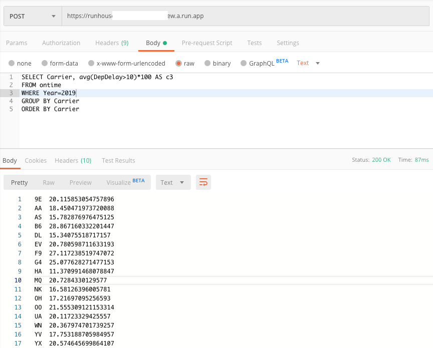

+++ 
draft = false
date = 2020-01-23T18:14:16Z
title = "Squeezing ClickHouse into Cloud Run"
description = "First in the series of bad idea posts, I tried to squeeze ClickHouse into Cloud Run."
slug = "clickhouse-on-cloud-run" 
tags = ['clickhouse','gcp','cloud run']
categories = []
externalLink = ""
series = []
+++

So here's the first in the series of my bad ideas that are nevertheless fun to think through. I am __not__ suggesting you actually do this. Really, I'm not. Serverless data technologies already exist.

## The idea

I really like [ClickHouse](https://clickhouse.yandex). Compared with the expanse of complex software in the big data space, it's refreshing to run a single process. It's very fast and versatile.

Running it on [Cloud Run](https://cloud.google.com/run/) is a bad idea. Cloud Run is for stateless things like APIs and tasks that pull in data from elsewhere. 

But... well... _what if_ the data being stored/queried is immutable? Then, arguably the state is fixed.

## How could that possibly be useful?
- Maybe you have a comparatively small dataset (or your data has natural partitions of reasonable size, such as multi-tenant SaaS) that doesn't need to be updated frequently. For instance, the user might be happy to look at usage metrics for year, up to yesterday. Maybe the data is something historical such as oil production figures from 1983. These could be extracted to a snapshot by some other process.
- You want to allow arbitrary queries on that snapshot: most likely slice and dice aggregations with small result sets.
- Perhaps that small dataset is read heavy and might need to scale up and handle a lot of slice and dice queries. Cloud Run will in theory handle this by spinng up more _replica_ containers, each _containing_ the same fixed dataset.

## How I think it could work
- Extend the `yandex/clickhouse` image with some ready-to-roll data (I used the ontime dataset) or consider adding a startup script that will pull the data in from some storage service
- Push this image and run it on Cloud Run
- Access ClickHouse through HTTP

## Did it work?
Hilariously, it started up and answered _some_ queries. And then the wheel fell off and rolled away.

Firstly I prepared some data to stamp into the ClickHouse image. I used a single year (2019) of the ontime dataset and followed the instructions in [ontime](https://clickhouse.yandex/docs/en/getting_started/example_datasets/ontime/) example. In a local `yandex/clickhouse-server` container I opened a `bash` session and read the CSV into ClickHouse with
```
cat ontime.csv | sed 's/\.00//g' | clickhouse-client -query="INSERT INTO ontime FORMAT CSVWithNames"
```
I then stopped the server process and copied the `data` and `metadata` out of the container's `/var/lib/clickhouse`. 

A _data layer_ was added to the base ClickHouse image.
```
FROM yandex/clickhouse-server

RUN mkdir -p /var/lib/clickhouse/data/default
RUN mkdir -p /var/lib/clickhouse/metadata/default
ADD default /var/lib/clickhouse/data/default/
ADD ontime.sql /var/lib/clickhouse/metadata/default/ontime.sql

EXPOSE 8123
```
I built and pushed the image using Google Cloud Build.
```
steps:
- name: 'gcr.io/cloud-builders/docker'
  args: ['build', '--tag=gcr.io/${PROJECT_ID}/runhouse', '.']

images: ['gcr.io/${PROJECT_ID}/runhouse']
```
The build was submited with
```
$ gcloud builds submit . --config=cloudbuild.yaml
Creating temporary tarball archive of 227 file(s) totalling 56.1 MiB before compression.
```
This gave me an image to run in Cloud Run. As I wasn't sure of the exact settings I might need, I used the console to create the Cloud Run service.

I set the container port to `8123` and the container 256MB of RAM. I turned concurrency down to `5`. These settings could probably have done with some more thought.


I pressed `CREATE` and after maybe 10-15 seconds, it was running.


Exciting. I tried the endpoint given to me by the Cloud Run console with curl.

```
$ curl https://runhouse-xxxxxx-ew.a.run.app
Ok.
```
It works!!!

Moving over to Postman I queried one of the system tables.


Then the big moment. I tried to query the `ontime` table but the request timed out. I could see a spike in latency.

.

Logs told me that the ClickHouse had exhausted the 256MB memory. Not a problem. I deployed a new revision of the service, this time with 1GB and a query worked, responding very quickly.


A `SELECT COUNT()` also worked. However when attempting to run a query with `GROUP BY` or `WHERE`, the following error was returned.

```
Code: 460, e.displayText() = DB: :ErrnoException: Failed to create thread timer, errno: 0, strerror: Success (version 20.1.2.4 (official build))
```

Looking at the [ClickHouse code](https://github.com/ClickHouse/ClickHouse/search?q=Failed+to+create+thread+timer&unscoped_q=Failed+to+create+thread+timer), it appears this relates to a `timer_create` syscall in the query profiler, which can't be disabled. The excellent [Cloud Run FAQ](https://github.com/ahmetb/cloud-run-faq#which-system-calls-are-supported) has a list of supported gVisor supported syscalls and `timer_create` appears to be among them. Unfortunately the ClickHouse code doesn't appear to log the actual error from `timer_create`. I didn't have time to spend on compiling ClickHouse to explore further, but it looked as if `timer_create` within `gVisor` was not working as ClickHouse expected. Boo.

> Some system calls and arguments are not currently supported, as are some parts of the /proc and /sys filesystems. As a result, not all applications will run inside gVisor, but many will run just fine ...
-- https://cloud.google.com/blog/products/gcp/open-sourcing-gvisor-a-sandboxed-container-runtime

The next port of call would have been to try running ClickHouse in a gVisor environment outside of Cloud Run. I pulled the image into my [Cloud Shell](https://cloud.google.com/shell/) and it worked as expected, but this is a small VM so no gVisor? For now, game over.

## Update
A few days after publishing this post, I noticed [PR#8837](https://github.com/ClickHouse/ClickHouse/pull/8837) on ClickHouse's Github that provides a workaround. That's amazing! Thanks, contributors.

In addition, soon after, [issue#1738](https://github.com/google/gvisor/issues/1738) and [this commit](https://github.com/google/gvisor/commit/bd6d479b0d0009889496989401235ce17c7582bd) appeared on Google's gVisor repo, which look to address the issue at the source. Open source is great...

Anyway, I rebuilt, tagged and pushed a `clickhouse-server` [image](https://github.com/ClickHouse/ClickHouse/blob/master/docker/server/Dockerfile), with the latest build from the `testing` repository: `deb http://repo.yandex.ru/clickhouse/deb/testing/ main/`

I updated my `Dockerfile` to inherit from this new base image, and rebuilt my `ClickHouse + Data` image on Cloud Build. 

I then created a Cloud Run service with this image and ran a few queries from the [ontime tutorial](https://clickhouse.tech/docs/en/getting_started/example_datasets/ontime/).

As per the workaround, logs now report that `timer_create` on Cloud Run might not be behaving as expected.


And...



**It works.** It's a very small dataset, but yes - ClickHouse works on Cloud Run, for what it is worth. :) Available storage on Cloud Run is probably the limiting factor right now. This is understandable, of course.

## Why I thought the idea was interesting
- ClickHouse speaks HTTP so will just work on Cloud Run.
- It's very fast even with modest hardware and isn't a big install, it's a single binary. There's a ready made Docker image.
- Given some tuning of the default configuration (especially around memory usage, caching and logging) it might work acceptably.
- Dataset is immutable so no background processes (merging of data) to worry about.
- UPDATE: It turns out this pattern has a name: [baked data](https://simonwillison.net/2020/Dec/13/datasette-io/). Nice!

## Why Not
- ~~Well, it doesn't work... right now.~~
- ClickHouse is meant for far, far larger amounts of data than what can fit into a Cloud Run RAM disk (2GB on the most expensive type, after any overheads so more like 1.5GB?)
- sqlite may be a substitute if you like this odd idea... maybe after a trivial HTTP API, similar to ClickHouse's is implemented. This is all about tiny datasets anyway. A `.sqlite3` file would be mastered and added to the image instead of `/var/lib/clickhouse` (although the `.sqlite3` file I tried was over 200MB - close to the source `.csv` vs 58MB for Clickhouse's data directory.)
- You would need to rebuild the image for new data (although you could pull it in from GCS/S3 on start.)
- Data volume/image size might make the service take a long time to start on demand.
- ClickHouse probably wasn't designed to be robbed of _all_ CPU when not serving an HTTP request (I believe this is what Cloud Run does. I don't know enough about ClickHouse's internals to comment on whether that'll break things.)
- The API exposed over HTTP speaks SQL, some people get offended by that.
- Probably a niche use case which could be better met in a more conventional way?
- Serverless data tech already exists! (Athena, Aurora Serverless, BigQuery....)

## Conclusion
It was good to learn more about gVisor and remember some C++ by reading through the ClickHouse code. Not a completely wasted hour or two ... and the ClickHouse and gVisor community took note and fixed the issue I ran into. It just goes to prove that a terrible idea can maybe have a positive effect, after all.
