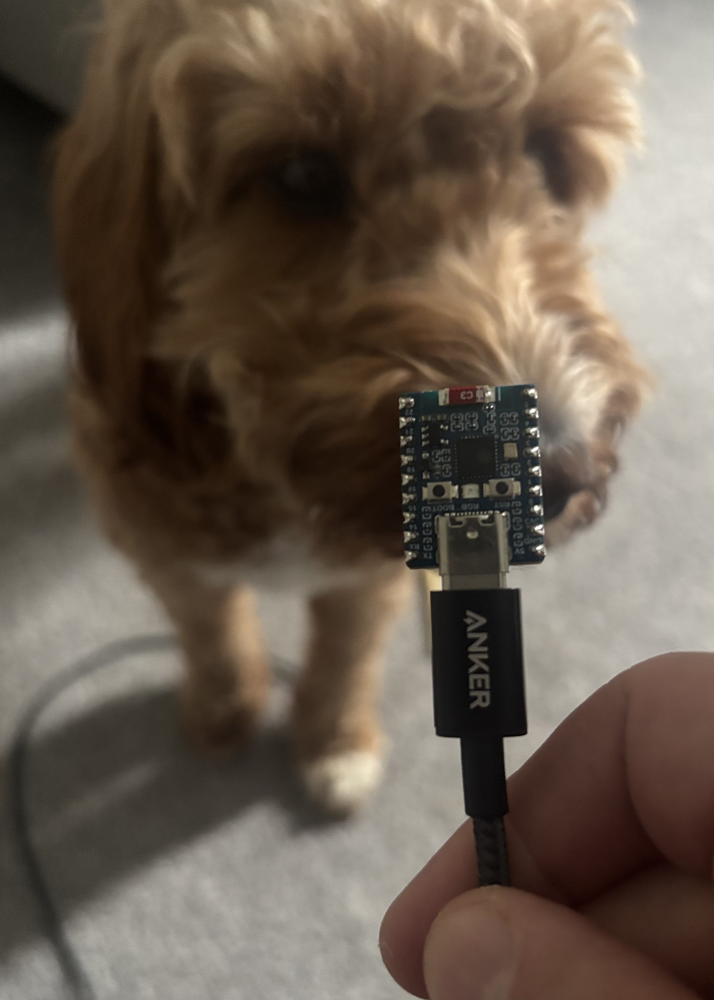
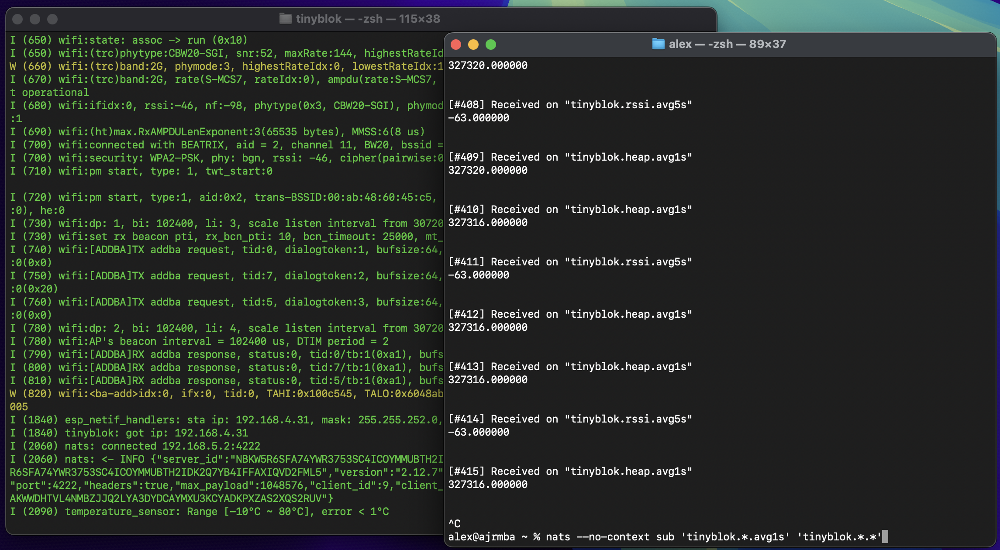

+++
draft = false
date = 2026-05-03
title = "tinyblok: monoblok's patchbay on an ESP32-C6: a £5 microcontroller"
description = "Running the existing patchbay DSL on a microcontroller"
slug = "tinyblok"
tags = ["esp32","zig","nats","monoblok","patchbay","embedded","iot","greatest-hits"]
categories = ["projects"]
externalLink = ""
series = []
ShowToc = false
TocOpen = false
+++

[tinyblok](https://github.com/lexvicacom/tinyblok) is the obvious next experiment after [monoblok](/posts/monoblok/): can the patchbay run on a microcontroller and ship sensor data straight into a remote NATS cluster? In the original post, the [Peter's Porsche Rentals worked example](/posts/monoblok/#a-worked-example-catching-over-revs-at-peters-porsche-rentals) put a Raspberry Pi behind the glovebox; an ESP32 is an order of magnitude cheaper and smaller. Coupled with a 4G mi-fi or the car's onboard Wi-Fi, it's a self-contained edge node that can sit on a OBD2 dongle's worth of power and select what crosses the mobile data connection.



Right now it's an ESP32-C6 that brings up Wi-Fi, opens a TCP socket to a NATS broker, sends `CONNECT`, and publishes some metrics off the board at defined rates. C owns everything that touches ESP-IDF (Wi-Fi, NVS, lwIP, the NATS client); Zig owns the sample-and-publish loop.

The patchbay introduces a new top-level form, `pump`, alongside the familiar `(on ...)` rules. A `pump` declares a source: the _subject_ values appear on, the Zig `extern fn` that returns the next value, the value's type, and how often to poll it. It is equivalent to a NATS subject - `on` reacts to these messages.

<small>

```clojure
(pump "tinyblok.heap"   :from tinyblok_free_heap    :type u32      :hz 10)
(pump "tinyblok.rssi"   :from tinyblok_wifi_rssi    :type i32      :hz 10)
(pump "tinyblok.uptime" :from tinyblok_uptime_us    :type uptime-s :hz 10)
(pump "tinyblok.temp"   :from tinyblok_read_temp_c  :type f32      :hz 1)
```

</small>

So `tinyblok_wifi_rssi` is called ten times a second and the result is published as an `i32` on `tinyblok.rssi`. From there it's the same DSL as monoblok: deadband, moving averages, rising-edge alerts.

<small>

```clojure
(on "tinyblok.heap"
  (-> payload-float
      (deadband 1024)
      (publish! (subject-append "stable"))))

(on "tinyblok.heap"
  (-> payload-float
      (moving-avg 10)
      (round 0)
      (publish! (subject-append "avg1s"))))

(on "tinyblok.heap"
  (when (< payload-float 20480)
    (-> payload (rising-edge) (publish! "tinyblok.alert.heap.low"))))

(on "tinyblok.rssi"
  (when (not (= payload-float 0))
    (-> payload-float
        (deadband 2)
        (publish! (subject-append "stable")))))

(on "tinyblok.rssi"
  (when (not (= payload-float 0))
    (-> payload-float (moving-avg :ms 5000)
        (round 0)
        (publish! (subject-append "avg5s")))))

(on "tinyblok.rssi"
  (when (and (not (= payload-float 0)) (< payload-float -75))
    (-> payload (rising-edge) (publish! "tinyblok.alert.rssi.weak"))))

(on "tinyblok.uptime"
  (-> payload-float
      (throttle :ms 60000)
      (round 0)
      (publish! (subject-append "1m"))))

(on "tinyblok.temp"
  (-> payload-float
      (moving-avg 30)
      (round 1)
      (publish! (subject-append "avg30s"))))

(on "tinyblok.temp"
  (when (> payload-float 30)
    (-> payload (rising-edge) (publish! "tinyblok.alert.temp.hot"))))
```

</small>

Below: device boot log on the left, conditioned stream on the right. TCP connect to the NATS broker at `[1840]`, first publish a tick later. From the right pane you can see only the conditioned outputs reach a subscriber: deadbanded `tinyblok.heap.stable`, `tinyblok.rssi.avg5s`, `tinyblok.heap.avg1s`. The 10 Hz raw firehose stays on-device.



## Shared kernel, two backends

Monoblok interprets the DSL, tinyblok uses codegen to keep things as light as possible.

The fork isn't so bad as the ops themselves aren't duplicated. `deadband`, `moving-avg`, `rising-edge`, `throttle`, and friends live in a small kernel that both monoblok and tinyblok share. Monoblok walks the parsed tree at runtime and calls the kernel; whereas tinyblok's codegen emits straight-line Zig that calls the same kernel. The DSL has one implementation of what each op _means_; the two backends just differ on how they get there.

Adding one? Write the op in the shared kernel, teach the runtime walker to dispatch to it (monoblok), teach the codegen to emit a call to it (tinyblok). Two light touches, not two parallel implementations to keep in sync.

## Drivers are just functions

A `pump` form points at a function :fn ... and that's the entire driver contract. Codegen turns it into an `extern fn` declaration on the Zig side and an entry in a static table the C side reads. Either language can use this, so an IDF-touching sensor would likely be a C function and a pure-compute source is an exported Zig function with `callconv(.c)`. Adding a sensor is one function and one line of patchbay.

The C side wires that table into IDF's native event loop: each pump gets an `esp_timer` armed at its `:hz`, the timer posts onto a private `esp_event` base, and a single handler dispatches back into Zig. Sample read, format, rule eval all run on the event task; the main Zig loop only drains the network.

Only polled drivers exist today. The interesting follow-on is push-style drivers (GPIO ISRs, UART RX) under a `pump` form with no `:hz`, registering their own event ids on the same base. From the patchbay's perspective an interrupt-driven sensor looks identical to a polled one, which is the bit I want.

## The TX ring and what gets dropped

`publish!` doesn't write to the socket; it enqueues into a small ring (8 KB, ~256 messages at typical sizes) which the main loop drains via non-blocking `send()`. When the broker is slow or Wi-Fi is retransmitting, the ring drops the _oldest_ records rather than stalling the loop. Newest-wins is the right default for telemetry: when the link comes back you want recent state, not a faithful replay of half an hour ago.

The cases where age _does_ matter, like a lower velocity remote sensor where every reading counts, probably a needs a different approach: spooling overflow to LittleFS and flush on reconnect. That's possibly the next addition, paired with a producer-side `X-Measured-At` header so a catch-up burst is distinguishable from live data downstream. Growth is still bounded by virtue of it being in a ring, so this could require some config exposing to set the ring cap. Maybe a whole 32K? `:)`

## Challenges so far

**More C than planned.** ESP-IDF macros don't translate: `ESP_ERROR_CHECK`, `WIFI_INIT_CONFIG_DEFAULT`, `IPSTR`/`IP2STR`, FreeRTOS event-group bits. `@cImport` has issues. I was naive - it was faster to keep the IDF surface in C and reserve Zig for the overlap with monoblok/patchbay.

**The C NATS client is hand-rolled.** The obvious off-the-shelf options didn't fit. Synadia's [nats.c](https://github.com/nats-io/nats.c) is a good library on a server or full client, but it pulls in pthreads, a thread pool, and TLS through linking OpenSSL, none of which is a good match in a microcontroller context where the NATS client is one of several tasks sharing 320 KB of RAM. Same story for [nats.zig](https://github.com/nats-io/nats.zig) which assumes `std.Io.Threaded` and `std.crypto.tls`, neither of which exist here either. So, a small bespoke client it is: this is the beauty of the NATS protocol: the wire format is so simple you can implement the publish-only subset in a small amount of C and have it talk to a real broker. TLS and auth is a problem for another day (or 8), but doable.

**The temperature sensor quantizes to 1 deg C.** Polling faster than 1 Hz just gives you duplicates. Ironically quantization is already in place. A good early reminder that on-device, the sensor is usually the bottleneck, not the code.

It is built with `make build`. A Python script runs as a CMake step before the Zig static lib is built, turning `patchbay.edn` into `main/rules.zig` automatically on every `make build`. The Zig-flavoured alternative would be a `comptime` EDN parser or Zig-based executable; instead a small Python script is boring and produces a `.zig` file you can read. Python was the right move. What's next? Doing something more interesting than forwarding temperature and Wi-Fi RSSI.

The most satisfying bit: run `make build flash`, and it's running. From then on every time the board sees power it's on Wi-Fi, talking to the broker, and publishing conditioned data in a couple of seconds.

Code is at [github.com/lexvicacom/tinyblok](https://github.com/lexvicacom/tinyblok); expect more than a few rough edges. You'll need [espressif/esp-idf](https://github.com/espressif/esp-idf) installing first. It's a chunky download but is really nice.

If you've thoughts, [give me a shout](mailto:alex@lexvica.com) or find me on [X](https://x.com/AlexJReid) or [LinkedIn](https://www.linkedin.com/in/alexjreid/).
