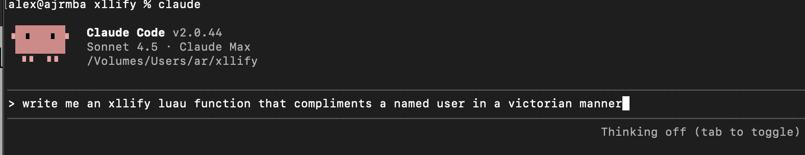
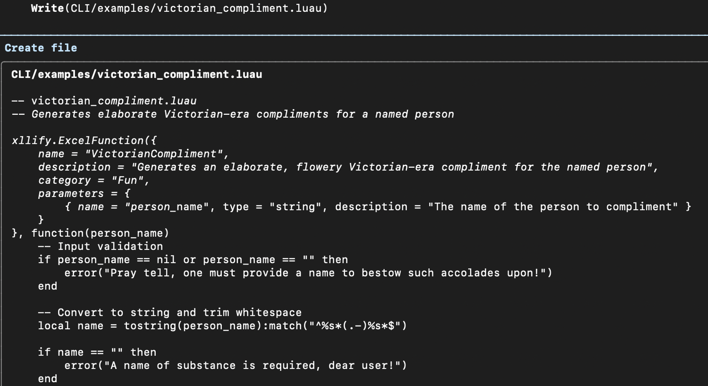
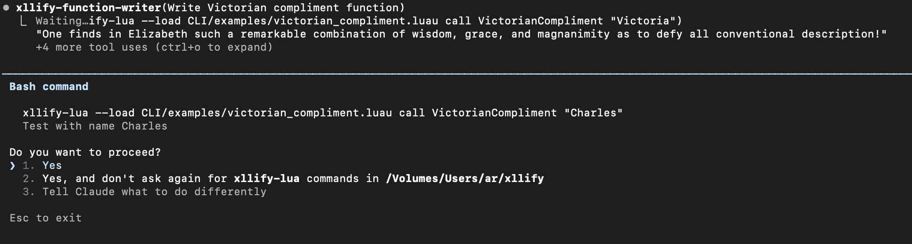
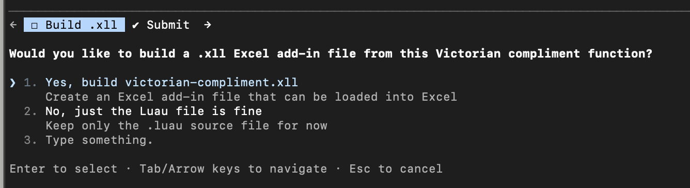

+++ 
draft = false
date = 2025-11-18
title = "From prompt to Excel custom function in 30 seconds"
description = "Thanks to xllify + Claude Code agent"
slug = "xllify-claude-code-agent"
tags = ["data","excel","lua","python","greatest-hits","xll","excel add-in","luau","python","xllify","claude","ai"]
categories = []
externalLink = ""
series = []
+++

> [xllify](https://xllify.com) is a packaging tool and runtime that allows functions written in Luau and Python to be used as high-performance custom functions in your Microsoft Excel workbooks.

In a bizarre collision of 1990s style development (the Excel C SDK) and 2025 era AI, I've been experimenting with having a Claude agent write Excel custom functions for xllify!

As Excel itself is now fat and 40 years old, it could be donning ill-fitting running gear and developing an irrational interest in coffee beans. Or, rather is Microsoft shoehorning in Clippy-esque AI features to stay relevant? I don't think so. Spreadsheets aren't going anywhere, but nor is AI (or whatever we end up calling it.)

Anyway. The UNIX philosophy of Claude Code means that existing command line tools from xllify can be called to exercise the code that Claude has dreamed up, and even build a ready-to-go .xll as the final step.

We start with a frivolous prompt which gets picked up by the xllify agent.

After burning some tokens, some [code](./victorian_compliment.luau) pops out.

Accept. #yolo. Now the agent uses existing tooling to check its work.

As a final step, the agent will ask whether to build it for Excel. Go!

Loading the .xll into Excel, sure enough, I have a custom function. =VictorianCompliment

Which works!

An Excel custom function from scratch with no code in 30 seconds. This was fun segue for an otherwise rainy and cold Tuesday morning!

This is all very frivlous.

> We're in an age where a bit of duct tape programming can do something that was unfathomable not so long ago. Take a step back and think about how this single prompt has enhanced existing incumbent software, conceived long before Claude was born (BC).

Integration of existing tools (pipes - the UNIX philosophy) and eliminating technical barriers so more people can get stuff done absolutely is progress. Old and new worlds collide.

Perhaps due to what is possible with low effort, we are absolutely in an era where random stuff gets thrown out, because AI. Most of it won't stick. We ought to question this "just because we can..." mentality but I suppose that's how we learn. Maturity will come with time. Meanwhile, it is fun to play.

Check out some [other posts on xllify](/tags/xllify/) or the [thing itself](https://xllify.com).

If you've any questions about xllify [give me a shout](mailto:alex@xllify.com) or find me on [X](https://x.com/xllify).
