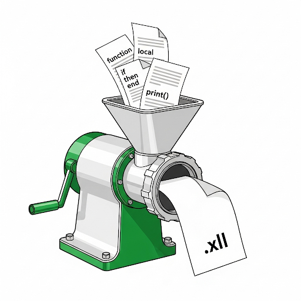

+++ 
draft = false
date = 2025-08-27
title = "Fast and easy Excel custom functions with xllify"
description = "When extending Excel with custom functions, the ancient Excel C SDK is notoriously hard to use and should be generally avoided. There are modern alternatives that use .NET and JavaScript, but they too bring drawbacks and challenges."
slug = "xllify-hello"
tags = ["data","excel","lua","acornsoft"]
categories = []
externalLink = ""
series = []
+++

**Excel is the original rapid application development tool.** You can do unholy things to get the job done without code. These solutions end up brittle and hard to change.

Over the years there have been many approaches for extending Excel beyond formula soup and VBA. There is the excellent [Excel-DNA](https://excel-dna.net/), [PyXLL](https://www.pyxll.com/), Microsoft's own [Office.js](https://learn.microsoft.com/en-us/office/dev/add-ins/reference/overview/excel-add-ins-reference-overview) and [Python](https://support.microsoft.com/en-gb/office/introduction-to-python-in-excel-55643c2e-ff56-4168-b1ce-9428c8308545) support, among others. These technologies are far simpler than the [Excel C Development Kit](https://docs.microsoft.com/en-us/office/client-developer/excel/welcome-to-the-excel-software-development-kit) and are well documented and supported.

There are many ways to skin a cat, so **check them out first to see if they fit your problem space.**

### C, C, C don't prove them right 🎵

An XLL is a DLL that exports functions enabling its code to be loaded, unsafely, into Excel. As a result, the C API brings exciting features such as dumping garbage into cells, crashing Excel and generally causing chaos. When being used directly, one use plenty of caution.

Lack of safety and pre-historic development approaches aside, we cannot escape the fact that in certain scenarios, the C API still takes the crown for absolute efficiency and performance. JavaScript interop performance (not the language itself) can be poor, and Microsoft's own Python support involves a network call: enough said. Excel-DNA performance is great, but requires .NET installing (probably non issue), C# development chops and Visual Studio for Windows.

What if there was an easy way of leveraging the speed of the C API, [safely exposed](https://luau.org/sandbox) through a fast, yet simple scripting language, with no dependency hell or complicated development setup?

### Hello, xllify

**xllify is an API that takes your Lua functions and emits you a signed, ready to go XLL to load into Excel.** Developers download a simple interpreter for Mac, Linux and Windows to develop and test their functions locally ahead of submitting them to be converted into an XLL.

A trivial example would be:

```lua
xllify.ExcelFunction(
    {
        name = "acme.SIMPLE_ADD",
        description = "Adds two numbers",
        category = "Math",
    },
    function(a: number, b: number): number
        return a + b
    end
)
```

This exposes `=acme.SIMPLE_ADD(1, 2)` to be used from your sheets, complete with documentation. Parameters are inferred from the function signature.

You can develop and destruction test your Lua implemented functions on any platform. You do not need a Windows machine, Office installed or anything like that. Just plain old Lua.

A CLI/REPL is provided so that developers can validate their functions' behaviour.

xllify actually embeds the Roblox implementation of Lua called [Luau](https://luau.org/library). It is compatible with Lua 5.1. Luau was used for sandboxing reasons, so potentially harmful Lua code cannot be run. It also has a gradual typing system, to catch bugs early on and provide useful type hints to the conversion process.

Developers can easily offer up their Lua code to xllify with the provided GitHub Action.

```yaml
jobs:
  runs-on: ubuntu-latest
  steps:
    xllify:
      - name: Build Excel add-in with xllify
        uses: acornsoftuk/xllify@v1
        with:
          XLLIFY_SECRET: ${{ secrets.XLLIFY_SECRET }}
          BUILD_ASSEMBLY_NAME: acme_addin.xll
          TARGET: Release-x64
          LUA:
            - acme.luau
```

The developer's build is using an Ubuntu runner. The Lua code is compiled into bytecode using this runner. Any errors will be reported should this fail.

If the bytecode compilation succeeds, it is submitted to the xllify API which will remotely build and sign the XLL on Windows with the necessary MSVC toolchain. The developer does not incur Windows runner costs. The action will download the built result in about 10-15 seconds.

From there, the developer can add further steps in their action to publish or deploy the resulting XLL.

### Why this is good

Developer quality of life almost always trumps raw performance, but initial tests shown this approach to be a great balance between performance and productivity.

<style>
 .image-float-left {
    float: right;
    padding-right:15px;
    max-width: 40%;
    height: auto;
 }
  .clearfix::after {
     content: "";
     display: table;
     clear: both;
 }
</style>

<div class="clearfix">

<ul>
<li>Speed of development
<li>Speed of execution
<li>Simple <code>fn(x) => y</code> value in-value out scenarios require no Excel API knowledge
<li>Batteries included XLL with many handy functions exposed to the Lua environment already
<li>Tiny (~300KB) XLL with zero dependencies
<li>Built-in logging
<li>Develop, unit test and profile outside of Excel
<li>Developers do not need Windows
<li>Leverage existing Lua and C code
<li>Luau sandbox for security and stability
</ul>
</div>

### How does it work?

Not much to see here. An XLL build is orchestrated with CMake; Luau and XLCALL32 are linked to form an XLL. There's standard C++ glue to expose relevant aspects of the Excel SDK and marshal between `LPXLOPER12` and friends, carefully managing memory and abstracting quirks - wide Pascal strings and other such fun.

The submitted Luau bytecode is packed into the assembly as a resource, which is loaded into the Lua environment when the add-in is loaded. _Customer_ builds run on segregated GitHub Actions Windows runners.

Customer code is somewhat obsfucated through its compilation to bytecode, but an self-run solution to this is in the works, should privacy be a concern to some organisations.

### Availability

xllify will be available in September 2025, for free. If you've any questions or comments, drop me a line via [email](mailto:alex@acornsoft.uk) or on [LinkedIn](https://www.linkedin.com/in/alexjreid/).
